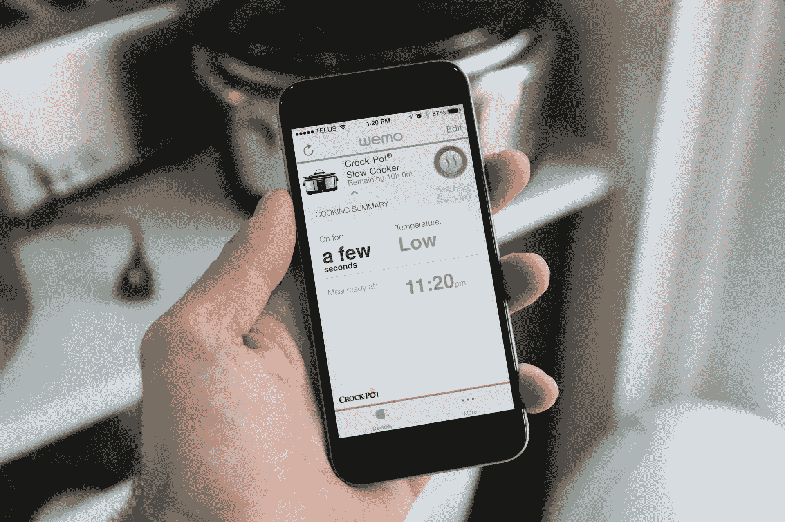
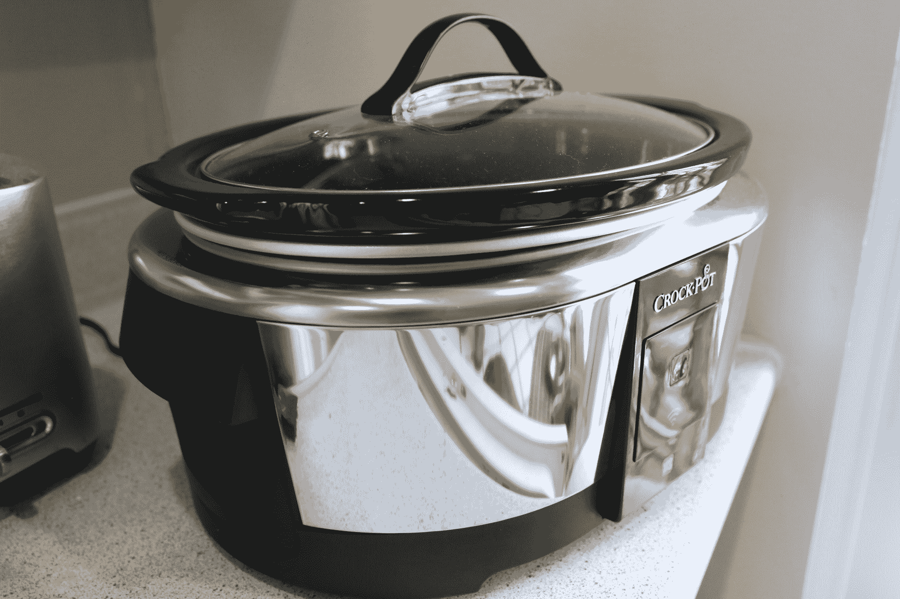

# Belkin WeMo 瓦罐评论:不是最聪明的智能设备，但它完成了工作 

> 原文：<https://web.archive.org/web/https://techcrunch.com/2014/09/23/belkin-wemo-crock-pot-review/>

# Belkin WeMo 瓦罐评论:不是最聪明的智能设备，但它完成了工作

Belkin 正全力以赴打造互联家庭，产品范围从互联照明系统到智能插座。但它最奇怪的产品之一可能只是与慢炖锅行业的领导者瓦罐锅的合作，瓦罐锅的名字基本上是火了就忘的烹饪的同义词。Belkin 和 Crock-Pot 现在提供带 WeMo 的[智能慢炖锅，这是一款 130 美元的厨房电器，可以连接到 Wi-Fi，并通过智能手机上的应用程序进行控制，只要你有数据连接。](https://web.archive.org/web/20221007041709/http://www.belkin.com/us/p/P-F7C045/)

WeMo 系列是 Belkin 的智能家居品牌，可以从同一个应用程序控制瓦罐，让你监控和互动你的 WeMo 灯，开关和插座。但是瓦罐在与 WeMo 家族的其他成员互动的方式上并没有提供太多；它本质上是一个遥控慢炖锅，带有一个你可以放在口袋里的开关。

不过，这不一定是件坏事。慢煮基本上已经是当你想要简单和容易的东西时你所做的烹饪类型，因为它基本上包括以大杂烩的方式组合东西，然后将其转到三个模糊定义的温度范围之一，然后完全忽略它，直到你的胃通知你的脑干你需要营养。

WeMo 对此的补充不是地理围栏或基于 IP 摄像头检测到运动的触发——它本质上是一个通过手机控制的开/关开关，能够改变温度，查看你烹饪了多长时间，并设置何时关闭。额外的便利使你可以从远程位置调整你的慢炖锅，这样你就可以为意想不到的事情做准备，比如不得不在办公室呆到很晚。

你可以选择高、低、暖三种温度，一旦你设置的定时器到时，或者你手动结束定时器，炖锅就会自动切换到暖态。作为一个独立的瓦罐，硬件也令人印象深刻:它有一个可移动的，可用洗碗机清洗的 6 夸脱陶瓷碗，表面有一个按钮控制。

然而，WeMo 炖锅的价格是没有智能功能的可编程倒计时炖锅的两倍多，所以你必须真正决定增加的便利是否值得。但对于一个完全旨在让忙碌的人以最少的时间投入享受家常菜的设备来说，不管不可预测的时间表，WeMo 设备提供的少量功能可能值得价格差距。