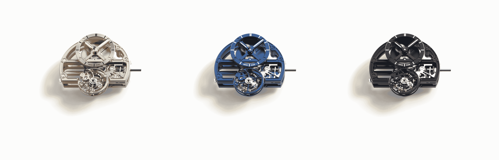
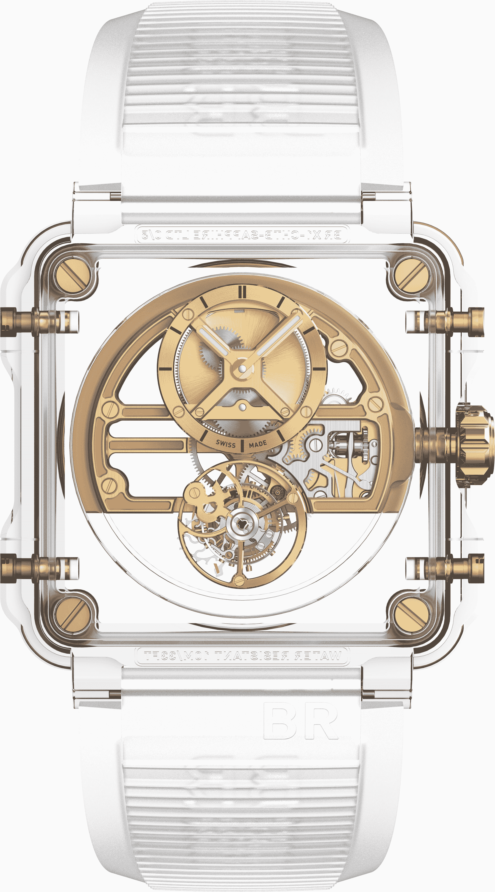

# Bell & Ross 打造透明陀飞轮 

> 原文：<https://web.archive.org/web/https://techcrunch.com/2018/03/22/bell-ross-creates-a-transparent-tourbillon/>

# 贝尔&罗斯制造透明陀飞轮

春天到了，这意味着巴塞尔时间到了，权威的国际手表展。每年的这个时候，你最喜欢的品牌——以及你从未听说过的品牌——都会推出价格超过几十块本田雅阁(Honda Accords)的独特时计，看起来就像是由[曼哈顿博士](https://web.archive.org/web/20221209035008/https://en.wikipedia.org/wiki/Doctor_Manhattan)在他不那么忧郁的时候制作的东西。

今天的百搭时计来自[贝尔&罗斯](https://web.archive.org/web/20221209035008/https://www.bellross.com/)，它们是看起来像飞机表盘的大方形手表的制造商。这款名为 BR-X1-Skeleton-Tourbillon-Sapphire 的新表款保持了传统的 B & R 形状，但几乎完全透明，表壳由蓝宝石制成，通过销钉和螺钉固定在一起。该机芯有三种颜色，是一个完整的手动上弦陀飞轮系统，从各个角度都能看到美丽的画面。

对于外行人来说，陀飞轮是一个可以将手表的摆轮旋转 360 度的系统。这个系统最初是由宝玑创造的，确保手表在受到奇怪的重力时不会变慢。然而现在，这是一个非常昂贵的谈话开始。

这是对 B&R 最初的透明手表的美丽更新，虽然我们中的绝大多数人永远不会拥有这样的东西，但很高兴知道有人仍然关心钟表的复杂性和狂野的设计。拥有相当于神奇女侠隐形喷气机的手表要花多少钱？大约 50 万美元。对于那些有兴趣的人来说，这款游戏将会在网上出售。

