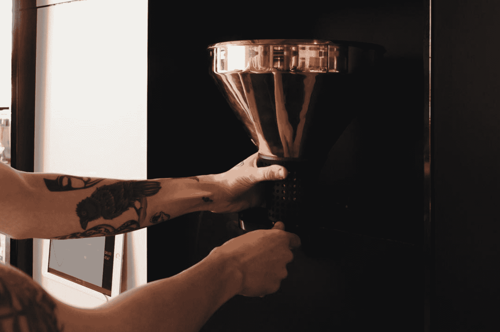

# 领头羊咖啡融资 1000 万美元，为咖啡行业带来更多透明度 

> 原文：<https://web.archive.org/web/https://techcrunch.com/2018/08/27/bellwether-coffee/>

含有咖啡因的代餐产品可能在技术人员中风靡一时，但一杯可口的咖啡仍然是我们大多数人早上的首选饮料。为了利用美国人贪得无厌的咖啡习惯， [Bellwether Coffee](https://web.archive.org/web/20221208110450/https://www.bellwethercoffee.com/) 已经筹集了 1000 万美元的首轮融资，并开始向咖啡馆和杂货店出售其 零排放商业烘焙机和在线咖啡豆市场。这笔资金是在 2016 年 600 万美元的种子轮融资之后获得的。

concursory Ventures 领投了这家总部位于加州伯克利的初创公司，参与投资的有 FusionX Ventures、Tandem Capital、New Ground Ventures、Hardware Club、XN 风险投资公司以及 SolarCity 创始人 Pete 和 Lyndon Rive。作为交易的一部分，皮特·里夫(Pete Rive)加入了这家初创公司的董事会，他的管理合伙人乔希·波萨曼蒂耶(Josh Posamentier)也加入了董事会。2013 年，担任公司产品创新主管的里卡多·洛佩兹创立了领头羊。

风向标首席执行官内森 吉利兰 说公司位于软件和硬件的结合点。后者对风投来说可能更难接受，尽管吉利兰表示，其最新一轮融资已被超额认购。该公司刚刚开始以每月 1000 美元的价格向咖啡馆、杂货商和其他企业出租无气孔的电咖啡壶。

作为月费的一部分，Bellwether 的客户可以访问其在线咖啡豆市场，他们可以使用该市场从由 Bellwether 团队管理的 20 多家咖啡农场的循环列表中订购咖啡豆。零售商和咖啡消费者也可以通过风向标直接给农民小费。吉利兰解释说，这可能会改变这个行业的游戏规则。他说，每卖出一磅咖啡，咖啡农大约能赚 75 美分。如果每磅咖啡能得到 1 美元的小费，农民的收入将会翻倍。

追溯你日常饮用的咖啡豆的原产地，无论是危地马拉、埃塞俄比亚、哥伦比亚还是其他主要的咖啡豆生产国，都是很困难的。Bellwether's marketplace 允许零售商根据各种因素浏览咖啡农场，包括农场是否获得有机认证或由女性所有，旨在为通常不透明的业务增加一点透明度。

吉利兰告诉 TechCrunch:“我们生活在一个如此互联的世界里，让消费者知道谁煮了他们的咖啡以及他们在哪里真的很有意义。”。“我们真的努力让质量和口味与可持续发展指标保持一致。我们希望两者之间达到完美的平衡。”

总部位于加州伯克利的 Bellwether Coffee 已经筹集了由 concursory Ventures 领投的 1，000 万美元 A 轮融资

Bellwether 拥有巨大的潜在市场，因为大多数咖啡馆和杂货商都没有内部烘焙设备，但可以通过租赁像 Bellwether 这样的设备来省钱。最重要的是，美国人喝很多咖啡。根据省钱应用 [Acorns](https://web.archive.org/web/20221208110450/https://www.acorns.com/) 最近的一项研究，三分之一的用户每年花在咖啡上的钱超过了他们的投资。然而，他们的大多数受访者是千禧一代，当然，众所周知，他们会在鳄梨吐司和其他东西上过度消费。因此，他们的消费习惯可能不是所有咖啡消费者的最准确代表。无论如何，对于领头羊来说，这可能是一个巨大的机会。

总体而言，在咖啡科技领域，其他几家公司最近吸引了风险投资者的注意。中国按需咖啡配送初创公司 Luckin Coffee 在 7 月份以 10 亿美元的估值筹集了 2 亿美元，随后防弹咖啡背后的公司防弹 360 获得了 4000 万美元的融资。

如果领头羊没有飞上独角兽的领地， 吉利兰至少已经开始欣赏一杯好咖啡及其诸多微妙之处。

“我承认，我以前会往咖啡里加一点奶油，但是现在全是黑色的了。”