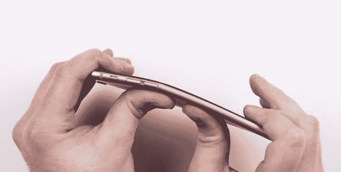

# 弯曲所有手机:iPhone 6 vs . HTC One M8 vs . Moto X 

> 原文：<https://web.archive.org/web/https://techcrunch.com/2014/09/24/bending-all-the-phones-iphone-6-vs-htc-one-m8-vs-moto-x/>

# 弯曲所有手机:iPhone 6 vs. HTC One M8 vs. Moto X

在 iPhone 6 Plus 发布之前，人们担心他们的手机有多“柔韧”的想法似乎很可笑。一周后，我在我的回音室外面的咖啡屋听到一些随机的人谈论这件事，就像他们谈论天气一样。奇怪。

昨天下午，在抱怨新 iPhone[从其所有者](https://web.archive.org/web/20221006184718/https://beta.techcrunch.com/2014/09/23/the-iphone-6-plus-gets-bent/)的口袋里出来后，YouTuber Lewis Hilsenteger [发布了一段他自己](https://web.archive.org/web/20221006184718/https://www.youtube.com/watch?v=znK652H6yQM)不费吹灰之力就成功弯曲 iPhone 6 Plus 的视频。

今天，他带着更多的手机回来了。iPhone 6 会像 6 Plus 那样弯曲吗？其他铝背手机呢，比如 HTC One M8？

【YouTube https://www.youtube.com/watch?v=IROcoJeVfSI&w=704&h=426]

这几乎是不科学的，但如果我们将“这家伙徒手能推多大力”作为标准衡量单位，iPhone 6 似乎比 6 Plus 表现得好得多。One M8 有点呻吟，屏幕暂时跳离了位置，但没有永久性的损坏。与此同时，2014 年的 Moto X 似乎进行了一场激烈的斗争。

*(如果你有兴趣了解公司在各种不同的潜在损坏情况下测试手机的方法，请查看我早在 2008 年拍摄的诺基亚硬件损坏实验室的视频。手机的弯曲倾向可能会用类似过度延伸测试视频中显示的机器来测试。)*

对于那些错过的人，他的原始 6 Plus 御术视频:

[https://web.archive.org/web/20221006184718if_/https://www.youtube.com/embed/znK652H6yQM?feature=oembed](https://web.archive.org/web/20221006184718if_/https://www.youtube.com/embed/znK652H6yQM?feature=oembed)

视频