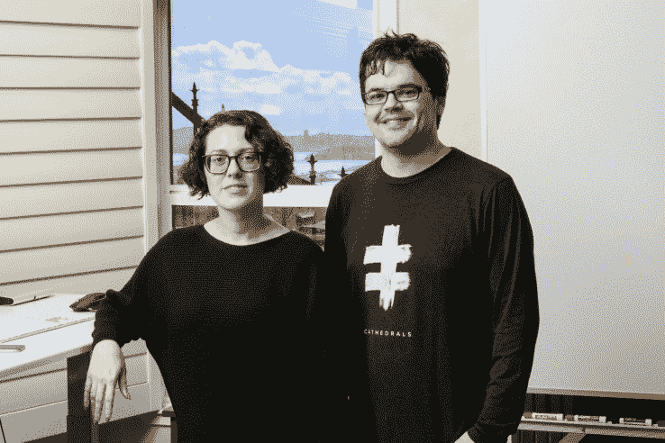

# Better 希望处理您的网络外医疗账单，因此您不必 

> 原文：<https://web.archive.org/web/https://techcrunch.com/2017/04/18/better-wants-to-handle-your-out-of-network-medical-bills-so-you-dont-have-to/>

我们需要就医疗保险索赔进行一次对话，因为这个系统太荒谬了。你被告知你需要某样东西，但不知道它的价格，然后，在得到它之后，你必须等几个月，直到最后的账单出现，而它已经准备好了。有时不清楚你是否在你的首选网络中，或者覆盖了什么。最重要的是，许多账单都写在实际的纸上，然后传真给各方，这就容易出现人为错误。

NerdWallet 的一项研究发现，猖獗的医院账单错误导致了高达 26%的超额收费，近一半的医疗保险索赔包含账单错误。

这是一件痛苦的事情，大多数人都不知道所有的代码，也没有时间去经历所有的麻烦来得到一个正确的结果。所以雷切尔·诺曼决定对此做点什么。诺曼曾经是斯坦福大学的医学预科生，他与人共同创办了一家初创公司 [Better](https://web.archive.org/web/20221208074439/https://getbetter.co/) ，以你的名义倡导降低你的医疗账单。

这家初创公司通过自动化和人工来代表你提交保险索赔。你下载应用程序，填写一些信息以验证你是你所说的那个人，然后拍一张你的医疗账单的照片，就大功告成了。然后，Better 开始寻找错误并联系你的保险公司，看看它能把你的账单削减到什么程度。

这家初创公司表示，它将对任何医疗费用提出网络外索赔，包括治疗、精神病学、针灸、脊椎按摩护理、验光、牙科工作、实验室测试和药物，因此它非常适合那些声称接受你的保险但由你提出索赔的医疗机构。

通常做这种工作的病人辩护律师已经存在，但他们通常收取高达 20%至 30%的费用，而且技术含量很低。人们打电话给其他人来纠正账单上的错误。Better 混合使用人工支持和自动化来发现错误并降低成本。而且，尽管现在对病人是免费的(或者至少在索赔额达到[100 万美元](https://web.archive.org/web/20221208074439/https://getbetter.co/)之前是免费的)，Norman 说她最终会在任何减免后收取总账单的 10%左右。

与此同时，Better 计划发展壮大，并在 Ben Blumenfeld 和 Enrique Allen 的设计师基金以及其他各种天使投资者的参与下，从初始资本(前 TechCruncher Kim-Mai Cutler [已登陆](https://web.archive.org/web/20221208074439/https://medium.com/@kimmaicutler))筹集了 110 万美元来帮助它实现增长。

更好的联合创始人雷切尔·诺曼和约翰·斯托克代尔。

我可以直接说它工作得很好。去年夏天去巴西之前，我让我丈夫在打了几针之后，为他收到的一份医疗账单做了测试。他去的诊所没有告诉他这是网络外的，几个月后我们收到最终账单时，将近 1000 美元。这是在我们结婚后不久，所以我们当时不准备支付这笔费用。

一个朋友告诉我更好的，我们决定尝试一下。这花了大约一个月的时间，但更好地减少了我丈夫的付款到几百美元。

我不能说这将是每个人的经历，但那是我们的——我应该指出，在我让我丈夫测试这项服务时，Better 团队并不知道，也不知道我有兴趣写点什么。

但不清楚的是该公司计划如何扩大规模。这个团队仍然很小，目前只有 Norman、她的联合创始人和前脸书工程师 John Stockdale 以及其他一些工程师，不可否认，现在主要是她和 Stockdale 代表病人给保险公司打电话，这听起来很累。

诺曼希望用新的资金来改变这种常规，并计划雇佣更多的工程师来实现大量工作的自动化。她还表示，开发 Android 应用程序是重中之重，所以尽快去做吧。