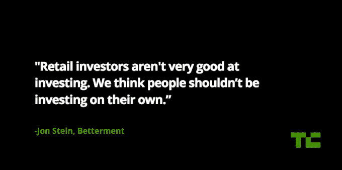

# 改善和罗宾汉在如何扰乱投资上发生冲突

> 原文：<https://web.archive.org/web/https://techcrunch.com/2016/05/10/betterment-and-robinhood-clash-on-how-to-disrupt-investing/>

金融服务业的未来是什么样的？两个创业公司的创始人对这个问题有两种截然不同的答案，他们今天早上在 TechCrunch Disrupt NY 2016 大会上讨论了他们计划如何颠覆传统经纪公司。

专注于千禧一代的投资应用 [Robinhood](https://web.archive.org/web/20230311140054/https://www.crunchbase.com/organization/analyst) 的联合创始人兼联合首席执行官 Vlad Tenev 认为，应该取消交易佣金，让任何人只需按一下按钮就能轻松投资。 [Betterment](https://web.archive.org/web/20230311140054/https://www.crunchbase.com/organization/betterment) 的联合创始人兼首席执行官[乔恩·斯坦](https://web.archive.org/web/20230311140054/https://www.crunchbase.com/person/jon-stein)的观点恰恰相反——人们不应该在没有指导的情况下投资自己的钱。

“我们认为人们实际上不应该自己投资，”他说，称这是一种“疯狂的”理财方式。

他的公司的解决方案也没有试图从客户的钱中赚钱——比如，从未投资的现金中赚取利息，或者其他不太透明的方式，除了面向客户的费用之外，公司传统上还通过这些方式提高利润率。

相反，改良公司的客户需要支付投资援助费，以帮助他们实现退休储蓄、买房和其他需要资本的计划等目标。

斯坦解释道:“我们认为，在您不知情的情况下，通过您的钱赚钱可以让我们与客户保持一致。”。

与此同时，Tenev 的初创公司能够提供免佣金交易，正是因为它遵循了零售经纪公司使用的旧模式，即在佣金之外创造收入。

他还认为，像罗宾汉这样的应用程序有不同的用例，人们在没有指导的情况下进行投资。他说，并不是每项投资都是为了退休储蓄或积累储蓄。

如果有人真的非常信任一家公司并支持他们——也许是因为他们读过的东西，或者是因为他们购买了他们的产品，那么“我们作为软件制造商的工作不一定是告诉你不应该投资，”特纳夫反驳道。

[gallery id = " 1320178，1320182，1320181，1320180，1320177，1320176，1320175，1320172"]

因此，这两家初创公司有着天壤之别——一家提供用户导向的免佣金交易，另一家帮助你明智地付费投资。

然而，两者的一个共同点是扰乱了大银行和经纪公司。

“我们想利用金融机构正在使用的技术，让散户投资者可以获得这些技术，”斯坦说。“我们认为散户投资者更难在市场上竞争——如果你是散户投资者，游戏就会对你不利。”

罗宾汉也是为了搞垮大银行，他成长于对整个金融服务业的不满，正如“占领华尔街”运动的人群所表现的那样。

“人们对金融系统失去了信任——尤其是我们这个年龄组的人，”他指的是会使用罗宾汉这样的应用程序的千禧一代客户。

尽管他们的策略不同，两人似乎都很好地实现了他们的目标，挑战旧的保守和做事方式。

Tenev 表示，罗宾汉已经发展到近 100 万客户，几个月前宣布已经通过了 30 亿次平台交易。它现在正在国际上扩张，包括进入中国，在中国有 2 万人加入了等待名单，以便在服务开放时使用，这将允许他们在美国股市交易。

与此同时，斯坦表示，改善对每个客户都有利可图，因为去年大多数客户的余额增长了 50%，而其自身在钱包中的份额也相应增长。

现在它的目标是成为市场领导者，就像亚马逊在电子商务领域的统治地位或者网飞在流媒体视频领域的统治地位一样。

“没有一家科技公司引领金融服务的未来，这太疯狂了，”他说，“我们想成为那家公司。”