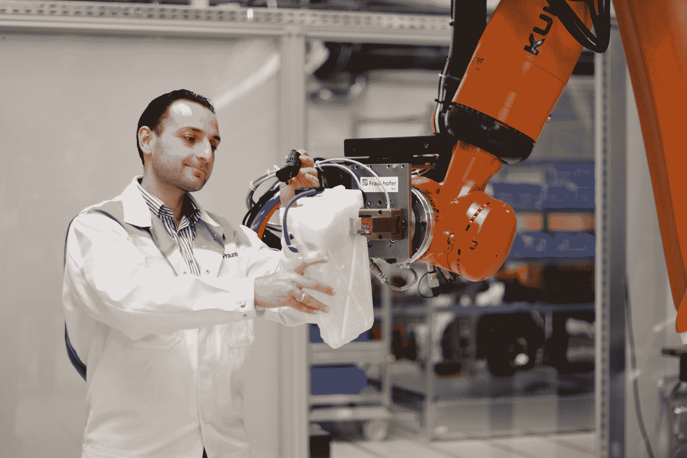

# 在机器人“安全”和“不安全”区域之间，提出了一种机器人朋友区域 

> 原文：<https://web.archive.org/web/https://techcrunch.com/2017/03/27/between-robots-safe-and-unsafe-zones-a-sort-of-robot-friend-zone-proposed/>

# 在机器人的“安全”和“不安全”区域之间，提出了一种机器人朋友区域

不用说，与机器人和重型机械一起工作是非常危险的。虽然更好的实践和道德公司仍然不太常见(正如《彭博商业周刊》这篇出色的文章所描述的那样)，但更智能的机器人是另一个平行的解决方案。德国研究机构弗劳恩霍夫[提出了一个工业环境中人机合作的直观模型](https://web.archive.org/web/20221205153120/https://www.fraunhofer.de/en/press/research-news/2017/march/new-safety-technology-enables-teamwork.html)。

很多有机器人操作的地方，基本上都有两个区:安全区和不安全区。机器人移动速度快，力量大，所以基本上它们能到达的任何地方都是不安全的，远离它的指定区域是官方安全的。如果有人进入安全区，许多机器人根本不会操作。

但是，当人类和机器人需要频繁互动时——检查零件、传递东西或只是混日子——存在第三个区域是有意义的，这是为了友谊和愉快的合作。创造者称之为 Kooperation Zonen。

 弗劳恩霍夫的模型使用摄像机追踪机器人大致区域内的人的位置。如果它们处于绿色，机器人可以全速前进，做机器人最擅长的事情。但是如果有人靠近，机器人不会停下来，它只是进入一个新的行为模式。它可以继续工作，但速度会更慢，或者可以执行人类特有的动作，例如将手臂降低到人所在一侧的所需位置。

但是如果这个人走近红色，机器人就会完全停止移动。这么近的距离对它的移动来说一点都不安全，而且不管怎样，人类接近它可能是为了关闭它或者搞乱它的内脏。

“我们的系统已经功能齐全，并在实验室进行了测试，”该研究部门的负责人马蒂亚斯·普茨说。“今年的目标是让贸易协会测试一个应用程序，并使其在行业中得以实施。”

机器人无疑正在接管工业的许多领域，但操作和维护它们仍然是一项非常人性化的工作。任何像这样促进健康的人机互动的东西对我来说都是一个好主意。