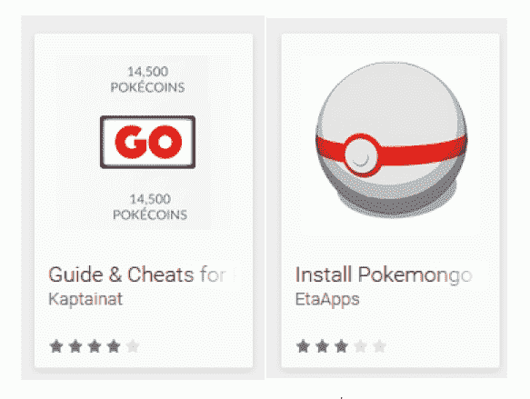

# 当心假冒的 Pokémon Go 应用

> 原文：<https://web.archive.org/web/https://techcrunch.com/2016/07/18/beware-the-fake-pokemon-go-apps/>

本月早些时候，第一款 Pokémon Go 恶意软件在野外被发现，但该应用对用户没有太大威胁，因为它从未进入官方 Google Play 商店进行下载。对于[来说就不一样了，一组新的危险应用](https://web.archive.org/web/20230404093251/http://www.welivesecurity.com/2016/07/15/pokemon-go-hype-first-lockscreen-tries-catch-trend/)通过承诺欺骗、提示和其他功能来瞄准 Pokémon Go 用户。尽管它们的名字听起来无害，但这些应用程序实际上包含恶意代码，要么欺骗用户支付昂贵的虚假服务，要么接管受害者的手机，点击色情广告等。

这些应用首先是由 [ESET](https://web.archive.org/web/20230404093251/http://www.eset.com/) 移动安全的安全研究人员发现的，包括一个名为“神奇宝贝 GO 终极版”的锁屏应用，以及“scareware”应用“神奇宝贝 Go 指南&秘籍”和“安装神奇宝贝 mon Go”

该公司发现这些应用时，它们正在 Google Play 上直播，但在 ESET 标记后被谷歌删除。

[根据研究人员](https://web.archive.org/web/20230404093251/http://www.welivesecurity.com/2016/07/15/pokemon-go-hype-first-lockscreen-tries-catch-trend/)的说法，这款名为“精灵宝可梦 GO 终极版”的应用类似于游戏本身，但会在启动后故意锁定屏幕。重启不会解决问题，相反，受影响的用户将不得不通过拔出电池或使用 Android 设备管理器来重启他们的设备。然而，重启后，该应用将继续在后台运行，点击色情广告。用户必须从 Android 的设置中手动卸载该应用程序。

虽然这款应用程序是恶意的，但它的操作方式——将用户锁在设备之外——可能会让它的创建者随心所欲地造成更大的破坏。该公司指出，例如，如果他们在应用程序中添加了勒索信息，他们可能会在 Google Play 上出现第一个锁屏勒索软件。

其他两个应用程序没有接管受害者的手机，而是属于“scareware”家族。也就是说，这些应用诱使用户订阅不必要的服务。

在这种情况下，这些应用程序将向用户承诺，他们可以为《神奇宝贝 Go》生成大量游戏内物品，如神奇硬币、神奇球或幸运蛋——每天高达 999，999 英镑。然而，在兑现这些承诺之前，这些应用会要求用户“验证”他们的账户。此时，欺诈性弹出窗口会出现，称设备感染了病毒，需要清理。

这将使受害者签约昂贵的短信订阅服务，或根据用户的国家执行其他不良功能。这些应用程序还可以用来下载其他应用程序，显示诈骗广告，或创建调查。每按一次“返回”按钮，就会出现新的弹出窗口或广告。(要摆脱它们，用户必须按两次“后退”。)

[gallery ids="1354438，1354437，1354436，1354434，1354433，1354432"]

幸运的是，在被移除之前，这些应用程序都没有在 Google Play 上存活很长时间。这意味着他们没有时间吸引大量的受害者。该公司表示，“神奇宝贝 go 终极版”的用户达到了 500-1000 人，“神奇宝贝 Go 指南和秘籍”达到了 100-500 人，而“安装神奇宝贝 Go”吸引了 10，000-50，000 名受害者。

话虽如此，考虑到它们的功能，这些应用程序甚至在第一时间进入了 Google Play，这令人担忧。

谷歌对其 Play Store 的监管仍然无法与苹果更严格的程序相提并论，尽管谷歌去年春天声称，它也已经结合其更自动化的系统实施了人工主导的应用审查。该公司[在主动阻止恶意应用程序、广告软件和恶意软件在其应用程序商店上线方面有着](https://web.archive.org/web/20230404093251/https://techcrunch.com/2013/04/08/nearly-60k-low-quality-apps-booted-from-google-play-store-in-february-points-to-increased-spam-fighting/)和[参差不齐的](https://web.archive.org/web/20230404093251/https://techcrunch.com/2013/04/20/newly-discovered-android-malware-was-downloaded-millions-of-times/)和[记录](https://web.archive.org/web/20230404093251/https://techcrunch.com/2015/02/03/new-adware-found-in-google-play-apps-with-millions-of-downloads/)，即使它迅速做出反应，删除那些被标记的应用程序。然而，该公司[声称其系统](https://web.archive.org/web/20230404093251/https://security.googleblog.com/2016/04/android-security-2015-annual-report.html)通过每天检查超过 60 亿个已安装的应用程序来保护 Android 用户免受恶意软件的攻击。

随着 Pokémon Go 热潮没有立即放缓的迹象，你可以预计未来会有更多的恶意应用程序出现。

由于你似乎不能相信 Google Play 商店是完全安全的，所以暂时最好在安装第三方 Pokémon Go 应用程序之前谨慎行事——特别是如果它做出的承诺似乎好得不真实。

*图像演职员表:[ESET](https://web.archive.org/web/20230404093251/http://www.eset.com/)*