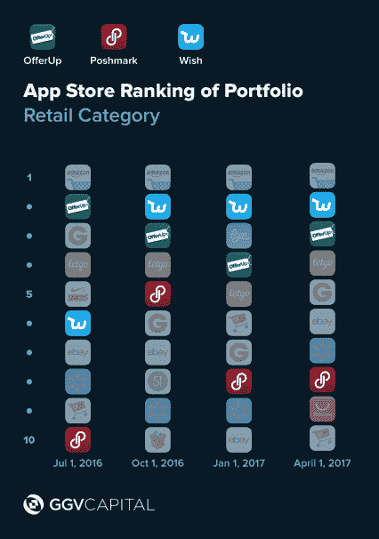
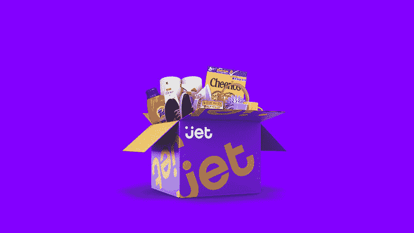

# 超越亚马逊和阿里巴巴:电子商务的下一步是什么？

> 原文：<https://web.archive.org/web/https://techcrunch.com/2017/08/20/beyond-amazon-and-alibaba-whats-next-for-e-commerce/>

童士豪是律师事务所的管理合伙人

[GGV Capital](https://web.archive.org/web/20221221193515/http://www.ggvc.com/)

，专注于全球互联网和电子商务生态系统的早期投资。他八次入选福布斯迈达斯排行榜，最近一次排在第 10 位，他的投资组合中有 16 只独角兽。

More posts by this contributor

你如何智胜一只 800 磅的大猩猩？中国和美国这两个最大市场的电子商务零售商每天都在努力应对这个问题。

鉴于亚马逊(Amazon)和阿里巴巴(Alibaba)的巨大成功(两家公司市值均超过 400 亿美元)，许多人认为电子商务游戏已经结束。亚马逊系统化地将一个又一个产品类别商品化——书籍、家庭用品、电子产品、服装、杂货等，而阿里巴巴的天猫和淘宝平台以数百万个 SKU 占领了市场份额和大众想象力，真正创造了一个全球性的“一切商店”。

但宣布这些市场的游戏结束是一个错误。对新兴趋势的仔细阅读揭示了丰富的新领域，在那里，价值数十亿美元的初创企业可以通过从第一天就认识到千禧一代的全球大众市场的机会而蓬勃发展。我在这里写了更多关于千禧一代购买习惯的文章。

理解这些新兴趋势的关键是重新定义我们所说的“大众市场”。从历史上看，在一个买家和卖家都受到地理位置限制的时代，服务大众市场意味着以尽可能低的价格销售几乎所有垂直领域的所有商品——本质上，就是创造“天天低价”的“一切商店”。

在今天智能手机的世界里，这不再是真的了。全球大众市场在很大程度上受到[千禧一代购买习惯](https://web.archive.org/web/20221221193515/https://www.slideshare.net/GGVCapital/the-mobile-generation-chinas-millennials)和优先事项[的影响，以及中国正在发生的](https://web.archive.org/web/20221221193515/https://medium.com/@jeffgrichards/the-great-consumer-upgrade-934706cf0eac)消费升级，消费者正在通过旅行、家居用品、时尚、餐饮等方式“升级”他们的生活方式，他们正在寻找价格低廉的奢侈品——独特的产品。

像中国女鞋品牌 [Dollar Shave Club](https://web.archive.org/web/20221221193515/http://www.dollarshaveclub.com/) 和 73Hours 这样的新电子品牌，以及像家居装饰和改造的 [Houzz](https://web.archive.org/web/20221221193515/http://www.houzz.com/) 、手工艺者的[达比智能](https://web.archive.org/web/20221221193515/http://www.darbysmart.com/)或美容产品的首选网站 Red/小红书这样的垂直市场，由于它们能够提供大幅改善的消费者体验，已经取得了巨大的增长。电子品牌和垂直市场都在利用策展、个性化和社区在美国和中国市场占据主导地位。

**策展 vs .仓库**

与游击队的区别开始于搜索与发现。亚马逊和淘宝是巨大的虚拟仓库，依靠基于目的的购物。消费者访问这些网站是为了找到他们知道自己想要的产品，并且可以低价购买。消费者登录，搜索一件商品，购买后离开。除了免费送货和次日送达，对于心不在焉的智能手机浏览来说，这种体验太枯燥或太混乱了。

电子品牌和垂直市场不会与这种仓库搜索竞争。相反，他们专注于*发现*——在特定类别中筛选出一批顾客希望仔细阅读并偶尔购买的产品。移动购物正在成为一种娱乐，一组精心策划的产品会带来更愉快的体验。在线品牌正以不同的方式进行策展，其受欢迎程度在应用商店中显而易见。

产品可以由专业人士策划——比如用于设计家居的社交商务平台 Houzz。或者由 kol(关键意见领袖)在其他用户推荐新造型的网站上发布，比如 T2。还有一些是由价格决定的——比如 Hollar 和 Wish，这是一款为用户提供一流疯狂折扣商品的应用，还有 [LetGo](https://web.archive.org/web/20221221193515/https://us.letgo.com/en) 或 [OfferUp](https://web.archive.org/web/20221221193515/http://www.offerup.com/) ，这是一款 Craigslist 风格的转售应用，旨在方便用户浏览。

这些应用程序都没有针对那些觉得自己现在需要接触每一件产品的购物者。但它们确实为消费者提供了精心策划的体验——通过产品或价格——在为智能手机用户的无尽娱乐而构建的应用程序中发现负担得起的奢侈品。

**个人就是社会**

尽管消费者可能喜欢亚马逊和淘宝，但他们从根本上把它们视为工具，而不是身份。它们将被用于它们有用的地方，但你不会发现很多用户转向这些品牌来创造社交身份。

成功的电子品牌和垂直市场，如 AirBnB、小红书、Pinterest 和 Houzz，擅长创造社交追随者，创造鼓舞人心和渴望的社区感。他们通过将他们的社区和价值观转化为文化声望而获胜，并培养消费者的忠诚度，因为这些用户认为在应用程序中购物等同于亚文化中的成员。产品的个性化和社区的培养推动用户在社交媒体上向外展示这些品牌。这在美国和中国都在发生。

一些电子商务新贵通过注入价值的品牌来实现这一目标，如庆祝自然体型的女性内衣品牌 [Lively](https://web.archive.org/web/20221221193515/http://www.wearlively.com/) 、一种新饮料 [Dirty Lemon](https://web.archive.org/web/20221221193515/http://www.dirtylemon.com/) 或一种个性化洗发水和护发素 [Function of Beauty](https://web.archive.org/web/20221221193515/http://www.fuctionofbeauty.com/) 。

有些是通过反复剪裁来满足用户的口味来实现的，比如 [StitchFix](https://web.archive.org/web/20221221193515/http://www.stitchfix.com/) 和 [Dia](https://web.archive.org/web/20221221193515/http://www.dia.com/) ，这是一种订阅式的服装配送服务，可以根据用户保留和退回的服装来优化配送。最重要的是，基于人工智能算法定制产品和推荐的品牌将能够通过深度个性化为用户区分他们的应用程序。

行业和策略多种多样，但它们都创造了一件事:在应用程序中购买的个人和社会原因，而不是通过亚马逊或阿里巴巴。类似地，线下大卖场正继续受到顾客购买习惯变化的挑战——与沃尔玛一样，它们可能会变得更加渴望生存。

沃尔玛收购 Jet，在电子商务领域与亚马逊一战

**那么……接下来呢？**

即使有这些优势，创业公司真的能智胜阿里巴巴和亚马逊吗？答案是肯定的，原因是电子商务还有巨大的增长空间。

亚马逊和阿里巴巴可能正在吞噬这两个市场的最大份额，但在美国和中国总额约 9 万亿美元的零售市场中，电子商务仍分别只占 8%和 16%。大量的电子商务美元仍有待创造和索取。展望未来，电子商务市场细分最终可能看起来更像传统零售，但在购物体验上有了新的转变，并可能得到 AR/VR 技术和人工智能的帮助。

赢得这些市场意味着通过他们的价值观和沟通渠道吸引更多的千禧一代。随着电子商务市场的增长和发展，策划、个性化和优化社区的初创公司有机会在这个不断增长的馅饼中分得一杯羹。