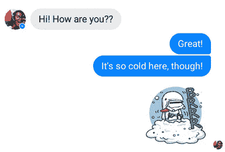

# Facebook Messenger 点击 8 亿用户:2016 年战略和预测

> 原文：<https://web.archive.org/web/https://techcrunch.com/2016/01/07/beyond-messaging/>

消灭短信，催生聊天机器人平台，把朋友带到线下，提高人工智能，愉悦人们。这是 Facebook Messenger 2016 年的路线图,现在它拥有 8 亿月活跃用户，高于 6 月的 7 亿，3 月的 6 亿和去年 11 月的 5 亿。

根据尼尔森的数据，这使得 Messenger 成为 2015 年增长最快的应用程序，也是仅次于脸书的第二大最受欢迎的 iOS 应用程序。它还每月传输 100 亿张照片。

现在，脸书的聊天应用在一些市场已经无处不在，它可以开始向竞争对手的棺材钉钉子，用开发者生态系统巩固自己的地位，并超越传统消息的授权。

在今天的一篇[博客中，Messenger 的负责人 David Marcus 阐述了脸书 2016 年战略的主题。昨天，我与 Messenger 的产品负责人 Stan Chudnovsky 进行了交谈，以便更深入地了解该计划。下面是这个策略的分解，以及我对 Messenger 将如何执行它的预测。](https://web.archive.org/web/20230404132719/https://www.facebook.com/notes/david-marcus/heres-to-2016-with-messenger/10154485804004148)

首先，快速概括一下 Messenger 在 2015 年取得的成就:

*   速度改进
*   视频通话
*   使用颜色、昵称和表情符号进行对话定制
*   通过信使提供客户服务
*   发送和接收付款
*   内容和表达应用平台
*   改进的位置共享
*   呼叫者/信使 ID
*   与非好友聊天的消息请求
*   使用照片魔术自动分享照片
*   m 虚拟助手
*   优步交通应用平台

# 2016 年计划和预测

## **计划:篡夺电话号码**

Messenger 在美国遥遥领先于其他核心消息应用(对不起，是谷歌)，现在它唯一有价值的竞争对手是 SMS/iMessage。马库斯说，短信诞生于翻盖手机时代，现在我们需要智能手机时代的聊天。通过内置丰富的媒体功能，如照片、贴纸、gif、支付、应用程序、位置和交通，Messenger 试图说服人们放弃短信，但这些功能都没有很好地实现。

Messenger now [允许任何人向脸书上的任何人](https://web.archive.org/web/20230404132719/https://techcrunch.com/2015/10/27/facebook-message-requests/)发送消息请求，有效地消除了知道某人电话号码的需要。丘德诺夫斯基告诉我，“我们有每个人的目录，我们可以让你找到任何你想要的人，你需要的只是一个名字。”将基本上每个联网的人放在一个开放的通信系统上是一个巨大的飞跃

**预测:依靠视频信息**

视频已经成为手机的热门，然而视频通话仍然很笨拙。Skype 很烂，FaceTime 只在 iPhones 上运行。Messenger 已经有了 VoIP 音视频通话，但是很多用户并不了解或者依赖它。我希望 Messenger 能推出群组视频通话，让自己与众不同，并利用与几个朋友在线的有趣体验，让用户相信短信已经过时。

## **计划:线程是新的应用**

Messenger 希望您能够直接通过聊天线程在手机上做许多最常见的事情。聊天是手机的中心，就像搜索是网络的中心一样。现在，脸书希望利用这种关注来建立一个商业、内容等的门户。

马库斯写道，Messenger 正在设计新的方式来“与企业或服务互动，以购买商品(然后再次购买更多商品)，订购乘车服务，购买机票，并以真正无摩擦和愉快的方式与客户服务交谈。”

[Facebook URL = " https://www . Facebook . com/Dave Marcus/videos/10156429336080195/"/]

**预测:基于文字的客服将取代电话菜单**

脸书希望通过将脸书页面与通过信使进行[客户服务的能力结合起来，允许企业在不维护应用程序的情况下在移动设备上运营。由于几乎每个企业都需要与客户沟通，脸书可以提供免费或廉价的基本服务，将企业拉到 Messenger 上。现在客户服务系统仍处于早期测试阶段，但我敢打赌，脸书已经开始正式建立一个系统，将那些没完没了的按键式电话菜单转换成信息线索。](https://web.archive.org/web/20230404132719/https://techcrunch.com/2015/08/05/facestomer-support/)

## **计划:让 Messenger 成为你的个性化社交空间**

如果 Messenger 可以让你和你最亲密的朋友聊天(你会经常这样做)，它就可以利用这种引力引入其他类型的对话。脸书将继续增加更多的方式来定制你的线程，就像 WhatsApp 一样，Marcus 称之为“你自己的社交握手”它希望感觉像你的数字第三空间——不是家，不是工作，而是你可以表达和放松的地方。

**预测:线下交友的一种方式**

脸书知道你所有的朋友是谁，知道他们什么时候在线，当你无聊的时候，他们会去那里。我预计脸书将推出一款产品，延续“附近的朋友”的使命，专注于帮助你发现你所在城市的哪些朋友可以离线见面。

2015 年，谷歌试图通过[“谁倒下了”](https://web.archive.org/web/20230404132719/https://techcrunch.com/2015/10/30/google-asks-if-you-are-down/)和 Danny Trinh 的初创公司推出 [Free](https://web.archive.org/web/20230404132719/https://techcrunch.com/2015/06/11/get-free/) 来获得牵引力，这两个公司都试图为你找到可以一起出去玩的朋友。都没有起飞。因为他们缺乏普遍的安装和参与，他们解决问题的能力比脸书差得多。

## **计划:人工智能**

脸书希望将 Messenger 与其他短信方式区分开来。感谢它的财政和工程资源，它建造了[个人助理 M](https://web.archive.org/web/20230404132719/https://techcrunch.com/2015/08/26/dial-m-for-murdering-other-chat-apps/) 。虽然 M 将人类和人工智能相结合的方式推广起来会很慢，成本也很高，但它将教会脸书，除了信息传递，人们还想从 Messenger 中得到什么，并帮助它理解自然语言。这可以为 Messenger 提供更多基于语音的界面，它可以转录口述内容或大声朗读你的信息。

**预测:聊天机器人平台**

脸书将推出一个在 Messenger 上构建机器人和互动体验的平台，而不是试图在聊天线程中内置用户可能想要的所有功能。m 将作为一个旗舰，一流的例子。本周，我爆料脸书已经秘密地给一些开发者提供了一个新的聊天软件开发工具包，可以让他们开发自动回复短信的机器人，并连接到 Messenger 的支付系统。让外部开发人员为 Messenger 构建体验，这款应用会让它变得更有粘性，并为盈利创造机会。

## **计划:取悦用户**

今年，脸书终于开始在 Messenger 上采用一种更加异想天开的方法。使用正确的表情符号，你可以在聊天线程上画出心形或雪花。这些[小设计的繁荣](https://web.archive.org/web/20230404132719/https://newsroom.fb.com/news/2015/12/messenger-adds-new-features-for-sharing-during-the-holidays/)提醒人们他们正在使用一个比冰冷的机器人短信更人性化的信息平台。

预测:脸书如何留住青少年

脸书总是担心它会变得不酷。但现在，其产品的重点开始从社交网络转移到消息平台，它需要一个新的剧本来防止这种情况发生。预计 Messenger 将继续从 Line 和 KakaoTalk 等亚洲即时通讯应用中汲取灵感，让自己变得更加年轻。

起初，这些特征中的一些对成年人来说可能看起来微不足道，但它们吸引了那些有着更爱玩态度的孩子。脸书起初在内部抵制推出贴纸，但它们已经变得非常受欢迎。当人们每天一整天都在使用一个产品时，它必须提供比逻辑效用更多的东西来防止我们发疯。