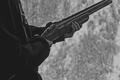
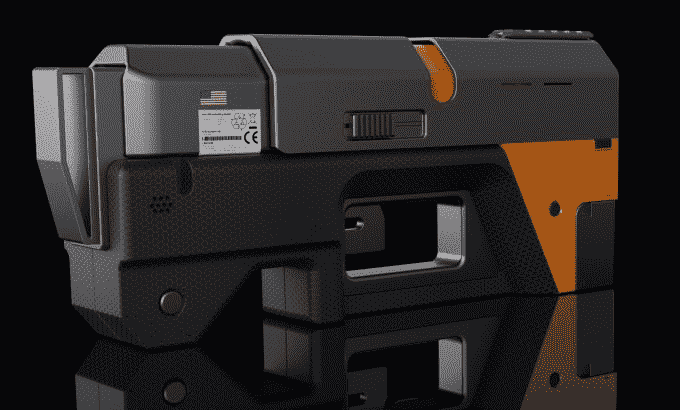

# 超越子弹 

> 原文：<https://web.archive.org/web/https://techcrunch.com/2016/07/13/beyond-the-bullet/>

在这一点上，对枪支暴力的反应像钟表一样准确。

上周枪击事件的新闻报道一播出，这个国家就陷入了一种熟悉的仪式。首先，是震惊，然后是悲伤，然后是愤怒，然后是……无助。每次枪支死亡进入国家话语，我们都要经历这些动议。

甚至无助也成了一种仪式:首先我们看到对枪支法的强烈批评。然后是回应:第一组被指责将悲剧政治化。现在处于守势的原团体发表了一份更加强硬的声明，要求政治家们采取行动。尽管辩论双方的每个人现在都充分意识到政客们将无所作为，但所有这些还是发生了。

这已经成为一种可悲的模式，但是自 1968 年以来，关于枪支和枪支暴力的辩论[一直遵循着类似的模式。那一年标志着枪支控制法案的通过，以及土拨鼠日式应对枪支暴力的开始。](https://web.archive.org/web/20221006022621/https://www.washingtonpost.com/national/history-of-gun-control-legislation/2012/12/22/80c8d624-4ad3-11e2-9a42-d1ce6d0ed278_story.html)

双方的支持者都提出了通常的论点:反枪支团体可以证明我们在枪支控制方面做得还不够；支持枪支的团体可以辩称，枪支管制永远不会奏效。但是任何一方都不能否认的是，我们未能显著减少使用枪支造成的死亡人数。据估计，自 1968 年以来，已有 140 万人因枪支暴力而死于枪伤。

面对这样的数据，以及辩论的瘫痪性质，我们有没有可能一直在错误的地方寻找答案？有些人渴望我们的领导人通过更强有力的法律，相信我们可以通过立法解决这个问题。但是在这样一个宇宙中，通过这样的法律看起来越来越不可能，而且这些法律的有效性受到严重质疑，难道不应该有另一种方法来解决这个问题吗？

还有一个答案。

在我们经济和生活的其他领域，看似无解的问题被技术专家们发现了。不可避免的是，面对“我们永远也不会弄清楚”的问题，有人会出现并颠覆我们一直以来的做事方式。创新经常给我们意想不到的优势。例如，有人问，一匹马的运动能否被压缩成一辆汽车。

一对兄弟——自行车机械师——制造了一台机器来模拟鸟类的运动。我们手机上的一个小图标让我们质疑出租车行业的垄断。一个网站引导我们预订度假的房屋，而不是酒店。没完没了。

在所有这些例子中，我们都觉得看似不可能的事情是不可避免的。一个 app 当然可以叫我们车！当然，马达可以代替马的动力！当然啦！最终，旧的做事方式似乎无可救药地过时了；我们不知道我们怎么会认为是做事的正确方式。

这就给我们带来了一个关于枪支的自然问题:为什么这么多年过去了，我们仍然在射击热铅和非常高的速度？除了发送一个小球撕裂人类的皮肤和骨骼以及血液之外，我们还没有找到任何更好的自我保护方法吗？几百年后，我们基本上已经有了更快更好的火枪？

真的吗？

当你问这样的问题时，你会回到基本原则。特别是，为什么人们首先要买枪？答案是:保护自己免受暴力袭击。

夺取他人生命的唯一理由是，你必须这样做是为了保护你自己或你亲近的人免受迫在眉睫的死亡或严重伤害的危险。简而言之:杀戮一直是抵御被杀的唯一选择。

这是我们留下的错误选择——阻止暴力袭击者的唯一手段是一种可能结束袭击者生命的设备，基本上是一种已经使用了几百年的技术的升级版本。但是如果事情不一定是这样呢？换句话说，如果有效和直接的自我防卫不需要死亡工具呢？

更直截了当地说:如果我们有办法让一个人丧失能力，而不用一颗子弹结束他的生命，会怎么样？

在 FwdForce 网站上作为项目列出的非致命自卫武器的概念图像

这听起来可能很荒谬。但是在 1902 年，载人飞行的想法也破灭了。这个想法被认为是如此古怪，以至于任何尝试飞行器的人都很快被贴上了怪人或傻瓜的标签。当然，直到它发生了。突破性技术往往遵循这种模式:被视为疯狂，直到它被接受为我们生活中自然的一部分。1962 年，将人类送上月球的想法似乎是科幻小说中的幻想——直到它被实现。在中世纪的欧洲，把佳能的力量放进我们的口袋似乎是不可能的——直到枪被创造出来。

我想象下一种自我保护会经历这个过程。它会被认为是疯狂的、笨拙的和不可想象的——直到它成为标准问题。我也认为我们正处于这个新时代的尖端。

我们正处于历史的转折点，不再有任何正当理由让事情变得更加致命。我们必须把努力集中在新的方向上。正当的自我保护总是与对他人造成死亡联系在一起。当我们打破这种联系会发生什么？当人们能够满足自我保护和保存的基本需求而不发生杀人的悲剧时，会发生什么？

对我来说，这不是无聊的猜测。我有两个高中朋友在一起公路暴力事件中被枪杀。这时候我开始更深入的思考这个问题。就在那个时候，我去了欧洲学习，我看到他们的社会是如何用怀疑和嘲笑的眼光看待我们的枪支文化的。他们让我有机会退后一步问:为什么？

23 岁回到美国后，我将枪支暴力问题视为一项技术，而非政治问题。

我设法找到了一位前美国国家航空航天局的工程师，他从 20 世纪 60 年代中期就开始在这个领域工作，用的是一种叫做“泰瑟枪”的设备。由于种种原因，这项技术还没有成熟到实用的程度。1993 年，我们开始再试一次，用朋友和家人的一些资金创办了一家公司。

> 一个承认:今天，这种 NMI 技术不是火器的合适替代品。它主要用于威胁级别较低的情况；通常，这是一种在事态升级前化解危机的方式。

我们花了大约七年的时间才发现最大的技术障碍——如何让这项技术真正有效。一旦我们在名为 M26 的产品中实现了近乎完全的失能，或神经肌肉失能(NMI)，该技术就迅速在全球执法界传播开来。

一个承认:今天，这种 NMI 技术不是火器的合适替代品。它主要用于威胁级别较低的情况；通常，这是一种在事态升级前化解危机的方式。

但它越来越接近成为一种真正的、彻头彻尾的枪支替代品。这项技术的发展速度超过了我们任何人的预期，鉴于传统枪支领先了几个世纪，我喜欢我们的胜算。

2010 年 3 月 12 日，在德国南部城市努尔贝里举行的国际武器交易会上，Armatix 的一名员工在展示“智能枪概念”时为摄影师摆姿势。1150 家参展商参加了将持续到 2010 年 3 月 15 日的交易会。(图片:约尔格·科赫/法新社/盖蒂图片社)

我们不是唯一在解决这个问题的人。一家名为 Zore 的以色列公司发明了一种智能枪，通过使用技术防止枪支被除所有者之外的任何人使用，该公司刚刚在 Indiegogo 上筹集了 30 万美元。

“智能枪”竞赛吸引了众多业余发明家和爱好者[。这并不意味着解决方案是完美的，但重要的是寻找一些替代方案。这意味着枪支暴力问题是一个可以解决的问题，在这个问题上，技术可能会给我们带来政治无法带来的优势。](https://web.archive.org/web/20221006022621/https://medium.com/@FastCompany/whatever-happened-to-that-so-called-smart-gun-218da0ecdf71#.1qt9zj546)

真正的问题将会在这项技术完成时出现。当它到来的时候——当我们已经获得了与致命武器相匹敌甚至更胜一筹的非致命武器的时候——我们将会进行一些重要的自我反省，思考我们为什么会选择杀人武器而不是不杀人的武器。但目前，我和其他人只是在努力，希望有一天这个问题成为一个合理的问题。我想，答案是不言而喻的。