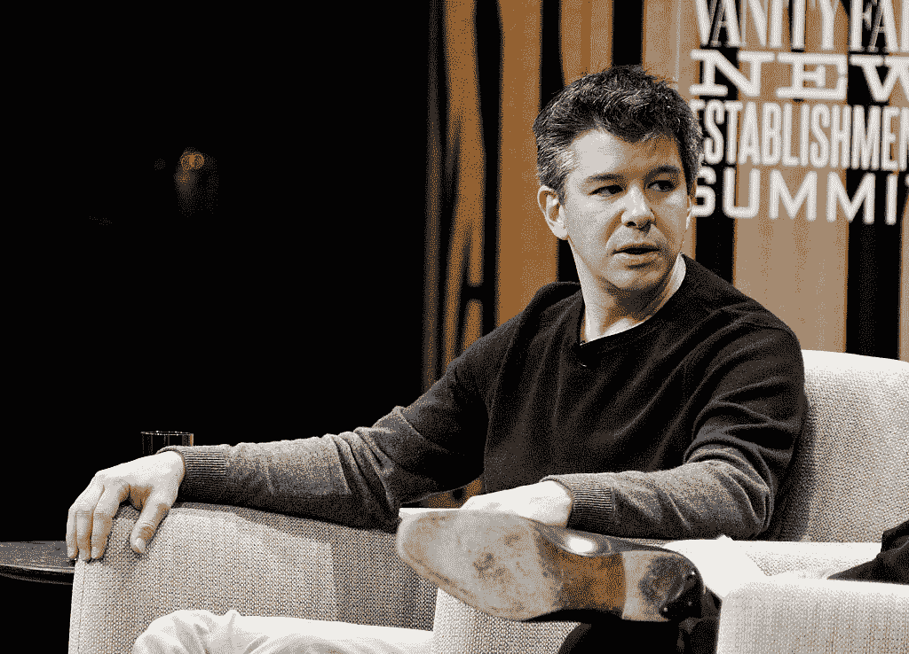

# 超越多元化报告 

> 原文：<https://web.archive.org/web/https://techcrunch.com/2017/05/07/beyond-the-diversity-report/>

曾经有一段时间，每个人心里都知道科技行业是超级白人和男性主导的，但却没有数据支持。

现在，像脸书、苹果、推特、谷歌、亚马逊、网飞以及最近的这样的公司，已经发布了他们的报告，统计数据就在那里。很多人认为该行业缺乏多样性，这一想法被证明是正确的。

自从 2013 年 [第一份多样性数据出来](https://web.archive.org/web/20221007051402/http://money.cnn.com/2013/03/17/technology/diversity-silicon-valley/index.html) 以来，由于信息自由法案的要求，以及随后许多知名科技公司的自愿披露，几乎没有什么变化。

还有少数科技公司尚未发布多样性报告，包括 Lyft、Snap、Spotify、特斯拉、Twilio、Instacart、Sprig 和 Postmates。但是考虑到几乎没有什么会改变，比如有色人种的总体代表和公司文化，对于发布多元化报告的公司来说，这些公司没有发布也没什么关系。

让我们现实一点。在这一点上，发布一份多样性报告将是一个“如果你做，就该死，如果你不做”的场景。如果这些公司突然发布它们的报告，看起来它们这样做只是因为它们觉得必须这样做，而不是因为它们想要并致力于真正培养一种更加多样化、包容和公平的工作文化。这可能看起来像是一种尝试，而不是一种深思熟虑的促进多样性和包容性的尝试。但是，如果他们不发布报告，多样性和包容性似乎不是他们的优先事项。

但是，与其质疑为什么这些公司还没有发布这些报告，我将花一些时间来探索为什么这些多元化报告存在，它们实现了什么，我们希望它们实现什么，以及我们将从这里走向何方。

虽然多样性报告——通常包括一家公司雇用的女性和有色人种相对于白人男性的数量，有时还包括残疾人和 LGBTQ 人群的统计数据——在透明度和问责制方面很好，但在其他方面收效甚微。首先，他们把责任推给了“另一方”。这可能会让我们中的一些人不得不更仔细地审视自己的与众不同，并被迫比现在更多地思考这个问题。

此外，对于那些可能感到被边缘化、被忽视、被歧视或被骚扰的人来说，他们并没有改善工作环境。 我们来看看优步。在受到来自牧师杰西·杰克逊和公众的压力后，鉴于前优步雇员的性骚扰指控，该公司终于 [发布了一份多样性报告](https://web.archive.org/web/20221007051402/https://beta.techcrunch.com/2017/03/28/uber-first-diversity-report/) 。很糟糕，但这不是我们见过的最糟糕的报告。这告诉我们，原始数字和百分比对文化没有影响。这只是表明，你不能通过一家公司的“我们所见过的最差的”数据来判断它的文化。

2016 年 10 月 19 日，在加利福尼亚州三藩市芳草地艺术中心举行的名利场新机构峰会上，优步首席执行官特拉维斯·卡兰尼克在舞台上发言。

平等就业机会委员会要求公司收集有关种族、性别、工作类别和级别的数据。但仅此而已。它没有涉及一家公司雇佣了多少同性恋、双性恋、变性者和酷儿。它不会询问有关残疾人的信息。它也不要求交叉身份数据。当一些公司发布他们的报告时，他们使用自己的调查来获得 EEOC 在年度调查中没有收集的信息。

科技公司最大的自主权在于决定如何处理这些数据:公开还是保密；公开，设定目标(很少有公司设定公开目标)；保持私密，设定私密目标。

处理这种情况有很多方法。尚未发布报告的科技公司可能会辩称，他们认识到这些报告作用甚微，而是专注于更有意义的变革。当然，这种类型的论点会遇到很多审查，但我愿意倾听。最重要的是，科技公司的内部结构和协议为所有种族、性别、年龄、能力等的人营造了一个安全、包容的工作环境。

我并不是建议科技公司停止发布多样性报告。我也不是说那些没有发布报告的人就不要发布报告。我的意思是多样性报告没有完成他们应该完成的任务。

这些多样性报告不应该简单地存在。他们被认为会带来真正的改变，比如更多代表不足的少数民族、LGBTQ 人群和残疾人的就业。他们应该激励领导者想要做得更好，为每个人创造一个更好的工作环境——一个反映我们生活的文化的环境。展望未来，科技公司需要重新思考对多元化和包容性的责任和承诺是什么样的。

多元化报告只是打破这个异性恋、白人、健全、有头脑、男性主导的科技行业的漫长旅程的第一步。与历史上的黑人大学和组织合作，专注于将代表性不足的年轻人带入技术领域，对已经在技术领域就业的人没有任何帮助。这些伙伴关系不会让人们停止在工作时询问黑人女性的头发。他们不能阻止种族主义和性别歧视。它们无助于确保变性人和性别不合群的人有一个安全的地方使用卫生间。他们也不能确保老板和同事使用正确的代词(他/他，她/她，他们/他们，等等。)和他们跨性别不合群的同事。我可以继续说下去，但你可能已经明白了。

我没有解决办法，但我有一些建议。首先，白人需要加入进来，我们这些关心多样性和包容性的人需要张开双臂欢迎他们。我们需要尽可能多的盟友。正如 Slack 高级工程师杜蕾蒂·希尔帕所说，我们需要帮凶。

有许多资源可供大大小小的科技公司实施促进多元化和包容性的流程。例如， [项目包括](https://web.archive.org/web/20221007051402/http://projectinclude.org/) ，有一堆免费的建议来推进公司的多元化和包容性。

代替提供无意识偏见培训，或者除此之外，雇主可以提供同理心培训。人们能够与那些不喜欢他们的人互动是很重要的。我们还需要关于员工保留和文化的数据，这些数据可以包含在多元化报告中，这样我们就可以继续让各个公司对其办公室内发生的事情负责。

下面是我愿望清单上的一些其他事情

1.  关于有色人种、残疾人、退伍军人、LGBTQ 人群等就业的标准统计。
2.  保留和提升数据
3.  招聘和保留目标
4.  文化调查和结果(思考:员工对公平性的反馈、对公司的偏见、发展机会等)
5.  按种族、年龄、性别、退伍状态、残疾状态细分的薪酬数据
6.  中性浴室
7.  公司表格中没有前缀，如先生、夫人、女士等。是啊，都不是。
8.  领导层对多元化重要性的认可
9.  公平透明的晋升和薪酬流程

随着时间的推移，随着更多的废话不断出现，我可能会添加到这个列表中。科技公司，如果你正在阅读这篇文章，请放心继续多样性报告，但也请认识到，这些报告只是一个开始。这种伙伴关系很好，但不是一个成熟的解决方案。没有万无一失的方法来做好这一点，但请尝试做得更多。我可以向你保证，你总是可以做更多的事情，让所有员工的工作做得更好。