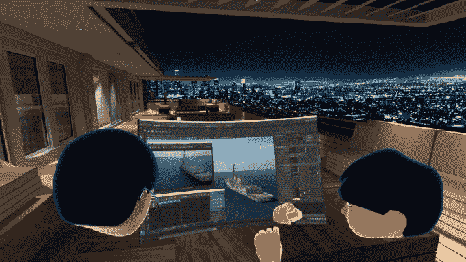

# Bigscreen 获得 1100 万美元资金，用于打造完美的虚拟电影观看应用

> 原文：<https://web.archive.org/web/https://techcrunch.com/2017/10/10/bigscreen-nabs-11m-in-funding-as-it-looks-to-build-the-perfect-virtual-movie-watching-app/>

# Bigscreen 获得了 1100 万美元的资金，用于打造完美的虚拟电影观看应用

大屏幕显然意味着赚大钱。

虚拟现实远程桌面应用 [Bigscreen](https://web.archive.org/web/20230317061412/http://bigscreenvr.com/) 已经为其钱袋增加了 1100 万美元的首轮融资，因为它希望在虚拟现实耳机市场建立自己的同时，经受住投资者对虚拟现实兴趣的减弱，并建立自己的技术。

这轮投资由 True Ventures 牵头，之前的投资者 Andreessen Horowitz 也参与了投资。《T2 日报》最先报道了融资消息。

Bigscreen 使用远程桌面流让多个用户在 VR 中观看他们 PC 屏幕上的内容。该平台目前可在 Oculus Rift 和 HTC Vive 上使用，并将于下周在微软的 VR 耳机平台上推出。

目前这项技术的主要焦点是观看视频；该公司最近推出了一个巨大的动态照明电影院环境，用户显然已经在其中度过了一段时间。该公司今天在一篇博客中宣布，它现在拥有超过 25 万注册用户，并指出其高级用户每周在该应用上花费 20-30 多个小时。

未来，该公司有兴趣看看它的虚拟现实技术能把生产力带到哪里。

“Bigscreen 的最初灵感是建立虚拟办公系统，这仍然是我们认为对 VR 和 Bigscreen 非常重要的应用之一。因此，随着时间的推移，我们将继续专注于此，”首席执行官 Darshan Shankar 说。

Bigscreen [刚刚在 2 月份从 Andreessen Horowitz 和其他人那里筹集了 300 万美元的种子资金](https://web.archive.org/web/20230317061412/https://techcrunch.com/2017/02/24/vr-social-productivity-app-bigscreen-raises-3m-in-round-led-by-andreessen-horowitz/)，但是 lean remote 团队还没有花掉这笔钱。Shankar 告诉 TechCrunch，这次加薪主要着眼于未来。

“在过去的一年里，虚拟现实的种子和首轮融资实际上已经完全枯竭。Shankar 说:“在过去的一年里，我没有看到多少对虚拟现实的新投资。“我们做得真的很好，我们希望确保在未来几年里我们有足够的资金来追求我们雄心勃勃的东西，而不是在我们没钱的时候筹集资金。”