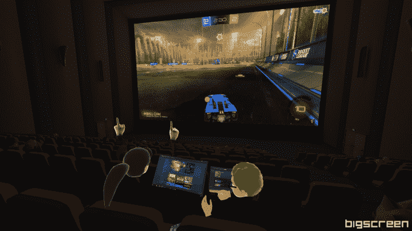

# 大屏虚拟现实应用通过最新更新获得了迄今为止最大的屏幕

> 原文：<https://web.archive.org/web/https://techcrunch.com/2017/07/25/bigscreen-vr-app-gets-its-biggest-screen-yet-with-latest-update/>

随着今天的最新更新，[大屏幕](https://web.archive.org/web/20230327215033/http://bigscreenvr.com/)名副其实。

安德森·霍洛维茨支持的虚拟现实应用程序将获得自 Cinema Update 推出以来最大的更新之一，该应用程序将一个庞大的动态照明 IMAX 般的影院环境引入应用程序，允许用户以一种非常史诗的方式在 PC 上观看电影、玩游戏和工作。除了大屏幕之外，big screen 还进行了许多更新，因为它转向了 C++内置的新引擎，首席执行官 Darshan Shankar 表示，这将大大减少 CPU，GPU 和 RAM 的使用。

虽然社交功能很突出，经常让应用程序感觉像是在与 VRchat 和 AltspaceVR 等应用程序进行正面交锋，但 Bigscreen 从根本上说是一个屏幕共享应用程序，而且是一个非常好的应用程序。虽然大多数桌面应用程序可以支持 PowerPoints 等内容，但在任何视频相关内容的压力下都会崩溃，但最新的更新将能够以 30fps 的速度播放 1080p 视频。此次更新还带来了立体声的原生桌面音频流，因此您可以使用您选择的任何扬声器来欣赏它。

此外，最新的更新为更多用户带来了大屏幕，增加了实验性的 Windows 7 支持，并为由 Nvidia Optimus 驱动的笔记本电脑带来了一些爱。

我有机会进入虚拟现实，与大屏幕团队的一些人一起检查新的更新，巨大的电影院屏幕唤起了最近去 IMAX 看敦刻尔克的一些片段。(Shankar 说这个数字屏幕大约有 100 英尺宽。)

“影院视图”已经成为许多不同的 VR 头戴设备视频应用的重要组成部分，因为 360 内容通常很糟糕，制作精良的东西通常很简洁，而令人惊叹的球形视频仍然几乎无处可寻。对于像网飞、HBO 和 Hulu 这样的公司来说，这是一种必要的邪恶，因为他们 99.99%或 100%的内容都在 2D。

说实话，把你的内容完全从你的世界中分离出来是有好处的，尽管这可能被夸大了。对于大多数产品来说，问题在于你所处的影院环境因为试图过于新潮和独立而分散了对内容的注意力。

Bigscreen 过去也有这个问题；最新的更新纠正了这一点。最酷的事情之一是屏幕共享内容改变剧院动态照明的方式。当屏幕亮起时，在你旁边观看的人工智能机器人的脸也会亮起(在更新的环境中，最多有 40 个 NPC)。

虽然这款应用程序允许与最多四个其他用户进行社交分享，但花在这款应用程序上的大部分时间都是在单人模式下完成的。Shankar 告诉我，该应用总使用量的 60%是用户自己做的事情。该应用的高级用户(前 5%)平均每周在该应用上花费 20 到 30 个小时*。在接下来的六个月里，这家初创公司希望扩大目前最大房间的大小。*

 *目前，要使用这款免费应用，你需要一台 HTC Vive 或 Oculus Rift，但该公司计划很快增加对移动 VR 平台的支持。*