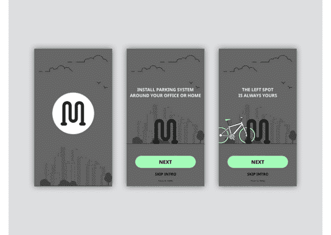

# 自行车停车场。俱乐部将社交网络连接到城市的自行车锁 

> 原文：<https://web.archive.org/web/https://techcrunch.com/2017/05/14/bikeparking-club-brings-connects-a-social-network-to-bike-locks-in-a-city/>

# 自行车停车场。俱乐部将社交网络连接到城市的自行车锁

帕洛阿尔托有一个自行车锁的问题，两个软件开发人员和一个设计师本周末在纽约尝试在 24 小时内解决这个问题。

Eugene Tonev、Alexander Sivura 和 Yuri Dymov 目前在健康创业公司 HealthTap 工作，他们组装了一个你可能在帕洛阿尔托街头看到的自行车架模型。但是这个架子上有一个相连的锁，配有一个社交网络，可以按需激活。这是一款名为 BikeParking 的应用程序的一部分。俱乐部，这是一个骑自行车的人的网络，可能会安装这样的结构和锁，以确保他们总是在附近的某个地方有一个位置放他们的自行车。所有这些都被整合在一起，并在今年的 TechCrunch Disrupt 纽约黑客马拉松上发挥了作用。

“你总是需要带着所有这些链子，或者买两条链子，一条放在办公室，一条放在家里，”Tonev 说。“你总是有一个锁在你的地方。因此，如果你到处都有连锁店，为什么还要分享它们呢(以确保你总能在某个地方找到一席之地)。”

他们在舞台上展示的原型是从附近的家得宝(Home Depot)拉过来的管道和水管的模型——但它类似于现实世界中的锁网络。用户连接到应用程序，这可以帮助他们找到附近的空地，然后让他们能够将自行车锁在行李架上。这三个人每天骑自行车去上班，这就是为什么他们认为这是一个可能在某个时候需要答案的问题。

托涅夫说，最大的问题是双重的:有足够多的骑车人可以进入的地方；而且不用到处带着锁来确保那些自行车(希望)呆在那些地方。因此，当用户安装一个锁时，他们将自动进入城市周围的停车网络，同时始终可以进入他们安装的锁的某个位置。

“这个锁是一个入口，在那之后——如果(成千上万骑自行车的人)有一半安装这个锁(在帕洛阿尔托)，我们马上就会有大约 35 万个自行车停车场。”

当然，这是一种黑客行为，但根据三人组的说法，HealthTap 鼓励他们尝试新的想法。对于一家医疗创业公司来说，开放自行车世界可能不是一个陌生的想法，尽管软件开发人员突然不得不处理硬件问题有点高要求。因此，谁知道它会去哪里，但至少当他们飞回海湾地区时，他们将有另一个整洁的项目扔在他们的投资组合上。