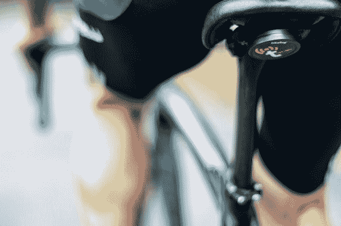

# BikeTag 是一款智能自行车安全传感器

> 原文：<https://web.archive.org/web/http://techcrunch.com/2015/07/20/biketag-is-a-smart-safety-sensor-for-cycling/>

硬件初创公司 Tagit Labs 正在为极限运动开发一种跟踪和安全设备，最初专注于自行车运动。联合创始人约翰·安东尼本身就是一名竞技自行车手，所以对被撞下自行车略知一二。

这家成立于一年前的初创公司刚刚开始为其即将推出的小发明[bike tag](https://web.archive.org/web/20230320061432/http://www.biketag.com/)——安东尼称之为“智能安全”标签——进行预购，目的是在 9 月初向买家运送第一批产品。基本设备的 RRP 将为 100 美元(包括自动跟踪和碰撞检测功能)。通过高级订阅服务，附加功能将需要更多费用。

虽然市场上已经有几十种用于健身和运动的 GPS 追踪器，但 BikeTag 的目标是为其他追踪器补充自行车专用功能(如基于事件的警报，如“骑行结束”或撞车警报)，并与其他追踪服务互操作。安东尼指出，例如，自行车标签可以设置为自动上传锻炼到斯特拉发。

它还旨在通过建立一个强大的、以安全为导向的标签来在该领域脱颖而出，这种标签需要很少的机构来持续操作，这意味着乘客不必在每次乘坐前考虑启用它或打开特定的安全功能。一旦设置好了，他们就骑上自行车走了。

“虽然我更喜欢骑自行车，出于健身/竞争的原因，也作为通勤的一种方式，但很明显，骑自行车的人在整体安全空间方面存在差距。他告诉 TechCrunch:“具体来说，没有任何产品能够无缝地(自动地)让骑手和骑手最亲密的家庭成员或朋友放心，让他们在骑行时感觉良好。”。

你可以将这种想法与联网家庭设备的轨迹进行比较——以智能灯泡为第一代例子，用户可以通过应用程序控制室内照明条件。然而，随着家中越来越多的设备联网，必须使用一个应用程序来控制你拥有的一切显然是不合适的。更多的自动化操作开始变得至关重要。(我们已经在像 [Stack](https://web.archive.org/web/20230320061432/https://techcrunch.com/2014/09/09/stacks-smart-sensor-packed-light-bulbs-run-autonomously-no-app-interactions-required/) 这样的初创公司中看到了这种想法，例如，他们正在制造带传感器的灯泡。这个想法是想办法让物联网能够自己思考。)

Tagit Labs 将这种自动操作视为一种核心优势，希望最终成为一系列适用于不同极限运动的智能安全标签。在第一个例子中，BikeTag 使用了运动传感器、算法和 iBeacon 技术的混合来为追踪器提供动力，一旦骑手离开，追踪器就会进行追踪。它还依靠骑手智能手机中的 GPS 无线电来减少电池负载。

“为了实现一年以上的电池寿命，同时实现 100%的自动化，我们使用运动传感器来了解自行车何时移动，并结合 iBeacon 技术来了解骑车人何时靠近自行车，以开始打开 BikeTag 安全功能，”Anthony 解释道。

“例如，即使满足了这一条件，我们也不会一次打开所有功能，因为这会对自行车标签和用户的智能手机电池造成不必要的消耗。相反，我们使用运动算法和启发式算法在需要时打开某些功能。”

为什么 BikeTag 需要成为独立的硬件？如果他们需要随身携带，难道就不能是骑手手机上的一个应用吗？Anthony 声称，需要单独的标签硬件来减少电池消耗，同时实现更自动化的操作。

他补充说，BikeTag 中的特殊传感器能够提供比智能手机传感器更精确的碰撞数据，他声称:“我们将检测到每一次坠落/碰撞，很少或没有误报。”

随着设备数量的激增，极低摩擦运行显然将成为物联网越来越重要的要求。同样重要的是构建能够以支持用户想要做的方式自主运行的智能硬件，而不是完全从他们手中夺取控制权。承受压力而不是简单地掌控是必要的平衡。

因此，BikeTag 确实有一个配套的应用程序，用户可以访问“细粒度”的控制，例如，指定与谁共享他们的骑行状态、位置和事故信息。“用户总是能控制谁能看到什么，”Anthony 补充道。

该团队在产品开发的这个阶段有生产单位——安东尼说这是在“测试的最后阶段”

“MVP 功能(自动跟踪、碰撞检测、碰撞警报)的所有开发都已完成。他补充道:“目前，我们正在对 BikeTag 移动应用程序进行一些小的修正，并采纳测试人员的反馈意见。

在向买家发货之前，还需要做的工作包括最终确定高级实时跟踪和乘车提醒功能。他补充说，最初的自行车标签将是 iOS，但对 Android 的支持正在进行中。