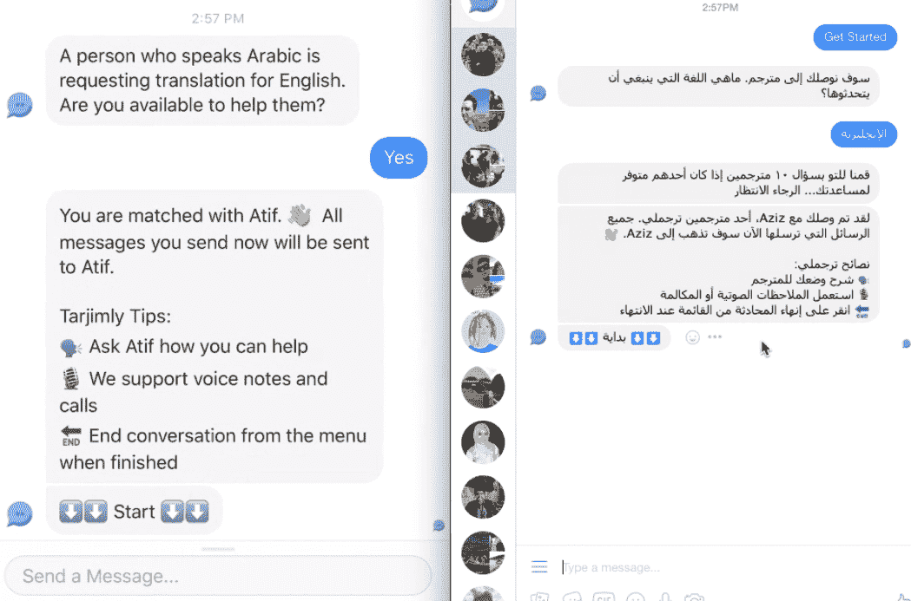

# 双语？Tarjimly 让您立即帮助难民或援助人员 

> 原文：<https://web.archive.org/web/https://techcrunch.com/2018/02/13/bilingual-tarjimly-lets-you-help-a-refugee-or-aid-worker-right-now/>

在世界各地，语言障碍限制了难民和移民寻求帮助的能力，也限制了援助人员提供帮助的能力。Tarjimly 是一项新服务，可以在几分钟内将会说一种语言但需要说另一种语言的人与会说两种语言的人联系起来。它们是 Y Combinator 最新一批产品的一部分，经过一年的打造，现在正式推出。

该公司的联合创始人阿齐兹·阿尔古奈姆(Aziz Alghunaim)和阿提夫·贾韦德(Atif Javed)告诉我，该公司是如何从他们分别在 Palantir 和甲骨文工作时建立的一个副业项目中崛起的。那是一年前，从中东涌出的难民潮正在增长。

贾韦德说:“我们想大规模地帮助难民，并决定利用我们的工程经验。”“实际上，我们在一年前第一次穆斯林禁令期间宣布了该产品的第一个早期版本——我们得到了很大的反响，因为人们很高兴有除了捐款或发送电子邮件以外的其他帮助方式。”

“我们在两天内就有 1500 人注册了，”Alghunaim 补充道。"我们决定建立一个科技非营利组织来解决这个问题，并于一月份退出."

基本的问题很简单，没有足够的翻译人员，他们的工作不能因为找到一个可能需要几天或几周的时间而推迟；有时，就像在有迫在眉睫的危险或关键的后勤问题的情况下，它甚至不能被延迟一个小时。

阿尔古奈姆说:“翻译是一种稀缺资源，而且极其昂贵。即使是更常用的语言，如西班牙语和德语，每小时也要 80 美元。“但是，如果你面前有一个来自伊拉克的家庭，他们说库尔德语。你的资源极其有限。甚至还有库尔曼吉库尔德语，索拉尼库尔德语，所有这些方言。”

你不可能在每个救援点或总部都配备几十名翻译，其中一些人可能一周只工作几个小时。依赖当地社区(一些救援人员就是这样做的)也不是一个好的选择，因为从定义上来说，当地居民才是需要帮助的人，而且无论如何，他们可能不会存在太久。这就是 Tarjimly 的切入点。

## 快速周转翻译

目前，Tarjimly 只在 Facebook Messenger 上使用，但一个独立的多平台应用程序正在开发中，它将允许跨平台聊天，例如 Messenger 或 WhatsApp 和 SMS 之间的聊天。使用聊天界面，援助提供者或难民指出他们自己的语言和他们需要与之交谈的人的语言。

Tarjimly 搜索其志愿者数据库，并使用一点机器学习(自然地)，它发现用户最有可能快速响应。当它找到一个时，它通过聊天界面将两者连接起来；为了使事情变得简单和匿名，消息通过 Tarjimly 的服务器进行中继，这既掩盖了用户的 id，又允许跨平台聊天。

右边是请求用户的屏幕(阿拉伯语)，左边是志愿者的屏幕。

一旦连接上，用户就可以输入文本或发送语音信息；志愿者只是翻译它们，然后把它们发回给用户，让他们与对话者分享他们的感受。可以请求音频和视频聊天，也可以将文档和图像发送给翻译人员，以防在签署某些东西或排队等候之前需要快速咨询。

这个想法不是指导人们通过像移民这样的主要过程——长时间的采访、技术语言等等仍然需要专门的翻译——而是处理时间敏感的事情，比如分发食物和水，或者解释一个事件或伤害。

“我们专注于实时部分，”Alghunaim 说。“我们希望在难民和服务提供者之间架起一座桥梁。”

贾韦德说:“难民不断与援助人员互动。“这些人无时无刻不需要这个——就像每一个救援人员每天都需要这个一样。”

现在，这项服务平均 90 秒就能找到一个匹配，而这些“微志愿”行为通常只持续几分钟。目前支持 16 种语言(加上方言变体)，重点是主要难民人口使用的语言:英语、阿拉伯语、波斯语、普什图语、乌尔都语、西班牙语、法语、希腊语、意大利语、孟加拉语、土耳其语、索马里语、德语、葡萄牙语、库尔德语和缅甸语。

这项服务的 2500 多名翻译已经在启动前的时间里帮助了 1000 多名难民。

[YouTube https://youtu.be/NZp0a7_zTUg]

(想知道机器翻译在这里是否有作用？事实是，在很多情况下这还不够好。联合创始人在麻省理工学院和之前的工作中曾在这一领域工作和学习，他们相信它还没有准备好这样的应用程序，无论是其功能还是其部署状态。“语言理解仍然处于非常非常初级的阶段，”Alghunaim 说。)

至于糟糕的翻译的可能性，甚至可能是故意的，Tarjimly 确实让用户对他们的体验进行评级，但 Javed 在后续的电子邮件中指出，“我们正在 FB 上培养一个强大的社区，在那里译者分享反馈，想法，并指出不好的演员。我们想到的一个简单的解决方案是使用翻译互相问答。”但他补充说，到目前为止这还不是一个问题。

## 重要的地方免费

Tarjimly 作为非营利组织的定位是经过深思熟虑的；该公司旨在通过赠款和捐款资助这项服务，以便让难民免费使用这项服务——尽管难民人数众多且有积极性，但直接赚钱并不道德。

贾韦德说:“我们将从一个基于赠款的模式开始，但我们希望创造一些可持续的东西。“如果我们最终制造出一种非政府组织和政府正在使用的产品，我毫不怀疑，如果我们去对他们说，‘看，我们想继续这样做’，他们会帮忙的。”

他们认为该服务的低成本快速扩展能力是一项重要资产。

“当你申请拨款时，他们首先会问你的效率——成本与影响。我们*就这样杀死了*，”阿尔古奈姆解释道。“我们以极低的成本创造影响，并以指数方式扩大所创造的商品。不是每个人都能通过技术做到那么多。”

Javed 补充道:“我们希望以硅谷公司开发产品的方式来实现这一目标——用户至上。“我们当然希望建立伙伴关系等，但我们希望明天就能让数百万难民拿到手。”

Tarjimly 联合创始人 Aziz Alghunaim(左)和 Atif Javed(右)。

参加 Y Combinator 应该会有帮助；两位创始人都对加速器提供的资源和反馈充满热情。

下一步，除了让这项服务吸引更多的用户和志愿者，是继续与援助组织和当地的人们合作。该团队已经在这方面花了很多时间，但很快将前往希腊进行为期两周的旅行，与那里的难民和援助人员交谈并观察他们。

数百万人可以使用这样的东西，所以让我们希望它能流行起来。如果你会多种语言，可以考虑报名成为志愿者；你的几分钟时间可以对需要立即帮助的人产生重大影响。