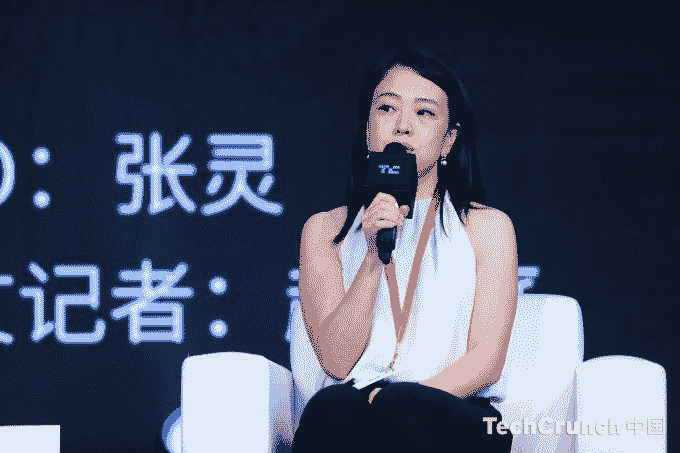

# 币安启动孵化器项目，发展早期区块链创业公司

> 原文：<https://web.archive.org/web/https://techcrunch.com/2018/08/23/binance-labs-incubation-program/>

谁需要风投？正如我在今年年初预测的那样，加密领域最大的公司正在继续通过积极的投资来构建生态系统。

[币安](https://web.archive.org/web/20230307194202/https://www.binance.com/)，世界上最大的交易所，是最新的例子。今年早些时候，该公司宣布了一个专注于培育早期区块链创业公司的孵化器项目，随后该公司向超过[10 亿美元的庞大基金](https://web.archive.org/web/20230307194202/https://techcrunch.com/2018/06/01/binance-1-billion-investment-fund/)进军。

币安实验室孵化项目[在 6 月份该公司宣布其基金时受到了嘲笑，但现在该公司已经揭开面纱并提供了更多细节——该项目非常具有侵略性。](https://web.archive.org/web/20230307194202/https://www.binancelabs.co/)

币安实验室首席执行官张艾拉(Ella Zhang)在接受 TechCrunch 采访时表示，该计划将在 10 周内每批接纳约 8-10 家公司，并补充说目标是每个季度举办一次。

这种频率是闻所未闻的，即使是那些全职做孵化器的人也是如此，但还有更多。币安实验室将向每个项目参与者发放 50 万美元，以换取该公司 10%的股份。同样，与大多数其他项目相比，这是一项巨大的努力，尽管值得注意的是，币安尚未决定是否将投资于菲亚特、crypto 或两者的结合。

除了金钱，该公司还希望开放自己，让参与者获得成为世界顶级加密交易所的好处。这将包括指导、技术建议、访问币安网络，以及对人力资源、行政等非技术性组织建设活动的支持。

首个项目将于 10 月 9 日在旧金山举行，截止申请日期为 9 月 14 日。和往常一样，该计划将以一个演示日——“BUIDLer Day”——结束，在这个演示日，初创公司将向投资者、媒体和其他行业人士进行推介。

张解释说，该项目的重点是初创企业，类似于币安基金。她说，这包括专注于基础设施、公共链可扩展性、安全性、分散式交易所、钱包、托管、支付、硬币稳定性、合规性、分散式应用、游戏、虚拟商品等项目。

理想的候选人尚未进行任何投资，因为的目标是成为第一个检查者，张说。他于 5 月加入加密公司，曾任 KPCB 中国的投资总监。

展望未来，币安的目标是每次在世界不同地区开展该项目，为区块链企业提供全球机遇。

“我们在世界各地寻找不同的城市，因为区块链和 crypto 是国际性的。我们看到不同地区的问题和机遇，以及利用区块链的不同方式，”张说。她补充说，非洲和亚洲是目前特别感兴趣的地方，但其他目的地尚未确定。

币安实验室首席执行官 Ella Zhang 在 TechCrunch 上发言

张和实验室主任 Christy Choi 解释说，大额股权支票旨在“方便”初创公司创始人，让他们专注于开发产品或服务，而不是必须建立一个企业。

考虑到这一点，这 50 万美元的投资将涵盖与孵化器项目相关的航班、住宿和生活成本，并为产品的启动和部署提供资金。该计划将与基金保持密切联系，该基金也由张的实验室部门管理，因此一旦该批项目完成，随着公司规模的扩大，将会有后续投资机会。

“币安实验室在过去几个月开始进行投资，我们看到了大量的市场炒作，这分散了许多创始人的注意力，因为投资者对他们的项目有巨大的需求，”张说。“他们需要很多帮助，才能成为一个更成熟的团队和公司，才能真正塑造他们想要做的事情。”

不像传统公司利用私人投资者的资本来启动，然后随着他们的成长，区块链和加密项目通常会迅速进入 ico。尽管这一过程通常有利可图，但可能会让他们不得不应对散户投资者对法律和其他领域的期望和担忧，所有这些都会从实际建立业务本身中窃取资源。张认为项目将帮助创始人“摆脱那些噪音，专注于他们的产品。”

币安积极的投资策略非常有意义。作为世界上交易量最大的加密交易所，在撰写本文的最后 24 小时内交易量超过 10 亿美元，它实际上是在印钞，但也完全依赖于加密行业。

根据公司的数据，币安从第一年的运营中获得了大约 4.5 亿到 5 亿美元的利润(取决于代币价格)，该公司用其季度利润的 20%回购和“烧毁”其 BNB 代币，但它将永远是加密行业的反映，因此它需要它健康发展。

既得利益意味着它必须确保世界上有有意义的区块链和密码公司。这在一定程度上解释了为什么它为每位参与者提供高达 50 万美元的奖金，并运营着一只规模 10 亿美元的基金，这只基金将用于投资基金以及直接投资初创公司。

值得称赞的是，张承认了这种情况，指出和 crypto 的真实用例将使“茁壮成长”孵化器和基金旨在发现这些案例，并使它们蓬勃发展，问题是币安是否能找到足够多它正在寻找的东西。

*注:作者拥有少量加密货币。足以获得一种理解，不足以改变一种生活。*