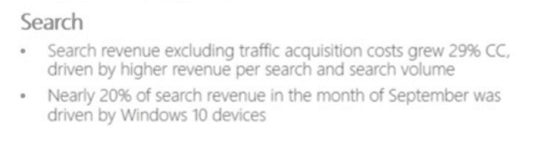

# 必应盈利

> 原文：<https://web.archive.org/web/https://techcrunch.com/2015/10/22/bing-is-profitable/>

微软承诺必应将在 2016 财年停止亏损。今天，该公司[报告了该财年第一季度的业绩](https://web.archive.org/web/20230302173152/https://techcrunch.com/2015/10/22/microsoft-jumps-6-on-profit-revenue-beat-in-its-fq1/)，并透露了一个有趣的消息:必应是盈利的。

下面是[玛丽·乔·福利对这种情况的描述](https://web.archive.org/web/20230302173152/http://www.zdnet.com/article/microsofts-bing-search-business-finally-is-profitable/):

> 在[召开的 2016 财年第一季度收益电话会议](https://web.archive.org/web/20230302173152/http://www.zdnet.com/article/microsoft-q1-solid-amid-azure-office-365-windows-server-gains/)上，微软宣布必应终于实现盈利。首席财务官艾米·胡德在该公司 10 月 22 日的财报电话会议上表示，搜索为微软 2016 财年第一季度贡献了超过 10 亿美元。

我怀疑我们中的许多人都期望微软在第一季度超过其目标，所以“怎么回事？”是一个体面的问题。令人高兴的是，微软为我们准备了笔记。从收益幻灯片来看:

简而言之，收入的增长超过了前一季度的增长。这很可能会让 Bing 陷入困境。

然而，尽管所有这些都很好，但第二点比第一点更重要。微软从 Windows 10 设备的搜索中获得的每五美元中就有一美元来自于此。Windows 10 的占地面积比更大的 Windows world 小得多，这在很大程度上是因为它的相对年龄。

因此，9 月份必应收入的 20%意味着微软利用 Windows 10 作为渠道来推动其他收入的战略正在奏效；我认为可以把微软的评论理解为暗示，比如说，每个用户在 Windows 10 上的每月搜索率远远高于 Windows 8.x，这意味着更多的收入。

但是，是的，微软应该卖掉必应。或者什么的。一位分析师告诉我。