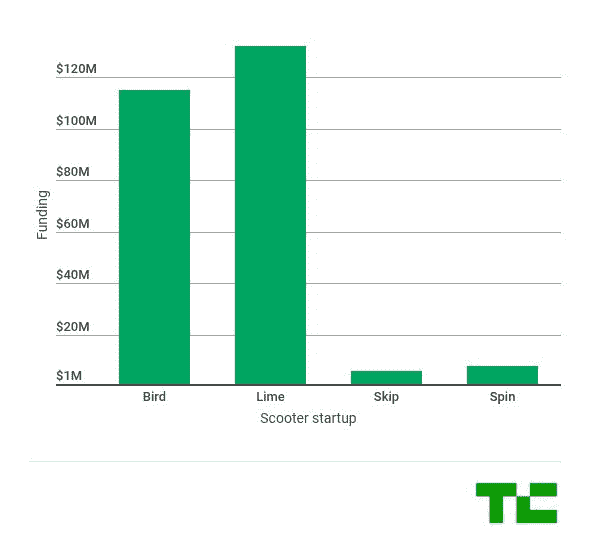

# 据报道，伯德以 10 亿美元的估值筹集了 1.5 亿美元 

> 原文：<https://web.archive.org/web/https://techcrunch.com/2018/05/29/bird-150-million-1-billion-valuation/>

# 据报道，伯德以 10 亿美元的估值筹集了 1.5 亿美元

据彭博报道，电动滑板车公司伯德在红杉资本的新一轮融资中筹集了 1 . 5 亿美元。这轮融资对该公司的估值为 10 亿美元。伯德拒绝对此事发表评论。

此前，伯德在三月份以 3 亿美元的估值[筹集了 1 亿美元。同月，](https://web.archive.org/web/20221117191813/https://techcrunch.com/2018/03/09/bird-is-raising-100-million-to-become-the-uber-of-electric-scooters/)[伯德在三藩市、圣何塞和华盛顿特区部署了它的滑板车](https://web.archive.org/web/20221117191813/https://techcrunch.com/2018/03/27/bird-expands-to-san-francisco-san-jose-and-washington/)。以下是电动滑板车公司已确认的融资轮次。然而，据报道 Lime 正试图筹集高达 5 亿美元的资金。

在旧金山，Bird、Lime 和 Spin 必须在 6 月 4 日之前将他们的滑板车从街道上移除。如果一家公司获得经营许可，旧金山市交通局将在 6 月的某个时候通知他们，他们将能够重新部署他们的滑板车。