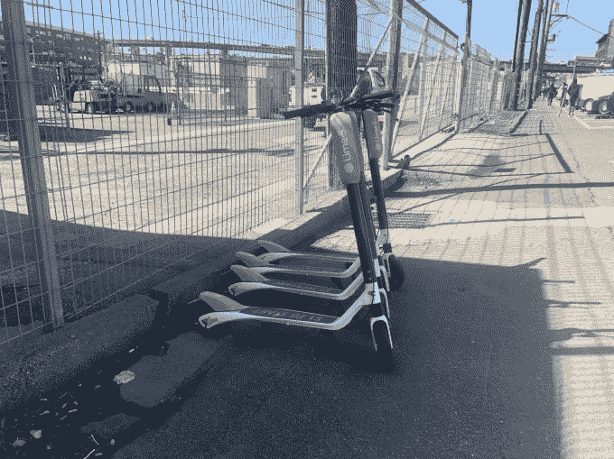

# Lime、Bird 和 Spin 不得不暂时将滑板车从 SF TechCrunch 中移除

> 原文：<https://web.archive.org/web/https://techcrunch.com/2018/05/24/bird-lime-spin-electric-scooters-san-francisco/>

作为为期一年的试点项目的一部分，旧金山市交通局已经正式发布了电动滑板车在该市运营的[许可申请](https://web.archive.org/web/20230102070958/https://www.sfmta.com/sites/default/files/reports-and-documents/2018/05/powered_scooter_share_program_permit_application.pdf)。这在一定程度上意味着，像 Bird、Lime 和 Spin 这样的公司在申请过程中，至少需要暂时将他们的滑板车从城市人行道上移走。

Lime、Bird 和 Spin——它们都是在 3 月份未经纽约市许可的情况下部署其滑板车的——必须在 6 月 7 日之前提交申请。届时，SFMTA 将审查所有申请，并计划在 6 月底之前让公司知道他们是否合格。

作为将于 6 月 4 日生效的一项新的城市法律的一部分，滑板车公司将不得在没有许可证的情况下在旧金山运营其服务。鉴于 SFMTA 要到 7 日才开始审查申请，这意味着滑板车公司需要在 6 月 4 日之前从城市人行道上移除他们的滑板车。如果他们不这样做，每家公司各自的滑板车将面临被扣押和每辆滑板车高达 100 美元罚款的风险。

“旧金山支持交通创新，但它不能以公共安全为代价，”[旧金山市律师 Dennis Herrera 在新闻稿中写道](https://web.archive.org/web/20230102070958/https://www.sfcityattorney.org/2018/05/23/san-francisco-announces-next-steps-regulating-shared-motorized-scooters/)。“这个许可证计划代表了一种深思熟虑的、协调的和有效的方法，以确保旧金山达到正确的平衡。我们可以有创新，但它必须保持我们的人行道安全，让所有行人都可以使用。我们可以有便利，但不能一路牺牲隐私和公平。该计划是向前迈出的一大步。它提供了一个框架，以确保在公共道路上运营的公司合法经营，并对其产品负责。”

旧金山的石灰滑板车

如果任何公司违反法律，在没有许可证的情况下操作电动滑板车，将自动被拒绝许可。SFMTA 的应用程序询问了诸如踏板车可用性、贫困社区的拟议车队规模、低收入人群的选择、充电和部署踏板车的流程、保险和骑手教育等问题。在 4 月份的一次监事会会议上，一些监管人员和公众对缺乏头盔和有人在人行道上骑车表示担忧。这就是骑手教育的用武之地。

为了提交申请，每家公司必须向 SFMTA 开出一张 5000 美元的支票，以支付评估费用。如果获得许可，公司必须每年支付 25，000 美元的许可费，以及 10，000 美元的公共财产维修和保养基金。公司还必须与城市共享出行数据。

本月早些时候，旧金山市对寻求获得电动滑板车许可的公司提出了要求。在为期 24 个月的试点项目中，该市将向不超过 5 家公司发放许可证。该计划将允许最多 2，500 辆小型摩托车运营，但目前尚不清楚每家公司将被允许部署多少辆小型摩托车。

自从 Bird、Lime 和 Spin 部署了他们的踏板车后，其他几家公司也表示了对电动踏板车的兴趣。例如，Lyft 正寻求在旧金山推出一项服务。优步也盯上了电动滑板车。四月，[优步首席执行官达拉·科斯罗萨西告诉我](https://web.archive.org/web/20230102070958/https://techcrunch.com/2018/04/09/uber-acquires-bike-share-startup-jump/)公司计划“考虑任何和所有的选择”,这将有助于以城市友好的方式转移交通选择。就在今天早些时候，一家名为山羊的公司在奥斯汀推出了一些电动滑板车。

> #LimeNation 旧金山，我们很高兴申请许可，并将遵守城市的要求，所有…
> 
> 由[石灰](https://web.archive.org/web/20230102070958/https://www.facebook.com/limebike/)发布于[2018 年 5 月 24 日星期四](https://web.archive.org/web/20230102070958/https://www.facebook.com/limebike/posts/2094927844116345)