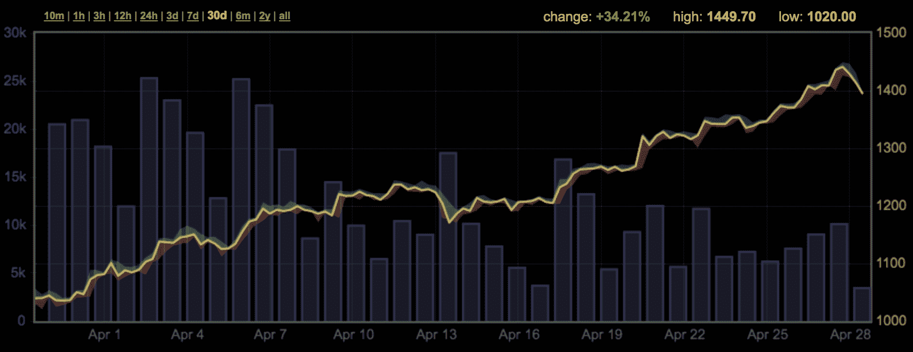

# 比特币和以太网价格创历史新高 

> 原文：<https://web.archive.org/web/https://techcrunch.com/2017/04/28/bitcoin-and-ether-prices-hit-all-time-high/>

# 比特币和以太网价格创历史新高

加密货币世界正在发生一些事情，但很难弄清楚为什么价格会飙升。比特币和以太价格目前都处于历史最高水平。

根据 Coindesk 的[价格指数](https://web.archive.org/web/20221208042932/http://www.coindesk.com/price/)，今天早些时候你可以用 1343 美元买一个比特币。它大致代表了 7 天内 6%的增长，一个月内 34%的增长。

而说到乙醚的价格，事情就更令人印象深刻了。一种乙醚[目前](https://web.archive.org/web/20221208042932/http://www.coindesk.com/ethereum-price/)价值 64.04 美元，仅一周就上涨了约 24%。

以太网价格与比特币价格有点关联，因为许多人用比特币交易以太网。但这并不能解释为什么乙醚的价格在这一周表现如此之好。

比特币仍然面临着可扩展性问题。似乎比特币的利益相关者[无法就解决方案](https://web.archive.org/web/20221208042932/https://beta.techcrunch.com/2017/04/27/how-to-fix-the-blockchain-fail-whale-problem/)达成一致，对核心比特币协议进行一些改进，以加快交易速度并降低交易费用。因此，发送和接收比特币从未如此昂贵和缓慢。

但是我注意到了一件事。当世界各地出现坏消息时，价格往往会上涨。如果唐纳德·特朗普(Donald Trump)在推特上发布关于朝鲜的消息，很可能会对加密货币产生积极影响。

相反，我注意到在法国第一轮选举结果出来几分钟后发生了一次小崩盘——几分钟后，价格又上涨了。马林·勒·庞位居第二，这对美元和欧元等传统货币来说是个好兆头。

仍然很难预测这些市场变化，因为许多变化取决于中国的宏观经济规则。但由于许多人担心当前的政治前景，加密货币可能看起来像一种安全的投资。

