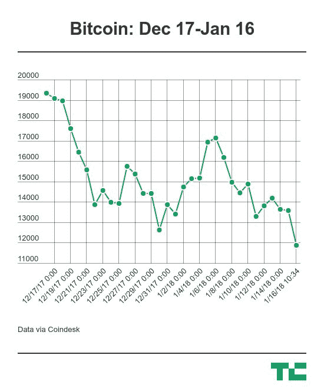
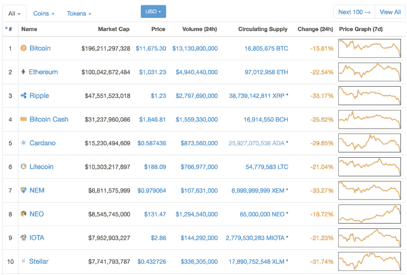
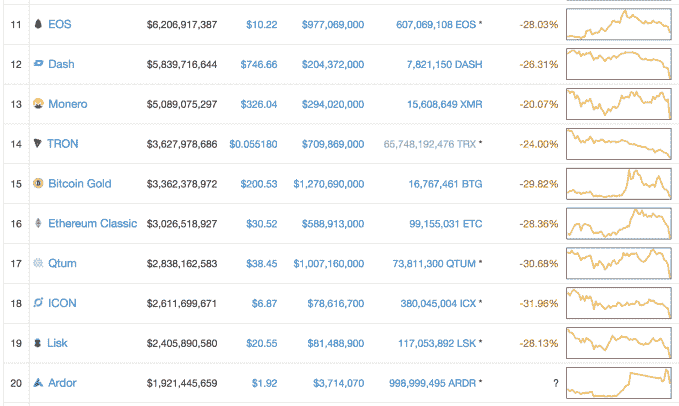
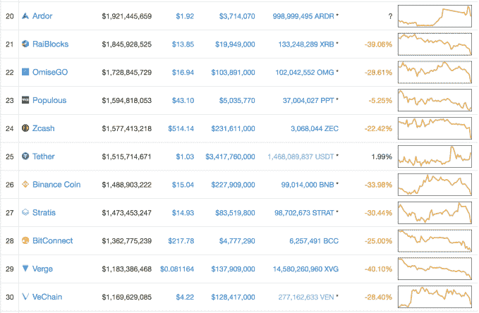
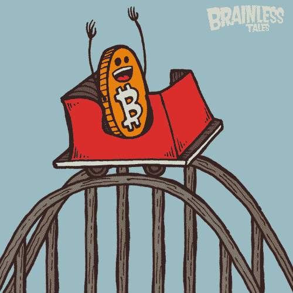

# 比特币、以太坊和几乎所有其他加密货币都在暴跌

> 原文：<https://web.archive.org/web/https://techcrunch.com/2018/01/16/bitcoin-crypto-crashed-hard-part-deux/>

如果你拥有比特币或其他加密货币，现在就把目光移开。如果你是投资者，这对你来说不会是什么新闻，但是今天整个加密市场以两位数的百分比下跌。

比特币价格暴跌 15%，自 12 月 4 日以来首次跌破 12000 美元。与此同时，以太坊下跌超过 20%，徘徊在 1000 美元以上，Ripple 下跌 33%，至 1.23 美元。

价格下跌产生了巨大的影响。[据 Coinmarketcap.com](https://web.archive.org/web/20230403082535/https://coinmarketcap.com/)称，在过去 24 小时内，价值最高的 100 种加密货币中只有一种没有亏损，该网站正迅速成为价格检查网站。那是系绳。

这与一个月前的 12 月 16 日比特币创下接近 2 万美元的纪录时相去甚远。

尽管有所下降，以太坊、Ripple 和其他 alt 币的表现基本上不如比特币。

基于硬币市值的前 10 名…

数字 11-20…

最后，在第 25 号用一点绿色墨水…

像所有与加密价格相关的事情一样，尚不清楚是什么推动了这些变化。

[彭博的一份报告](https://web.archive.org/web/20230403082535/https://www.cnbc.com/2018/01/15/china-is-reportedly-raising-the-bar-on-its-cryptocurrency-crackdown.html)昨日暗示，中国正准备阻止国内互联网用户访问国际比特币交易所。该国去年禁止了中国的交易所 T4 和国际证券交易所 T6。

上周，[有消息称，中央政府正在努力驱逐中国的比特币矿工，他们被认为占了地球上的大多数。许多大公司已经在准备向海外扩张，但这一消息震惊了市场。](https://web.archive.org/web/20230403082535/https://techcrunch.com/2018/01/08/china-is-reportedly-moving-to-clampdown-on-bitcoin-miners/)

围绕韩国监管加密的计划也有很多猜测，尽管[政府已经澄清](https://web.archive.org/web/20230403082535/https://techcrunch.com/2018/01/11/south-korea-bitcoin-regulation-story-lives-on/)它没有计划全面禁止比特币和加密交易。

密码就是密码，也有一些可供选择的理论。

https://twitter.com/CryptoKong/status/953206927365898240

当然，我们以前也遇到过这种情况——这个故事的标题可能看起来很熟悉。

[上个月圣诞节前，加密市场遭受了巨大损失](https://web.archive.org/web/20230403082535/https://techcrunch.com/2017/12/22/bitcoin-crypto-crashed-hard/)，尽管此后大多数估值都有所回升，但这就是这个领域的不稳定性。在今天的暴跌之后，这种情况仍有可能发生。事实上，一些金融市场观察家预测，随着华尔街银行家领取他们的奖金，价格可能会在本周[上涨。](https://web.archive.org/web/20230403082535/http://www.businessinsider.com/bitcoin-price-explosion-wall-street-spends-bonuses-2018-1)

*注:作者拥有少量加密货币，包括 ETH 和 BTC。*