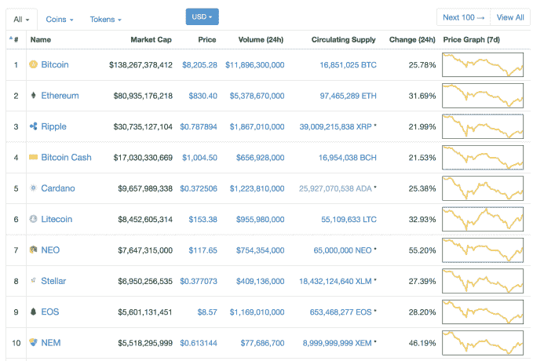
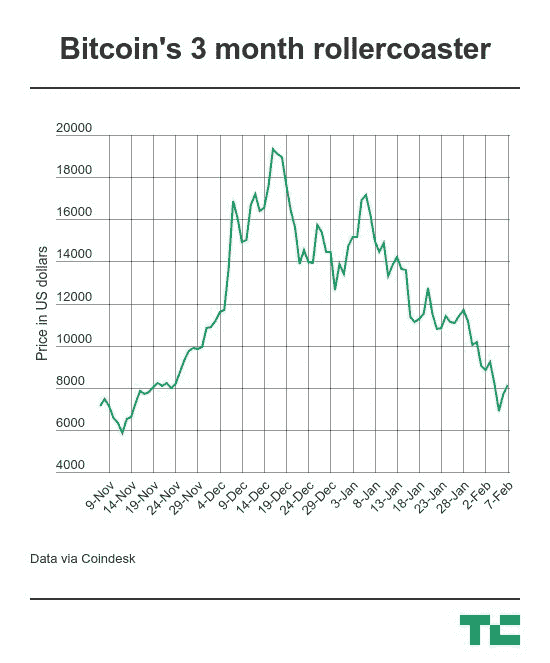

# 巨额亏损后，加密价格卷土重来 

> 原文：<https://web.archive.org/web/https://techcrunch.com/2018/02/07/bitcoin-crypto-prices-mount-a-comeback/>

什么上升，必须下降…什么下降，必须上升…？

在本周经历了一次大规模的血腥暴跌之后——比特币价格触及不到 6000 美元的两个月低点——加密市场已经全面以两位数的涨幅反弹。

【Coinmarketcap.com】——当前加密定价的热门话题——显示，在那场大屠杀之后，比特币在过去 24 小时内上涨了 26 %,达到 8200 美元。其余前五名中:以太坊同期上涨 32%，Ripple 和比特币现金均上涨 22%，Cardano 上涨 25%。

在十大最有价值的加密货币中，所有货币都上涨了至少 20%，尤其是 NEO，涨幅超过 55%。

随着 Coinmarketcap.com 的前 100 种最有价值的加密货币在过去 24 小时内都出现了增长，这种增长一直持续到尾部。

所有加密货币的总市值估计超过 3900 亿美元，其中比特币占 35%。

这标志着复苏，但总市值仍低于最近的水平。据我们报道，上周该数字为 4590 亿美元，1 月初高达 8300 亿美元。

这就是为什么，那么为什么呢？

好吧，没有人确切知道比特币或其他加密货币的价格高低，但就新闻和信号而言，过去的一周肯定是多事之秋。

就在昨天，[美国参议院的一次加密货币听证会对当前的游戏状态出乎意料地持乐观态度](https://web.archive.org/web/20221026001050/https://beta.techcrunch.com/2018/02/06/virtual-currencies-oversight-hearing-sec-cftc-bitcoin/)。尽管 SEC 主席杰伊·克莱顿(Jay Clayton)和商品期货交易委员会(Commodity Futures Trading Commission)主席克里斯托弗·吉安卡洛(Christopher Giancarlo)表达了对缺乏监管和潜在安全违规行为的担忧，但重点似乎是消除不良因素，而不是彻底消灭 crypto。

然而，在听证会开始之前，人们已经开始担心一些银行和信用卡机构让消费者更难购买比特币和加密货币。

上周，印度财政部长阿伦·贾特利(Arun Jaitley)的言论被广泛解读为对加密货币的严厉打击，在国际范围内引发了广泛的监管担忧。

“政府不承认加密货币为法定货币或硬币，并将采取一切措施消除这些加密资产在非法活动融资中的使用或作为支付系统的一部分，” [Jaitley 在预算演讲](https://web.archive.org/web/20221026001050/https://beta.techcrunch.com/2018/02/03/psa-no-india-hasnt-banned-bitcoin-but-its-still-talking-tough-on-crypto/)中表示，他也表达了对区块链技术的兴趣。

虽然他的评论集中在非法活动上，但有报道称，这一声明表明更广泛的加密货币禁令似乎是错误的，因为所有海外货币，如美元，在印度也不被承认为法定货币。根据部长的评论，比特币只不过是这个清单上的又一个补充。

然后，在韩国——一个著名的加密购买中心——的进一步更新中，一项新的[“了解你的客户”规则](https://web.archive.org/web/20221026001050/https://www.cnbc.com/2018/01/29/south-korea-cryptocurrency-regulations-come-into-effect.html)开始生效，强制要求在加密货币交易中使用真实姓名。尽管此前有报道和一些政府成员的评论，但韩国当局表示，他们计划监管而不是取缔比特币和其他加密技术。

这一切又是如何回到今天的价格上涨中的呢？

美国参议院的听证会以及韩国和印度似乎取得的进展，可能预示着未来对加密的潜在接受程度和监管程度。

但是，价格的上涨也可能只是因为加密爱好者的低价购买。这就是这一切的美妙之处。你可以列出所有你想要的理论，但市场运动可能只不过是从秘密人群中的机会主义购买。

*披露:作者拥有少量比特币和以太坊。*