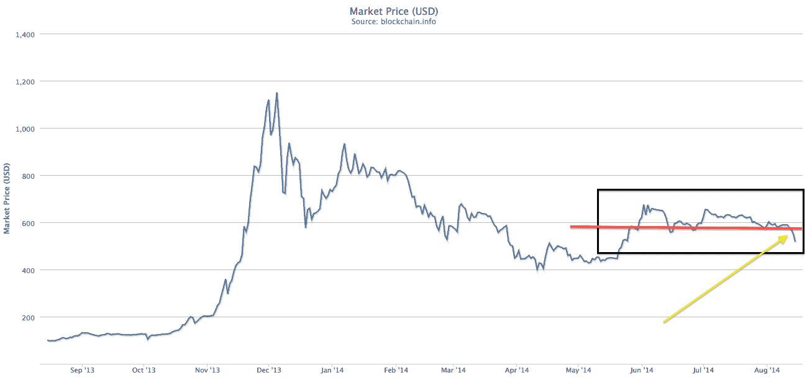

# 比特币跌出交易区间 

> 原文：<https://web.archive.org/web/https://techcrunch.com/2014/08/14/bitcoin-falls-out-of-its-trading-range/>

# 比特币跌出其交易区间

在几个月无所事事之后，比特币的价格终于找到了新的方向:下跌。

最近关于比特币的叙述几乎为零，因为这种加密货币获得了几个新的大型供应商的支持，但在其他方面却陷入了一种接近夏天的不安。与媒体和公众利益相关的比特币价格[已经在 500 美元左右的高位和 600 美元左右的低位之间反弹了一段时间。现在，它已经跌到了 517 美元，而且下滑趋势还没有停止。](https://web.archive.org/web/20230131005042/https://techcrunch.com/2014/06/13/bitcoins-price-and-the-public-interest/)

下面是图表，[通过区块链](https://web.archive.org/web/20230131005042/https://blockchain.info/charts/market-price):

我最近和 BitPay 的高管团队的一大部分人进行了交谈，他们表示比特币的价格稳定一直是商家感到鼓舞的事情。也就是说，比特币的价格越稳定，它作为一种潜在的支付选择就越容易被商家接受，即使是对于那些打算立即将比特币销售转换为传统货币的公司来说。

为什么？最重要的是，如果比特币的价格稳定，这意味着数字货币要么正在成熟，要么已经成熟，因此减少了它消失的可能性，可能使它更值得支持。

正如[一个体面的 Reddit 帖子](https://web.archive.org/web/20230131005042/http://www.reddit.com/r/Bitcoin/comments/2djiav/its_not_manipulation/)最近指出的，当前的价格下跌可能和早期的价格上涨一样随机。但值得注意的是，新的动力总是一种有趣的物质。