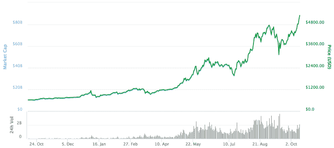

# 比特币刚刚突破 5000 美元

> 原文：<https://web.archive.org/web/https://techcrunch.com/2017/10/12/bitcoin-just-passed-5000/>

# 比特币刚刚突破 5000 美元

今天早上，比特币价格超过 5000 美元，现在徘徊在 5300 美元左右，比昨天上涨了近 10%。

这是加密货币首次自信地突破 5000 美元。在 9 月份的几分钟内，一些交易所的[价格触及 5000 美元](https://web.archive.org/web/20230307142250/https://www.coindesk.com/5000-bitcoin-price-hits-historic-new-milestone/)，但这只持续了大约 10 分钟，使得今天成为第一个超过这一历史性里程碑的持续波动。

比特币的 YTD 图表

有趣的是，并非所有加密货币都在追随比特币的脚步，这通常发生在现任加密货币经历价格波动时。以太坊只上涨了 2%，而 Ripple 下跌了 2%。莱特币是唯一模仿比特币走势的货币，因为它今天也上涨了约 10%。

这一里程碑事件发生在[加密货币突破 4000 美元](https://web.archive.org/web/20230307142250/https://techcrunch.com/2017/08/12/bitcoin-just-passed-4000/)整整两个月后。这证明了加密货币的弹性，尤其是在上个月 T4 禁止 ico 和 T6 加密货币交易后，它暂时沉没了。

虽然总是很难确定到底是什么导致了价格波动，但许多人认为机构兴趣在这轮长期反弹中发挥了主要作用。许多华尔街银行最近表达了对加密货币的兴趣(或不感兴趣)，美国消费者新闻与商业频道等主流金融媒体一直在谈论比特币，就像其他任何传统证券一样。

具有讽刺意味的是，今天早上在公司的收益电话会议上，摩根大通首席执行官杰米·戴蒙说他“不会再谈论比特币了”这是在他最初的评论[称比特币是“一个骗局”](https://web.archive.org/web/20230307142250/https://techcrunch.com/2017/09/12/bankers-mistrust-of-bitcoin-is-still-the-greatest-argument-for-it/)导致价格下跌 5%后的一个月。

那么比特币的下一步是什么？预计加密货币将在 11 月底经历另一次“硬分叉”，一些开发者将试图提出一项名为 SegWit2X 的协议变化。虽然还不清楚这一协议变化会得到多少矿工的支持，但我们可能很快就会看到另一个比特币衍生产品，就像[比特币现金](https://web.archive.org/web/20230307142250/https://techcrunch.com/2017/08/02/wtf-is-bitcoin-cash-and-is-it-worth-anything/)一样。

无论哪种方式，你都可以预计价格会在两个方向上波动很大，直到下个月关于规模的争论有望得到解决。