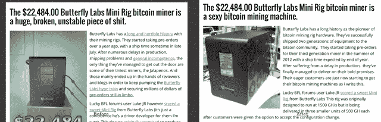

# 比特币矿业公司收购关键网站以改善搜索结果 

> 原文：<https://web.archive.org/web/https://techcrunch.com/2014/07/14/bitcoin-mining-company-buys-critical-site-to-improve-google-results/>

你可以原谅不知道[Buttcoin.org](https://web.archive.org/web/20221206141926/http://buttcoin.org/)，一个[比特币](https://web.archive.org/web/20221206141926/https://beta.techcrunch.com/tag/bitcoin)网站，该网站一直批评比特币社区无休止的乐观精神，更重要的是，批评用户从所谓的比特币挖矿提供商那里收到的坏掉的硬件。一家名为 [Butterfly Labs](https://web.archive.org/web/20221206141926/http://www.butterflylabs.com/) 的公司决定彻底改变这种双眉紧锁的局面，可以说，它以匿名出售的方式彻底买下了这个网站。结果呢？搜索“[Buttcoin 骗局](https://web.archive.org/web/20221206141926/http://lmgtfy.com/?q=butterfly+labs+scam)”，曾经返回一个 button coin 根据用户报告批评硬件的链接，现在返回一个标题为“22，484.00 美元的 button Labs 迷你钻机比特币矿工是一台性感的比特币采矿机”的故事。

“我不想具体到销售条款中去，因为合同中的一些语言很棘手，但这是一笔 5 位数的收入，是的。这不会改变我的生活或任何事情，但足以修复房子周围的一些东西，”埃文说，他是 Buttcoin 的前主人，不愿透露他的姓氏。“这个网站是 PR4，对于这种类型的博客来说，流量还不错，但如果我不接受这个提议，那我就太傻了。我以前买卖过网站，知道这是一个被高估的报价。然而，由于我关注比特币制造者已经很久了，我知道这些人大多数做的交易毫无金融意义，所以这看起来并不太令人难以置信。”

根据 Evan 在 Reddit 上发布的帖子，一位名叫 Jeff 的用户就该网站与他联系并提出了报价。埃文，谁是返回学校，需要一点现金，同意了，认为他可能能够更新网站，并帮助张贴。取而代之的是，用户 Jeff 进行了更改，并从本质上锁定了该站点。埃文怀疑买家是蝴蝶实验室的营销副总裁杰夫·奥恩比。

“这就是整个故事。埃文写道:“我被骗把 Buttcoin.org 卖给了 BFL，再也无法访问该网站，所以我在 subreddit 上安营扎寨，这样我就可以继续发布关于比特币的帖子了。”“在某种程度上，尽管我从未拥有过比特币，但我仍然因为比特币而套现。”

Butterfly 对网站所做的改动很不和谐。例如，在谷歌搜索“butterfly labs scam”的结果，从“[价值 22，484.00 美元的 Butterfly Labs Mini Rig 比特币挖矿机是一个巨大的、破碎的、不稳定的垃圾](https://web.archive.org/web/20221206141926/https://web.archive.org/web/20131109133622/http://buttcoin.org/butterfly-labs-mini-rig-is-a-huge-broken-unstable-piece-of-shit)”变成了“[价值 22，484.00 美元的 Butterfly Labs Mini Rig 比特币挖矿机是一个性感的比特币挖矿机。](https://web.archive.org/web/20221206141926/http://buttcoin.org/butterfly-labs-mini-rig-is-a-sexy-bitcoin-mining-machine)。”

另一个例子出现在[的原版这里](https://web.archive.org/web/20221206141926/https://web.archive.org/web/20131109133627/http://buttcoin.org/butterfly-labs-caught-allegedly-faking-ce-certification-bitcoiner-gets-his-miner-seized-in-germany)和[的更新版本这里](https://web.archive.org/web/20221206141926/http://buttcoin.org/butterfly-labs-caught-allegedly-faking-ce-certification-bitcoiner-gets-his-miner-seized-in-germany)。虽然文章的内容基本上没有变化，但最后一行华丽的文字被删除了。另一个帖子，[“蝴蝶实验室演示简直就是空话”](https://web.archive.org/web/20221206141926/https://web.archive.org/web/20130813031247/http://buttcoin.org/butterfly-labs-hot-air)，现在的标题是[“蝴蝶实验室演示很热”](https://web.archive.org/web/20221206141926/http://buttcoin.org/butterfly-labs-hot-air)，现在相当正面。

一家公司通过打开钱包来提高自己的声誉并不是什么新鲜事。然而，我从未真正见过如此令人震惊的粉饰网站的努力。诚然，这是一个悲伤的故事。Evan 现在面临的指控是，他是 Butterfly Labs shill，该公司本身在 SEO 方面不可能做得很好，因为它已经购买并支付了自己的正面新闻，并引起了比特币社区的愤怒。虽然一直愚弄一些人通常是好的商业做法，但我怀疑他们最终不会愚弄任何人。蝴蝶实验室没有回应置评请求，但如果我收到他们的消息，我会相应地更新。

就埃文而言，他并不担心。

“我觉得很好笑。面对如此多的诈骗、黑客和盗窃，这真的是唯一的出路。有人真的买下了网站并履行了他们的协议？如果和比特币有关，那绝对不可能。他说:“最后肯定会有某种陷阱。“Reddit 上的比特币制造者试图用它来反对我，好像我是某种骗子，我的声誉已经受损。我经营了一个 logo 上有巨型屁股的网站，我的名声还能差到什么程度？”他说，他的网站可能是世界上最古老的比特币新闻仓库之一，尽管这并不重要。“我认为我们对世界的影响介于印刷机和卡普里太阳袋之间，”他说。

“这是一个遗憾，但它不再是我的了，他们可以自由地做他们想做的事情。如果我知道这是蝴蝶实验室，我宁愿他们买下网站并关闭它，而不是改变信息。我的遗产怎么办？我的孩子会怎么想？”