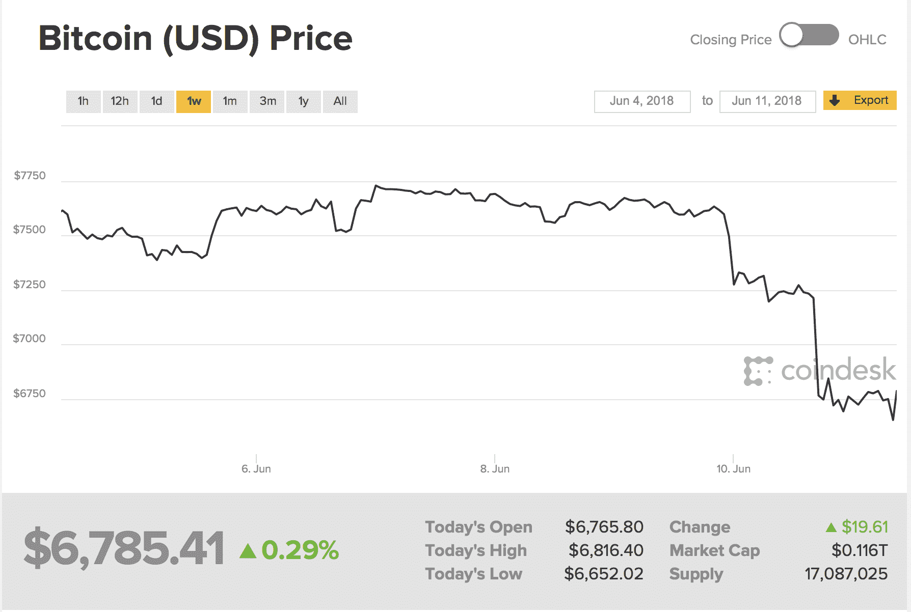
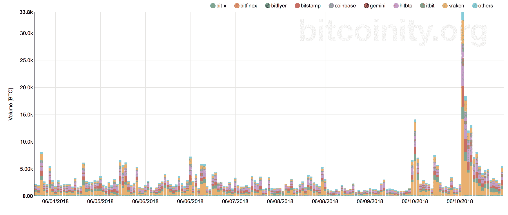

# 比特币价格下跌但不持平

> 原文：<https://web.archive.org/web/https://techcrunch.com/2018/06/11/bitcoin-price-falls-but-doesnt-flatline/>

# 比特币价格下跌，但没有持平

那些最近没有关注比特币市场的人要么会倒吸一口凉气，要么会笑一笑。在撰写本文时，比特币从 19000 美元左右的历史高点下跌，目前浮动在 6785 美元。对许多人来说，这意味着比特币实验要么已经结束，要么对更多人来说，它才刚刚开始。

有很多人会受到这次事故的伤害。我和一位罗马尼亚企业家聊起他的朋友，他用信用卡买了 BTC，却发现自己已经负债累累。波动性也让那些可能在最后一轮上涨时进场的人感到害怕，因为他们发现自己又回到了起点。我很同情那个可怜的服务员，一个朋友在他的轮班期间看到他以 18000 美元的价格进行比特币交易。我希望他卖了。

但没有迹象表明加密货币列车正在停下来。世界各地的初创公司都在研究——也在做——ico。许多早期的密码挖掘者和购买者仍然有足够的现金以各种方式进行游戏。像 R3 这样的比特币反对者正在认识到，一旦银行家们意识到比特币，就像他们钟爱的股票和商品一样，只是他们玩的另一个地方，他们就不想听到“区块链，而不是比特币”。

而且人还活跃在市场上。这很重要。正如 Coindesk 的分析指出的那样，在这段时间里，市场将会剧烈波动，并且可能会持续下去，因为冒险的买家会在下跌时抢购硬币。

不相信我？这是几乎所有交易所七天的交易量。

最终，这些举动构成了我们见过的最有趣的代际和国际财富转移形式之一。虽然这种财富转移曾经以继承和合资的形式出现，但加密货币使老年人和年轻人以及远近之间几乎瞬间成为合作伙伴。这是一个迷人的经济时代，我怀疑它会很快停止。

价格有时上涨，有时下跌。这是任何市场中任何聪明人能给任何人的最好建议。然而，这些迹象并没有显示出一条平坦的道路，而是显示出一个充满起伏、令人痛苦的 EKG。然而，病人还没有死。