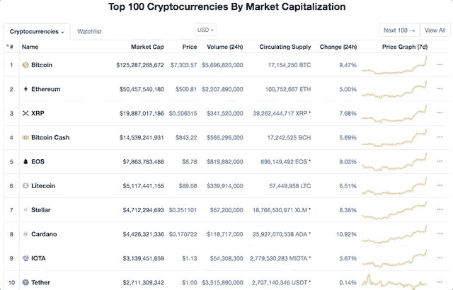
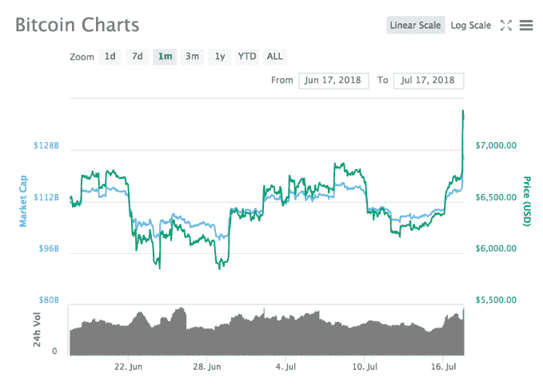

# 比特币价格突破 7000 美元，带动所有 100 种顶级硬币上涨 

> 原文：<https://web.archive.org/web/http://techcrunch.com/2018/07/17/bitcoin-price-july-2018/>

# 比特币价格超过 7000 美元，带动所有 100 种顶级硬币一起上涨

比特币正在上涨，它带着 99 个最好的朋友一起上涨。在过去的 24 小时里，市值最高的 100 种硬币中的每一种都是绿色的，其中 84 种的涨幅超过了 5%。在撰写本文时，比特币价格为 7310 美元，在过去 7 天内上涨了 14%，在过去 24 小时内上涨了近 10%。

CoinMarketCap 前 100 名

比特币本身在上个月首次突破了 7000 美元大关，这表明——但不是确切的迹象——它可能正在摆脱夏季的暴跌，价格不止一次跌破 6000 美元。比特币正在迅速回到 6 月初的 7500 美元左右的正常水平，尽管[可能会在 7750 美元](https://web.archive.org/web/20230202184448/https://cointelegraph.com/news/bitcoin-ethereum-ripple-bitcoin-cash-eos-litecoin-cardano-stellar-iota-tron-price-analysis-july-16)遇到阻力。今年 3 月，比特币跌破 10，000 美元大关，此后几个月一直无法回升至该水平以上。

通过 CoinMarketCap 截图

它们可能不会持续，但 7 月中旬的上涨不仅仅是比特币的故事。在排名前 100 的硬币中，有 24 个硬币在过去 24 小时内获得了两位数的收益，其中包括 0x 和 Zcash，这两个硬币[最近被比特币基地](https://web.archive.org/web/20230202184448/https://techcrunch.com/2018/07/13/coinbase-teases-several-new-cryptocurrency-assets-that-its-exploring-support-for/)挖掘为该平台正在“探索”的潜在资产比特币的大幅上涨通常会引领替代比特币的增长，尽管每次最重要的比特币价格飙升时，你都不会看到它的同行如此一致地跟风。

那么为什么*是*价格上涨？这些原因可能全部或全部都没有:

*   昨天，[比特币基地分享了一个消息](https://web.archive.org/web/20230202184448/https://techcrunch.com/2018/07/16/coinbase-reportedly-gets-approval-from-u-s-regulators-to-start-listing-tokenized-securities/)，美国监管机构将为交易所上市被归类为证券的代币打开大门。
*   上周，[比特币基地宣布](https://web.archive.org/web/20230202184448/https://techcrunch.com/2018/07/13/coinbase-teases-several-new-cryptocurrency-assets-that-its-exploring-support-for/)它正在探索增加 Cardano、基本注意力令牌、恒星流明、Zcash 和 0x。
*   在高盛，现任首席运营官大卫所罗门将进入首席执行官的角色。所罗门被认为是首席执行官的一个对加密货币友好的选择。
*   资产管理公司贝莱德成立了一个工作组来研究区块链和加密货币，尽管其首席执行官警告说，他还没有观察到“对加密货币的巨大需求”
*   Japan's LINE 本月将推出名为 bit box 的加密货币交易所(T2 ),不过这种令牌对令牌的交易所不会在美国或日本推出。
*   日本主要金融公司 SBI 控股[刚刚向该国加密货币交易所的交易员敞开大门](https://web.archive.org/web/20230202184448/https://www.coindesk.com/worlds-first-bank-backed-crypto-exchange-finally-opens-to-the-public/)。

与任何价格变动一样，世界某个地方的头条新闻只是众多无形的国际地震信号中的一个隆隆声，这些信号在某一天让硬币上涨或下跌。当你阅读茶叶时，当价格大幅波动时，值得记住的是相关性≠因果关系。尽管如此，这并不意味着你不能享受茶。

*披露:作者在一些加密货币中持有很少的头寸，主要是因为在 2013 年这似乎是一个有趣的想法，然后她就忘记了。遗憾的是，这对蓝宝来说是不够的。*