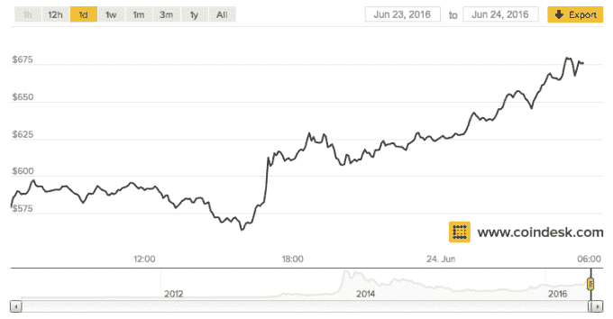
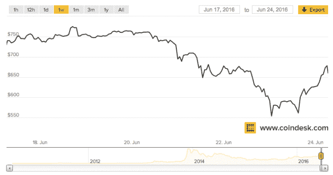

# 英国退出欧盟结果导致英镑跌至 30 年低点，比特币突破 650 美元

> 原文：<https://web.archive.org/web/https://techcrunch.com/2016/06/23/bitcoin-surges-past-650-as-brexit-result-sends-uk-pound-tumbling-to-30-year-low/>

# 英国退出欧盟结果导致英镑跌至 30 年低点，比特币价格飙升至 650 美元以上

在英国公众投票退出欧盟后，全球金融市场周五出现下滑，但有一种货币正陶醉于英国退出欧盟结果的不确定性:比特币。

众所周知，加密货币难以预测。2013 年，美元对日元的汇率一度升至 1000 美元，尽管自那次里程碑式的估值以来，日元汇率有所稳定，但在 6 月 17 日，日元对美元的汇率创下了两年半以来的新高，接近 775 美元，随后的一周，日元下跌了近 25%。

一些人认为这一下跌与英国是否继续留在欧盟的公投有关，但根据 Coindesk 的数据，一旦结果明朗——多家媒体称之为脱欧运动的胜利——比特币就开始增长，在 550 美元的一天后就突破了 650 美元。

> 今天比特币对美元的价格

> 过去一周比特币对美元的价格

考虑到英镑到目前为止所经历的悲惨的一天，这实际上并不是一个巨大的惊喜。英镑兑美元汇率下跌超过 10%，创下 35 年来的新低，因为围绕英国将如何退出欧盟的问号——它将是第一个这样做的成员国——它将如何找到新的贸易协议，谁将执掌政府，以及更多人看到英镑的萧条对亚洲和世界其他地区市场的影响。

https://twitter.com/TheXclass/status/746172673877651456

比特币看起来是一种特别有吸引力的卸载英镑的工具，因为在英国退出欧盟投票之前，由于潜在的市场动荡，TransferWise 等点对点货币服务暂停了与比特币的合作。

“随着 6 月 23 日星期四英国举行欧盟公投，汇率可能会出现波动。本周早些时候， [TransferWise 告诉客户](https://web.archive.org/web/20230316045145/https://transferwise.com/help/article/2471420/british-pound-transfers/gbp-transfers-during-the-eu-referendum)，我们已经制定了计划，以便尽可能顺利地继续处理您的转账。

总部位于伦敦的 TransferWise，其投资者包括总部位于美国的 Andreessen Horowitz，[估值为 11 亿美元](https://web.archive.org/web/20230316045145/https://techcrunch.com/2016/05/25/money-transfer-company-transferwise-raises-further-26m-at-1-1b-valuation/)，取消了任何在英国时间周四晚上 8 点之前未完成的未决英镑转让。~~该公司告诉客户，它计划今天恢复运营，但是，在撰写本文时，其服务尚未恢复对英镑的支持。~~

**英国夏令时上午 10 点更新:** TransferWise 现已重启英镑交易。