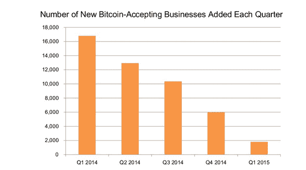

# 比特币的 Q1:创纪录的风险投资、不断下跌的价格和缓慢的消费者采用 

> 原文：<https://web.archive.org/web/https://techcrunch.com/2015/04/26/bitcoins-q1-record-vc-investment-falling-prices-and-slow-consumer-adoption/>

# 比特币的 Q1:创纪录的风险投资、下跌的价格和缓慢的消费者采纳

比特币观察新闻服务 [CoinDesk](ww.coindesk.com) 最近发布了对 2015 年头几个月加密货币表现的[第一季度展望](https://web.archive.org/web/20221226062418/http://www.coindesk.com/research/state-of-bitcoin-q1-2015/)。大部分数据都是正值，显示钱包和投资总量增加。然而，包括在内的一些数据显示，关键比特币以及比特币相关领域的增长正在放缓。

收集的数据表明，就比特币生态系统的风险投资美元价值而言，2015 年第一季度是有史以来最受欢迎的一个季度。然而，这个数据点被一项投资扭曲了，那就是[向 21 世纪投资的 1.16 亿美元](https://web.archive.org/web/20221226062418/http://www.coindesk.com/21-record-116-million-funding-all-star-investors/)，就其雄心而言，这家公司仍然至少部分被遮蔽。除了这一笔投资，第一季度的风险投资与第四季度持平，为 1.13 亿美元。

至少从外部角度来看，比特币表现的关键在于现有钱包的数量。比特币的这些容器和存储位置有助于市场了解这种加密货币正在吸引多少新的人群。根据 CoinDesk 的报告，第一季度，钱包总数从 740 万增加到 840 万，环比增长 14%。

这一增长率可能低于一年前的预期。从 2014 年第四季度到 2015 年第一季度，流通中的所有比特币(有些仍有待挖掘)的市值下降了 36%。

以下是 CoinDesk 最近的月度比特币交易总量图表:

11 月份的季度总量有所偏差，但在过去两个三个月的周期中，交易量似乎没有出现太大的加速或减速。

该报告包含的要点如下:“比特币(在本季度)难以获得主流消费者的关注。”比特币的一生就是如此。因此，这种趋势持续下去并不令人惊讶。不过，不难想象在过去 18 个月里向投资者推销比特币的公司预测会发生什么——他们预料到比特币的价格会这么低吗？如果比特币钱包的普及速度像现在这样缓慢，投资者还会在过去一年投资这么多吗？

最后一个想法，这是 CoinDesk 的新商家采用比特币的总数:

你可以问问自己，这种减速是糟糕的，还是仅仅是暂时的。