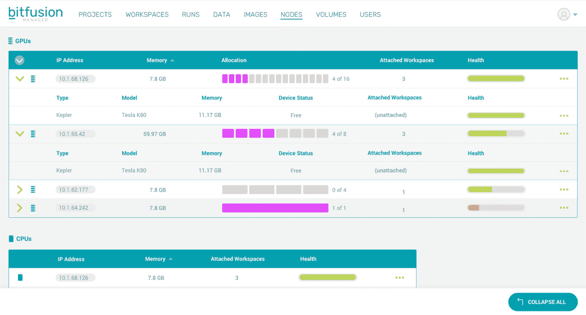
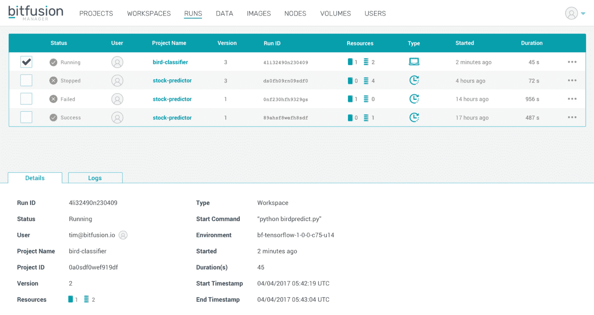

# Bitfusion 为其人工智能生命周期管理平台 TechCrunch 筹集了 500 万美元

> 原文：<https://web.archive.org/web/https://techcrunch.com/2017/05/02/bitfusion-raises-5m-for-its-ai-lifecycle-management-platform/>

当 Bitfusion [在 Disrupt NY 2015 上推出](https://web.archive.org/web/20230123202532/https://techcrunch.com/2015/05/05/bitfusion-helps-developers-get-more-power-out-of-their-existing-hardware/)时，它的重点是通过为开发者提供预编译的库来帮助他们加快应用程序的速度，这些库可以更好地利用 GPU、FPGAs 和其他协同处理技术。那是两年前的事了。如今，这些技术最热门的市场是训练深度学习模型，这在该公司推出时几乎不为人知。不过，毫不奇怪，这正是 Bitfusion 目前关注的焦点。

正如该公司今天宣布的那样，它已经筹集了 500 万美元的 A 轮融资，由 Vanedge Capital 领投，新投资者 Sierra Ventures 和现有投资者 Data Collective、Resonant VC 和 Geekdom 参与。该公司计划将这笔资金投资于加强其研发工作，并专注于 Bitfusion Flex，这是其用于构建和管理人工智能项目的新框架无关平台。

【T2

现在处于测试阶段，Bitfusion Flex 本质上旨在为开发人员提供一个管理人工智能应用程序生命周期的单一平台。开发人员获得一个单一的仪表板，从开发到培训、测试，最终到部署。在幕后，Flex 使用容器来简化本地机器和云之间的扩展和移动实验和模型，但它也支持裸机上的部署。

值得注意的是，Flex 的重点不一定是简化建模。虽然它确实为设置您选择的框架提供了类似于应用商店的体验(无论是 TensorFlow、Torch、Caffe 还是类似的工具)，但它的优势在于管理您需要构建和运行这些应用程序的基础设施。因此，它既不关心框架，也不关心您希望将应用程序部署到哪里。

该服务既提供了基于网络的界面来管理这一过程，也提供了命令行界面，例如，让您在开发阶段将远程 GPU 连接到本地笔记本电脑。

“很多开始深度学习项目的人都无法超越原型阶段，”Bitfusion 首席执行官兼联合创始人 Subbu Rama 告诉我。“每个人都想在任何地方进行深度学习，但全球 2000 强——他们没有足够的人手。”因此，通过 Flex，Bitfusion 希望将管理基础设施的繁琐工作抽象化，以便公司最终聘请的数据科学家可以专注于他们的应用程序。

展望未来，Bitfusion 计划在未来几个月内扩展 Flex 并将其推出测试版。这家总部位于奥斯汀的公司还计划扩大其在硅谷的业务(尽管 Rama 指出，R&D 的大部分工作仍将在奥斯汀进行)。

