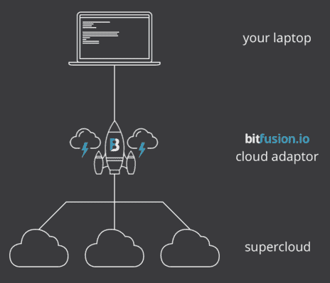

# Bitfusion 的新云适配器允许开发人员在云中使用 GPU 和 FPGA 

> 原文：<https://web.archive.org/web/https://techcrunch.com/2015/11/25/bitfusions-new-cloud-adaptor-lets-developers-use-gpus-and-fpgas-in-the-cloud/>

扰乱战场明矾 [Bitfusion](https://web.archive.org/web/20230131005718/http://bitfusion.io/) 希望帮助开发人员从他们的硬件中获得最佳计算性能，无论是他们的传统桌面还是专门的高性能计算云。

通过 [Boost](https://web.archive.org/web/20230131005718/https://boost.bitfusion.io/#/) ，Bitfusion 展示了它如何[通过为给定机器中的硬件优化它们的库来加速现有的应用程序](https://web.archive.org/web/20230131005718/https://boost.bitfusion.io/#/demo)。在过去的几个月里，Bitfusion 在私人 alpha 中测试了 Boost，现在它已经进入了测试阶段，你可以在这里注册使用。

Bitfusion 的联合创始人兼首席执行官苏布·拉玛(Subbu Rama)和首席运营官·马切伊·巴杰科夫斯基(Andrew ma ciej Bajkowski)告诉我，它的许多早期用户都对使用 Boost 进行机器学习和数据科学项目感到特别兴奋。目前，Boost 只适用于一些特定的应用程序(例如 Blender、ImageMagick、Octave、Matlab、 [Torch](https://web.archive.org/web/20230131005718/https://boost.bitfusion.io/#/demo#torch) )，但该团队计划随着时间的推移添加更多应用程序。

该公司将 Boost 视为其旗舰产品。然而，该公司现在也提供 bit fusion Cloud Adaptor——从许多方面来说，它确实是更令人兴奋的产品。

 云适配器允许开发人员在本地机器上编写应用程序(并且仍然可以访问云中的 GPU 和 FPGAs。这些应用程序让人们相信笔记本电脑是许多外来硬件的宿主，但实际设备生活在云中。

“我们推出了云适配器，因为它是 Boost 之后的下一个合理步骤，”Rama 告诉我。“借助 Boost，我们可以提供节点内加速。但是如果你的机器里没有合适的设备，你就有麻烦了。借助 Cloud Adaptor 命令行工具，开发人员可以访问 AWS、Rackspace 和 Softlayer 云中的 GPU，以及 Bitfusion 与 Rackspace 合作开发的自有云中的 FPGAs。

大多数开发人员都不太容易访问 FPGA，但有了这项新服务，他们可以轻松地使用云来访问 FPGA(或者至少在英特尔推出第一款内置 Altera FPGAs 的至强芯片[之前不会)。](https://web.archive.org/web/20230131005718/http://www.networkworld.com/article/3006598/intels-first-server-chip-with-performance-boosting-fpga-to-ship-early-next-year.html)

这里的区别很明显，这是为开发人员编写的新应用程序，以利用这种奇特的硬件。开发人员可以根据完成的工作或 API 调用付费。

Rama 和 Bajkowski 认为，到目前为止，开发人员能够在他们的机器上为 GPU 和 FPGAs 编写应用程序，但无法测试它们。现在，他们将能够使用一个简单的工具在云中运行他们的应用程序，而不是必须在运行应用程序时投资购买特殊的硬件。

Bitfusion 认为，让开发者轻松获得高性能计算将为许多修补者打开这个市场，如果没有这项服务，他们永远不会获得这种硬件。