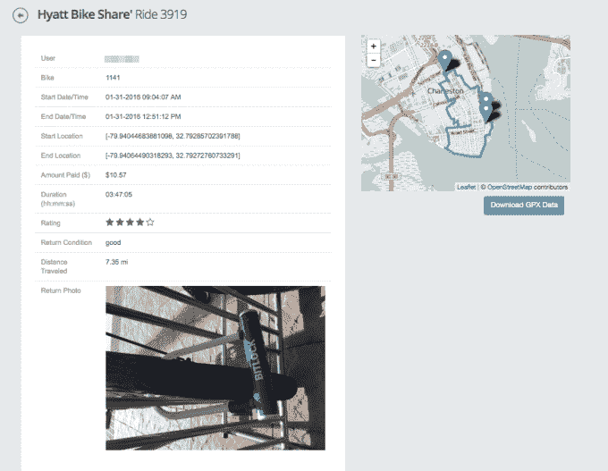

# Bitlock 在 2013 年众筹了一款智能自行车锁。接下来发生了什么？

> 原文：<https://web.archive.org/web/https://techcrunch.com/2016/04/28/bitlock-crowdfunded-a-smart-bike-lock-in-2013-what-happened-next/>

两年半前，Bitlock 开始众筹一款智能自行车锁，当时对联网设备的宣传正在兴起，众筹平台的善意也很高涨。

自那以后，这两个类别都遭受了一些信心打击，并带来了大量的失望。

那么比特洛克后来怎么样了？它出货了吗，如果出货了，它的智能设备是否不负众望？遇到了什么问题？事后来看，它是如何看待众筹过程的？

硬件众筹是一个特别难完成的行为。一些非常引人注目的项目已经在[崩溃并烧毁](https://web.archive.org/web/20230213084633/https://techcrunch.com/2015/12/11/kickstarter-hires-journalist-to-probe-collapse-of-zano-drone-project/)。其他在成功众筹后继续吸引风险投资的公司仍然在与[的延迟](https://web.archive.org/web/20230213084633/https://techcrunch.com/2016/02/20/kickstarter-backed-fove-delays-vr-headset-ship-date-begins-offering-refunds/)和[不断上升的竞争威胁](https://web.archive.org/web/20230213084633/https://techcrunch.com/2016/03/23/smartwatch-firm-pebble-lays-off-25-of-its-staff/)作斗争。[产品问题](https://web.archive.org/web/20230213084633/https://techcrunch.com/2015/11/19/when-crowdfunding-fails-the-backers-are-left-with-no-way-out/)似乎是既定的。在竞争激烈的消费电子领域，小而杂乱通常不是获得大规模市场成功的秘诀。

底线是硬件很硬。这是一场充满挑战的长距离马拉松，即使你有足够的前期资金来建造你的小发明。有时[金钱本身会让梦想脱轨](https://web.archive.org/web/20230213084633/https://techcrunch.com/2016/01/21/kickstarter-needs-better-ways-to-sanity-check-complex-hardware-projects-says-zano-review/)——让项目创建者过于自信，鼓励糟糕的决策和糟糕的预算，导致浪费甚至更糟。

再加上一群兴奋的众筹支持者，他们购买了你最初的热情，并带着他们的现金和厚望无情地与你的项目命运捆绑在一起，那么，你不可避免的漫长而坎坷的开发过程将会感到更加令人担忧。

我曾在 2013 年 10 月报道过 Bitlock 的众筹活动，当时众筹技术项目被认为是令人兴奋和实验性的，值得一写。如今，我们很少报道装运前众筹——这只能说明这个过程已经失去了多少光彩。(更不用说在这些平台上有多少[彻头彻尾的废话了](https://web.archive.org/web/20230213084633/https://techcrunch.com/2016/04/27/mmc-drones-indiegogo/)。)即使你制作了一个视频，让一群人相信你的产品有一天会存在，Vapourware 也不是很有趣。

在 [Kickstarter](https://web.archive.org/web/20230213084633/https://www.kickstarter.com/projects/126495570/bitlock-turning-your-smart-phone-into-your-bike-ke?ref=category) 上，Bitlock 最初的想法是一个智能自行车锁，让人们可以使用手机上的应用程序锁定和解锁自己的自行车，不再需要携带自行车钥匙，并实现额外的功能——例如创建和管理虚拟钥匙的能力，这些虚拟钥匙可以与他人共享，以共享对自行车的访问；通过 Bitlock 应用程序进行骑行跟踪和分析；和位置地图，以便于记住您的停车位置。

它被定位为一种鼓励协作消费的消费品，说服人们与朋友、同事和邻居分享自行车。

Bitlock Kickstarter 继续实现其融资目标，从 1，268 名支持者那里筹集到了近 13 万美元的资金。它最初的预计交付日期是 2014 年 7 月。

在[原始活动页面](https://web.archive.org/web/20230213084633/https://www.kickstarter.com/projects/126495570/bitlock-turning-your-smart-phone-into-your-bike-ke/description)的“风险与挑战”副标题下，Bitlock 的创建者表达了对准时发货的信心——写道:

> 根据 Kickstarter 的统计，超过 84%的最成功的 Kickstarter 项目都延迟发货。我们不想成为其中一员。我们坚信“承诺不足，兑现过度”。因此，我们决定在我们的预计交付日期上增加足够的时间余量，以确保 BitLock 按时交付。我们知道，由于仲夏的发货日期，我们可能会失去一些支持者，但我们相信，一旦我们全面投产，我们可以稍后让他们加入 BitLock 家族。

结果，该团队无法避免成为又一个迟到的硬件众筹项目的命运。两年半过去了，他们最近刚刚完成了最后一批 Kickstarter 预购订单。他们分两批发货，这意味着一些支持者比其他人延迟更短，但所有支持者都必须等待比承诺更长的时间才能拿到锁。创始人 Mehrdad Majzoobi 说，大约一半的支持者不得不多等一年才能得到这款设备。另一半时间接近一年零九个月。

“我们在这一点上是自举的。我所知道的为数不多的有自举的硬件创业公司之一。这真的很难，因为模具费用非常高。与许多 Kickstarter 活动相比，我们并没有筹集到多少资金。因此，第一批和第二批之间的延迟部分是因为我们需要找到一种方法来为第二批融资，我们花了几个月的时间来解决这个问题，”他解释说。

“此外，我们希望在第一次生产运行中获得尽可能多的反馈，以便我们可以在第二次生产运行中修复这些问题。此外，在应用这些修复时，我们必须对我们的工具和类似的东西进行一些更改，以解决这些问题，所有这些花费了我们大约 9 个月的时间。”

尽管经历了长时间的延迟，Bitlock 还是把货物交付给了它的支持者。所以这绝不是一个耸人听闻的众筹失败的故事。但即便如此，公平地说，这家初创公司也无法证明其最初的消费者智能锁主张。事实上，它现在很大程度上专注于 b2b 业务，而不是向个人消费者销售智能锁(尽管它仍然通过其网站和亚马逊等其他零售渠道销售)。

Bitlock 的 b2b 提议将其智能锁硬件包装为一个自动租赁系统，结合车队管理软件和一个租赁应用程序，该应用程序通过 Stripe 支付，该团队自最初的众筹活动以来一直在开发。这个想法是，小企业/公司/组织不需要为昂贵的自行车码头支付大量资金来实施租赁计划，或者拥有一个可以存储和租赁自行车的实体场所，而 Bitlock 的 connected lock plus app 组合允许以更低的成本和更低的基础设施要求建立租赁业务。

例如，租赁自行车可以停在酒店外面，锁在街道设施上，以利用游客的短暂需求。支付是在应用程序中处理的，可以通过 Bitlock 系统提供各种奖励和惩罚，例如，鼓励用户将自行车归还到他们租用的同一位置。Majzoobi 认为，整个操作可能只需要几个人来检查自行车，并处理租车人提出的任何问题。

“(我们最初的 p2p 自行车共享想法)并没有让人们非常兴奋，因为很多人不想共享自己的自行车。但这只是一个假设，在最初的几天里，我意识到这个想法是行不通的，”他说。“现在，我们的目标是系统运营商，他们希望投入一些资金购买 200 辆或 100 辆自行车，以便在城市中建立一个小型网络。或者一个学校，一个校园，或者一个公司校园，或者一个房产。”

Bitlock 的 b2b 业务枢纽仍处于早期阶段，因此其智能锁技术的这一应用也尚未得到证实。但是 Majzoobi 对这里的潜力比消费者空间更感兴趣。

用他的话来说，现在这个团队有三个“相对较大的系统”，与租赁运营商一起运行，还有几个小的试点项目。“我们在挪威奥斯陆有一个相对较大的系统(迄今为止最大的一次展示),几天前投入使用，有 50 辆自行车。下一个最大的是一个网络 30 辆自行车。我们大约有六个系统，其中大部分处于试验阶段。这意味着他们正在用 15 辆左右的自行车进行测试，以真正了解该系统是如何工作的，然后扩展到 50 辆左右。”

租赁系统的另一个小试点是在查尔斯顿，位于凯悦酒店前面。他说，今年夏天将扩大到 250 辆自行车——目的是在查尔斯顿市中心的每家酒店门口放置自行车。

Majzoobi 认为，b2b 智能自行车锁的商业模式很清楚——大谈与现有自行车共享系统相比的“巨大优势”,因为 Bitlock 的精简产品比那些需要固定底座来放置自行车的产品“便宜一个数量级”。

“仅仅通过向运营商提供这项技术，我们每个月就可以为每辆自行车创造大约 50 美元的收入——每台设备每年的经常性收入将接近 400 美元或 500 美元，与锁的成本相比，这是一笔可观的收入，”他说。“对于运营商来说，这也是一个实质性的价值主张，因为在许多情况下，他们的许多次优选择是采用基于站点的系统，每个码头的成本约为 6000 美元(包括自行车)。我们能以不到 500 美元的价格买到那辆自行车和锁。因此，设置成本几乎减少了 10 倍。”

回到 Bitlock 的消费者故事，这家初创公司的愿景起源于此，很明显，并不是每个支持者都对他们收到的智能锁感到满意。一些支持者联系了 TechCrunch，他们抱怨电池问题导致他们的自行车明显无法解锁——除非拿出钢锯。

其他支持者抱怨 Bitlock 软件的响应速度。或者关于交货的问题。一个人告诉我，他放弃了使用这种锁，因为尽管它确实像承诺的那样工作，但它没有他希望的那么小。“要想变得智能，锁栓里必须装的东西太多了，这意味着目前还没有小型智能锁。我喜欢小一点的锁，”这位买家说。因此，很明显，有一系列与该设备相关的投诉。

但是，这也不全是坏事。也有高兴的顾客称赞该产品像他们希望的那样工作。有人甚至称赞它能够忍受加拿大恶劣的天气条件。

Majzoobi 证实，在将原型转化为强大的消费产品的复杂过程中，Bitlock 遇到了一系列制造问题。第一批 Bitlock 产品尤其成问题(早期采用者请注意！).

考虑到它的使用地点和方式，这种设备显然很难制造。他将这种锁描述为“在许多层面上都非常具有挑战性”——因为它是在户外使用的，“不会受到很好的对待”。“它掉下来了，落在雨里，落在太阳底下。它有一个可以持续很长时间的电池。有太多的设计限制。”

防水是该团队遇到的一个问题，这意味着他们必须改变设计，以提高其抵御进水和潮湿的能力。另一个导致延迟的问题与电池有关。首先，他们遇到了组装问题，因为电池盒在一批锁上松动了，这意味着团队必须对所有受影响的锁进行手动修复，这花费了大量额外的时间。但是他们也遇到了电池本身的问题。特别是电池寿命。

“很难测试电池的寿命，”Majzoobi 说。“一切看起来都很好，但随着时间的推移，(问题出现了)。供应商说电池的保质期是 10 年，但有时他们的电池在此之前就没电了，这真的很难知道，除非它是一个经验丰富的供应商，其他人已经使用过它们，你有充分的信心。

“尤其是当我们使用 AA 规格的特殊电池时。它是锂电池，但它是 AA 外形和 3 伏电池。大多数 3 伏锂电池都有硬币形状或不同的形状…所以这限制了我们可以合作的供应商的数量。符合这种电池的供应商只有一两家。因此，我们在第一次生产中遇到了一些不幸的问题，我们已经解决了。”

另一个导致延迟的问题是运输/物流问题——因此一些支持者抱怨没有收到他们的锁。最初，Bitlock 自己处理运输，这是另一个耗时的过程，但现在它将这项工作交给了运输合作伙伴。但同样，理顺这些关系、打造供应链和分销链中的高效链接需要时间。众筹硬件初创公司可能会争分夺秒。

Bitlock 的两个生产批次之间的巨大延迟是由现金流问题引起的。从本质上讲，Kickstarter 的资金只够制造产品并运送给大约一半的支持者。因此，该团队不得不自己想办法为第二批产品融资。这意味着与制造商合作以获得融资条款。他们还必须获得库存融资，以便能够为第二次生产提供资金——以便完成最后 500 个 Kickstarter 订单。最低组件订单数量意味着他们必须生产更多的第二批产品，而不仅仅是 500 件，因此需要寻求融资。

“我们有一个为存货付款的金融家，我们从存货中出售，出售时给他们利息。所以这对现金流有很大帮助，”Majzoobi 说，并补充说:“我很高兴我们发货了，只是有时这种延迟真的会扼杀初创公司，因为如果你不发货，你每天都要支付日常运营的费用。你往更深处走。”

此外，还有另一类更令人头疼的问题:你自己的用户。人们并不总能猜对如何使用你的设备。他们也不总是像你认为的那样处理问题，所以你认为简单的事情变成了问题。当涉及到所谓的“智能设备”时，这种教育挑战显得尤为严峻，在这些设备中，人们对“自动魔法”的期望比比皆是——这意味着，如果设备不能立即完美工作，沮丧阈值可能会非常低。

与用户相关的产品问题无疑使 Bitlock 的资源捉襟见肘。例如，如果用户的锁因为电池过早损坏而报废，他们仍然可以通过锁上的外部微型 USB 端口从外部为设备供电来解锁。问题是这个端口被盖住了(因为防水的原因)，所以人们不知道它的存在。

Majzoobi 说:“我们的知识库中现在有很多东西可以告诉人们如何更换电池。”“我们必须明确地告诉他们。它不在我们的用户手册里。我们正在将信息放入我们的知识库帮助台。我们还在建立很多东西，我们的知识库还不完整，我们有很多问题。”

> 我们不知所措。我们每天会收到大约 200 封电子邮件，而你正试图尽可能多地回复我们。

“老实说，我们在沟通方面确实做得不好，”他补充道。“我们不知所措。我们每天会收到大约 200 封电子邮件，而你正试图尽可能多地回复我们。这些问题中有很多是重复的，一旦我们建立了知识库，我们就能够将它们引向知识库以获得答案。

“作为一家小型创业公司，我们真的没有时间去处理客户服务、物流、运输等运营方面的问题。我们已经建立了自己的物流系统，现在速度非常快，但以前我们只是自己运输，工作量大得惊人。现在，我们已经建立了物流系统，现在我们只需每天将订单发送给合作伙伴，然后他们就可以发货了。硬件启动的所有这些操作部分都令人不知所措，我正在努力赶上这些事情的大部分，并与客户发生争吵。”

的确，良好的沟通对于一家企业留住客户至关重要。但也许这里有一个更重要的问题需要考虑——特定于智能设备类别。也就是说，在这个新生的时刻，智能设备作为一种消费主张有多大吸引力？消费者对这些小发明的期望似乎太高了——这意味着失望从一开始就根深蒂固，这是由于技术限制以及与显然“愚蠢”(即没有互联网连接)的替代品相比往往是相当增量的优势。

例如，比特洛克关于你可以扔掉自行车钥匙的宣传从来没有给我留下深刻印象。自行车钥匙可以和其他钥匙一起挂在钥匙链上。在你的口袋里，这几乎不是一个巨大的额外负担。

重点是，最容易使用/操作的设备往往是非常简单的工具。例如，物理钥匙是一种非常简单的设备，它允许人们与复杂的锁定机制进行交互，而无需知道后者如何工作。也不需要用户手册来解释如何插入和转动它。它的运作就像它的身体一样强健。

然而，一旦您为任何设备添加连接，就不可避免地会带来更多的复杂性。这是智能设备正在应对的真正的大挑战。因此，如果你的智能设备营销的主要目的是你的联网设备将比愚蠢的旧替代品更方便，那么，你可能需要重新考虑这个承诺。

与非连接设备相比，智能设备当然可以设计成包括许多听起来有趣的附加功能。但是，它们是否也能被设计成总是轻松易用的，还有待商榷。从 Bitlock 的经验来看，很明显，即使是像智能自行车锁这样看似简单的东西，也给用户带来了很多挫败感。

“现在产品的主要问题是用户体验，”Majzoobi 说。“用户体验需要改善……归根结底，我想要一种不需要任何教育的产品；我不需要教育用户如何使用它；这是他们很容易得到的东西。但是现在，需要向用户提及产品的某些方面——你不应该这样使用它，或者你不应该这样做——这种教育将占用资源，这将间接增加你的业务成本。"

令 Bitlock 用户感到沮丧的物理弱点的一个例子是，如果锁被锁定，而 U 形杆从锁定机构拉开(当人们将他们的自行车固定到一件街道设施上时经常出现这种情况)，它将机构置于张力下，这意味着当用户按下按钮解锁时，锁不会解锁。

“解决办法是他们必须施加轻微的压力，向内的压力，以消除锁定机构上的张力。一旦他们得到它，他们知道他们必须这样做，但在那一刻的用户体验不是很愉快-哦，看，我的自行车卡住了！

“用钥匙的时候也是一样的。如果 U 形部分被拉动，你必须扭动它，或者你必须施加一点压力……但由于你没有触觉反馈，你不知道锁内的锁定机制在做什么，然后你会感觉锁被卡住了，我对此无能为力。”

虽然这个问题显然有一个非常简单的解决方案，但更广泛的问题是，用户不会自己找到解决方案，因为他们希望智能锁更智能，也就是说，在设计上没有任何这样的使用褶皱。所以他们最终失望了。或者生气。或者两者都有。

我问，在这个新生阶段，用户对智能设备的期望是否过高？“当然，”Majzoobi 说。“这是因为采用这种产品的人在寻找一种体验，他们无法从他们的非智能、非互联产品中获得这种体验。”

Bitlock 不得不处理的另一个经常出现的使用问题是，人们抱怨锁无法连接到他们的手机。解决这个问题也很简单；你必须让应用程序一直运行(无论是在后台还是前台),它才能与锁进行通信。但是 UX 的这一方面再次证明了用户的问题。

> 用户的心态是，如果我要把手伸进口袋，打开应用程序，然后连接到锁，这与我把手伸进口袋拿钥匙开锁的工作量是一样的。

“许多用户给我们发电子邮件，说锁不能连接到我的手机，我们意识到他们甚至没有运行应用程序，”他说。“这一点对我们来说非常明显，但用户的期望是锁应该总是连接到我的手机，因为它离我的手机很近。用户的心态是，如果我将手伸进口袋，打开应用程序，然后连接到锁，这与我将手伸进口袋拿钥匙并打开锁的工作量是一样的，这是一个完全有效的论点，但同时在技术上有一些特定的限制。

“我们实际上可以在 Android 上做到这一点，因为在 Android 上，你可以运行后台服务，它一直在运行，但 iOS 不允许这样做。您不能有使用蓝牙的后台进程。因此，我们正在研究 iBeacon 和其他一些方法，看看我们能否提供这种体验。”

当然，智能设备通常比非智能设备的价格更高，这加剧了用户期望问题。因此，如果价格下降，用户可能会更加容忍需要晃动他们的智能东西来让它像宣传的那样工作。

Majzoobi 指出:“大多数智能锁比任何类别的普通锁都要贵三到四倍。“我们的价格是 129 美元，普通锁的价格是 40 或 50 美元。如果你能缩小差距，你也能管理期望。如果用户为非智能锁支付 50 美元，为智能锁支付 50 美元，并且体验没有不同，那么他们将选择其中任何一个，这将是 50:50。如果你能让体验稍微好一点，而且价格接近，他们就会选择联网的。”

如果 Majzoobi 能再有一次机会，他会用 Bitlock 做什么不同的事情？“这是个很难回答的问题。我可能会做得更少。我们做了很多事情。我们不应该……作为发明家，我们对想法非常兴奋。嘿，让我们实现这个，让我们这样做。当客户问我们，你们会添加这个吗？作为初创公司的创始人，我们觉得我们必须说是的，我们想增加这个功能，让你开心。但是我们真的不明白添加一个简单的功能需要多少努力。

“因此，如果我回到过去，我可能会对产品的功能和/或部分说更多的不，这会让事情变得更容易。慢慢来，努力把更多的精力放在营销和销售上，少关注产品。”

经过大约 2.5 年的艰苦努力以实现他最初的愿景，他现在对众筹过程有什么看法？“我对众筹有一种苦乐参半的关系，”他告诉 TechCrunch。“我认为这是一个非常有益的平台，但有时它会让项目创作者非常疲惫，同时也会让支持者非常沮丧。”

他补充称，一些支持者的心态与驱动制造商的创造冲动不协调。“我的观点是，支持者并没有真正看到众筹的意义。很多人。他们中的一些人看到了这一点，他们明白这是一个创造性的过程…但为了解决这个问题，我认为支持者应该在产品上投入更多。我认为，进行众筹的最佳方式是要求支持者为产品投入 50%的资金，或者无论多少，然后在交付时支付另外的 50%。

“这也有助于项目创建者利用这些有限的资源。有时项目创建者得到全部现金，他们在两个月内就花光了…但是如果他们有这个里程碑，在项目结束时再次得到报酬，他们将更加仔细地制定预算。它可以以更好的方式进行构建，或者当产品推出时，支持者可能会有一些动力以比如 50%的折扣购买另一款产品。”

“双方都应该在这个过程中考虑额外的激励或惩罚措施，”他补充道。