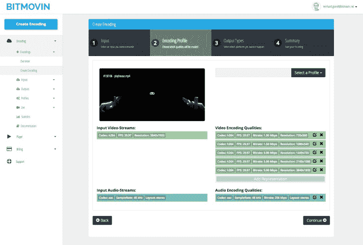

# Bitmovin 获得 1030 万美元，试图破解 VR 视频自适应流媒体技术

> 原文：<https://web.archive.org/web/https://techcrunch.com/2016/09/02/bitmovin-grabs-10-3m-as-it-looks-to-crack-vr-video-adaptive-streaming/>

非常奇怪的是，即使当人们在谈论制作每只眼睛 8K 分辨率、立体渲染和光场就绪镜头的虚拟现实视频的疯狂理论未来时，我仍然在这里努力防止路易斯·C·K 剪辑在我的手机上缓冲。

为了让虚拟现实获得成功，公司需要开始纠正高质量流媒体的一些发展问题。

Bitmovin 的目标是通过一种名为自适应流媒体的技术来解决这些问题，这种技术可以根据用户的设备和互联网连接动态调整视频质量。该公司表示，其技术编码视频的速度比市场上任何其他服务快 100 倍，并提供更高质量的输出。

Bitmovin 的技术更多地解决了不同 VR 头戴设备之间光学质量不匹配的相关问题。例如，将疯狂的高分辨率镜头传输到带有标准高清屏幕的移动 VR 耳机是没有意义的。随着高端虚拟现实技术的进步，这种不匹配可能只会越来越大。

“今年很多 VR 头戴设备从 Oculus 到 HTC 和索尼，还有 360 度相机如 Orah、Giroptic、诺基亚的 Ozo 等。Bitmovin 的首席执行官 T2·斯蒂芬·莱德雷尔说。“我们制作和观看视频的方式正在发生巨大变化。”

Bitmovin 的目标是赶在竞争对手之前支持这一重大变革。该公司刚刚完成了由 [Atomico](https://web.archive.org/web/20221210052107/https://www.crunchbase.com/organization/atomico) 牵头的 1030 万美元的首轮融资。莱德雷尔希望利用这笔资金来加速 Bitmovin 在虚拟现实等新媒体上的自适应流媒体技术的开发。

这家初创公司已经为虚拟现实行业中一些最知名的公司提供服务，但该公司目前的大部分努力都是在更传统的视频流媒体领域，其创始人在这方面有着相当重要的背景。

Bitmovin 的联合创始人创建了 MPEG-DASH 视频流媒体标准，该标准为网飞和 YouTube 等服务提供流媒体服务，占美国互联网流量峰值的 50%。Bitmovin 的 HTML5 播放器可以在各种平台上播放 MPEG-DASH 和 HLS 格式的视频，包括桌面 web 和移动设备，以及智能电视和 VR 耳机。

Atomico 的负责人 Teddie Wardi 说:“消费者已经开始期望在任何地方、任何设备上都能获得高质量的视频。“他们对缓冲和跳转几乎没有耐心，而 Bitmovin 将解决这个问题。”