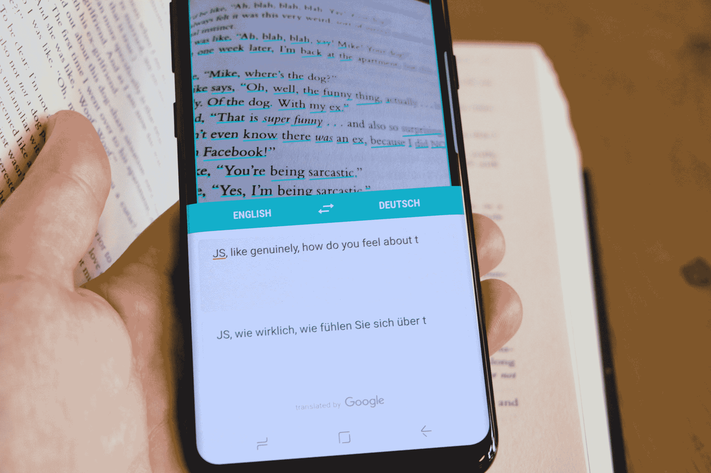

# 三星智能助手 bix by TechCrunch 的首次亮相令人失望

> 原文：<https://web.archive.org/web/https://techcrunch.com/2017/04/18/bixby-debut-samsung/>

上周，三星宣布 Galaxy S8 将不带 Bixby 语音控制功能。这个小小的爆炸性新闻似乎不太可能阻止任何人购买新旗舰。毕竟，这是一个很棒的硬件，正如我们最近的评论中详细介绍的[。](https://web.archive.org/web/20230128070814/https://techcrunch.com/2017/04/18/samsung-galaxy-s8-review/)

不过，对于这款手机的一个关键卖点来说，这是一个明显的失望，对于一个旨在为该公司指明前进方向的功能来说，这是一个失误。目前，三星的智能助手已经具备了引人注目的特性，但执行力度不够。

[Bixby](https://web.archive.org/web/20230128070814/https://techcrunch.com/2017/03/20/bixby-is-samsungs-new-intelligent-interface-for-smartphones-and-beyond/) 能够并且可能将会成为该公司承诺的强大团结力量。然而，在目前的状态下，它感觉像是在三星已经相当可观的 Android 附加产品上添加了一套功能。该公司从来不需要应用程序。事实上，它们长期以来一直是它用来区别于充斥市场的无数其他 Android 制造商的驱动因素之一。

这可能是该公司在 S-Voice 未能取得太大进展后选择推出自己的助手的很大一部分原因。既然你可以自己开发，为什么还要满足于谷歌助手呢？这样做可以一劳永逸地将银河系的无数应用程序统一在一个单一的、可访问的旗帜下，并作为更广泛控制的基础。

毕竟，亚马逊、苹果和谷歌最近的表现都表明，智能助手不仅仅是天气和愚蠢的维基百科问题的门户。除此之外，它们是一种共同的语言，可以作为统一[智能家居](https://web.archive.org/web/20230128070814/https://techcrunch.com/2017/03/29/samsung-bixby-smart-home/)的切入点——三星显然在这个领域投入了大量的联网设备。

很明显，三星在软件上挂了很多东西。它甚至把一个完整的按钮奉献给了 Bixby，甚至还大张旗鼓地在前面抛弃了大 home 键。但采用的一个重要部分要求一开始就有强大的用户体验，在目前的形式下，Bixby 没有兑现该公司在发布前做出的夸张承诺，[当时它向](https://web.archive.org/web/20230128070814/http://mashable.com/2017/03/20/samsung-bixby/)承诺将“彻底改变手机界面”

截至发稿时，三星承认未能推出 Bixby，与其说这是承认失败，不如说这是该公司宣传这款手机的机会。

新闻发布后，Bixby 在发给 TechCrunch 的一份声明中表示:“凭借其智能界面和上下文感知，bix by 将通过帮助完成任务，告诉你你在看什么，学习你的日常生活并记住你需要做什么，让你的手机变得更有帮助。”“Bixby 的主要功能，包括视觉、主页和提醒，将在 4 月 21 日三星 Galaxy S8 全球发布时提供。Bixby Voice 将于今年春天晚些时候在美国的 Galaxy S8 上推出。

在目前的状态下，Bixby 包括 Home，当你点击侧边按钮时弹出的位；图像和文本扫描服务 Vision 和提醒，可以让你创建提醒。

Home 的这一早期版本并没有让自己从无数其他内容聚合移动服务中脱颖而出。与此同时，Vision 是该产品中最有前途的部分，它增加了类似亚马逊流程的购物功能，让用户通过扫描标签或条形码来购物。此外，它还具备扫描和翻译文本的功能，对于经常出差的人来说，这绝对是一项有用的功能。

但就像 S8 本身一样，该公司在主题演讲中承诺它将是“体验世界的新方式的开始”，三星正在设定不可思议的高标准。当然，有一些引人注目的功能即将推出，比如语音，据说它比 Siri 等提供了更具情境性的用户体验。收购 Viv 带来的更多功能，如增加第三方支持，也有助于推动其发展。

目前，Bixby 感觉就像是一部精心设计的手机的仓促之作。该公司有机会在 Bixby 中提供真正突破性的软件体验，这种体验可以真正使其软件从其他 Android 兄弟中脱颖而出，并有助于建立一个向前发展的互联未来。然而，就目前的情况来看，智能助理一开始就没有发挥出应有的潜力。