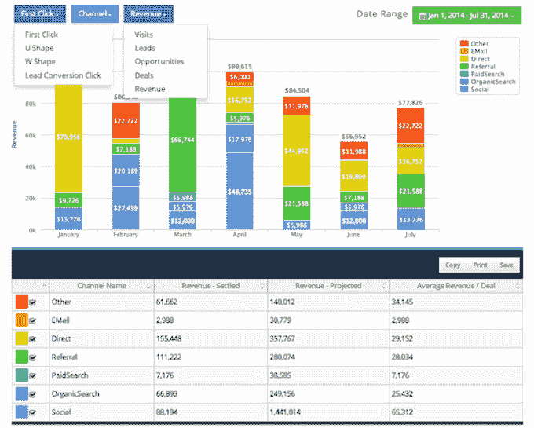

# Bizible 筹集 800 万美元将营销工具与销售数据联系起来 

> 原文：<https://web.archive.org/web/https://techcrunch.com/2014/08/26/bizible-raises-8m-to-connect-marketing-tools-with-sales-data/>

承诺帮助协调公司营销和销售工作的初创公司 Bizible 宣布，它已经筹集了 800 万美元的 B 轮资金。

这个想法，基本上，是跟踪在线广告是否导致销售。Bizible 最初将 AdWords 搜索广告活动的数据引入 Salesforce，现在它正在扩展到其他类型的广告和营销——例如，今年早些时候，我写了关于[与 A/B 测试服务优化整合的文章。](https://web.archive.org/web/20230129082505/https://techcrunch.com/2014/03/25/bizible-partners-with-optimizely-to-improve-ab-testing-for-sales-teams/)

Bizible 的联合创始人亚伦·伯德和彼得·汤普森都曾在微软从事广告工作，伯德告诉我，在许多公司可能会出现“严重脱节”，尤其是当你向其他企业销售时。

“你看到的是，从数据和工作流程的角度来看，营销和销售没有联系，”他说。“这就是为什么您会听到营销人员使用“销售线索生成”这个术语，而实际上，对销售团队来说，重要的是创收。”

伯德说，换句话说，你可能会陷入两个团队争执不下的局面，营销人员说，“我们上个月完成了销售目标”，而销售人员回应说，“那些销售线索很糟糕”，没有带来实际销售。伯德说，通过连接销售和营销数据，他的产品可以将这些团队放在同一页面上。

Bizible 的客户包括 Optimizely(因此它既是客户也是合作伙伴)、OpenDNS、MongoDB、Xamarin、Open Colleges、Curtiss Wright、ADP 和富士通。

新一轮由 Scale Venture Partners 牵头，Scale 的 Stacey Bishop 加入了 Bizible 董事会。蒂姆·科普和之前的支持者 Madrona Venture Partners、MHS Capital、圣巴巴拉投资集团(Investment Group of Santa Barbara)、鲁迪·加德勒(Rudy Gadre)和罗布·格拉泽(Rob Glaser)也投资了 b 轮融资，Bizible 目前已经筹集了超过 1000 万美元的资金。

伯德告诉我，Bizible 将继续投资该产品，但新一轮的主要目标是“加倍销售和营销”所以，嘿，也许它会更多地使用自己的产品。