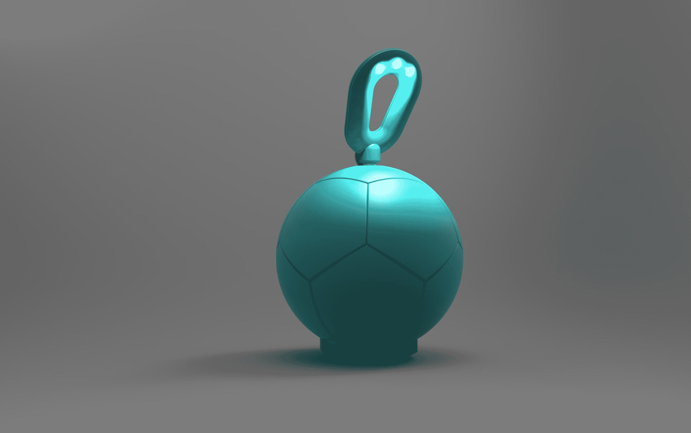

# 一位黑人女创始人为可再生能源科技公司 TechCrunch 募集了 700 万美元

> 原文：<https://web.archive.org/web/https://techcrunch.com/2016/09/19/black-female-founder-raises-7-million-for-renewable-energy-tech-startup/>

我想向杰西卡·o·马修斯(Jessica O. Matthews)致敬，她是一位黑人女性，是可再生能源科技初创公司[的创始人兼首席执行官。她的公司刚刚结束了由美国国家信息中心基金牵头的 700 万美元的 A 系列，参与方包括卡波资本、魔术师约翰逊企业、BBG 风险投资和林戈风险投资。](https://web.archive.org/web/20230316161016/http://www.unchartedplay.com/)

随着新资金的注入，未知游戏计划加强团队建设，并更好地装备自己，以支持该公司在未来几个月内引进的合作伙伴。未知游戏的任务是通过技术和游戏传播对全球能源和清洁能源的认识。

《未知的游戏》700 万美元的投资使马修斯成为第 13 位从外部投资中筹集到 100 多万美元的黑人女创始人。本月早些时候，Blavity 公司的[摩根·德邦表示，她已经筹集了超过 100 万美元的资金，并且仍在积极筹集](https://web.archive.org/web/20230316161016/https://techcrunch.com/2016/09/12/blavity-the-buzzfeed-for-black-millennials-gets-1-million-and-a-redesign/)。德邦是第 12 位筹集超过 100 万美元的黑人女性创始人。

在科技生态系统中，黑人女性创始人获得的风险资本基本为零。根据# projection Diane 最近的一份报告，在 2012 年至 2014 年间下降的数千笔风险投资交易中，不到 1%流向了黑人女性,[。根据 CB Insights](https://web.archive.org/web/20230316161016/https://techcrunch.com/2016/02/13/its-true-black-female-founders-receive-basically-zero-venture-capital/) 的数据，平均获得外部资金的黑人女性仅获得 3.6 万美元，而今年 2 月的平均种子交易规模为 450 万美元。在发表#ProjectDiane 报告时，只有 11 位黑人女性创始人从外部融资中筹集了超过 100 万美元。

未知游戏的第一个产品，SOCCKET，是一个兼作发电机的足球。SOCCKET 利用球每次滚动产生的旋转能量，为每小时的比赛产生三小时的光。

Uncharted Play 的第二个产品是 PULSE，这是一种兼做灯的跳绳。SOCCKET 和 PULSE 都是由 MORE(基于运动、离网、可再生能源、Uncharted Play 的微型发电机系统专利技术)提供动力的。这些系统可以集成到任何移动的东西中，这就是将足球或跳绳等产品转化为离网电源的原因。《神秘海域》的目标是更好地利用动能，以补充甚至取代其他能源系统。

Uncharted Play 的商业模式需要与消费电子和基础设施等行业的产品制造商合作，将更多的技术应用到我们使用的日常产品中，如婴儿车、购物车和行李箱。这个想法是，你可以用这个产品产生的能量给你的手机和其他东西充电。

马修斯说:“我们不仅旨在扰乱能源的产生方式，还旨在扰乱能源的消耗方式。”“我们设想这样一个世界，人们将从‘囤积和节约’能源的心态转变为‘持续和按需’的能源体验。”