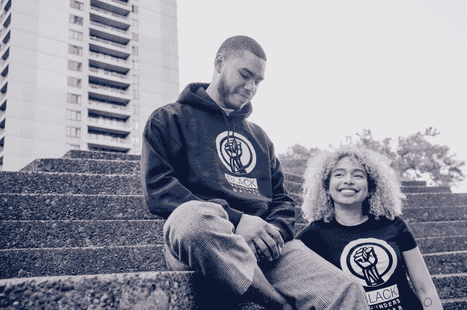

# 黑人创始人 Matter 希望筹集 1000 万美元来资助黑人领导的创业公司

> 原文：<https://web.archive.org/web/https://techcrunch.com/2018/04/29/black-founders-matter-wants-to-raise-10-million-to-fund-black-led-startups/>

几个月前，玛索·米歇尔(Marceau Michel)会见了另一位企业家 ScoutSavvy 的凯瑟琳·布朗(Kathryn Brown)，讨论了他们在科技行业的成功和苦难。这时，两人发现他们遇到了同样的问题:缺乏资金。

不幸的是，非裔美国创始人米歇尔并不孤单。只有 1%的风险投资公司由黑人创始人领导。为了解决这个问题，米歇尔希望让公众参与到传统投资者似乎缺乏意愿的领域中来。

“多样性和包容性得到了很多口头上的支持，但缺乏实际的实用性，”他告诉我。

随着[黑人创始人问题](https://web.archive.org/web/20230407004634/https://www.blackfoundersmatter.org/)，目标是将黑人的命也是命运动的坚韧带到创业行业。

“如果在少数族裔和他们作为企业家的梦想之间有一堵砖墙，我们如何帮助普通人帮助我们拆除我们和我们的梦想之间的墙？”他假设。

黑人创始人 Matter 有一个简单的前提，销售 t 恤和运动衫的目的不一定是政治性的，“而是字面上的，”米歇尔告诉我。这款服装售价从 49.99 美元到 69.99 美元不等，旨在增加收入，同时提高对黑人和女性创始人的认识。

迄今为止，黑人创始人 Matter 已经卖出了价值不到 1 万美元的 t 恤。然而，目标是在未来两年内达到 1000 万美元的销售额，然后将这笔钱投入到黑人领导的创业公司中。

米歇尔说:“我们可以改变风险投资，改变它的样子和谁得到它。”

在米歇尔努力将所有资金到位的同时，他正在组建一个委员会，最终决定如何分配资金。除了经营黑人创始人 Matter 之外，米歇尔还在经营自己的初创公司，按需招聘公司 Werk Horse。

“我们试图做的是创造一些我认为全世界都需要的东西，”米歇尔说。“我不只是想为黑人解决一个问题，而是为所有人。”

通过 Werk Horse 和黑人创始人 Matter，米歇尔希望人们开始将黑人视为首席执行官、创始人、首席财务官和首席技术官。一旦发生这种情况，米歇尔确信“他们不会向我们开枪”，这将改变“人们对黑人的误解。”