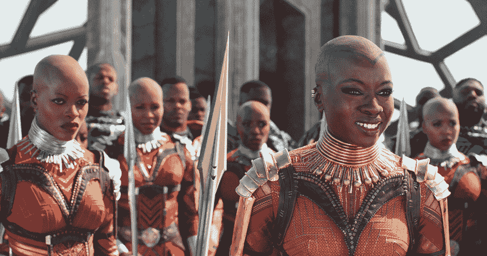
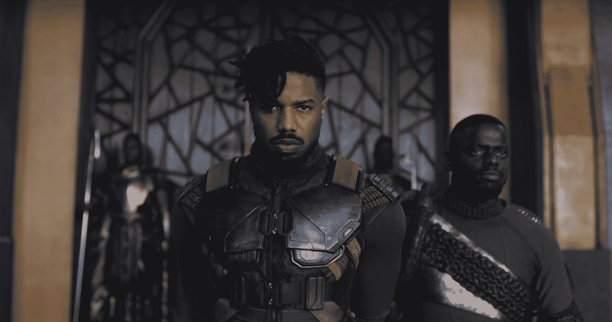
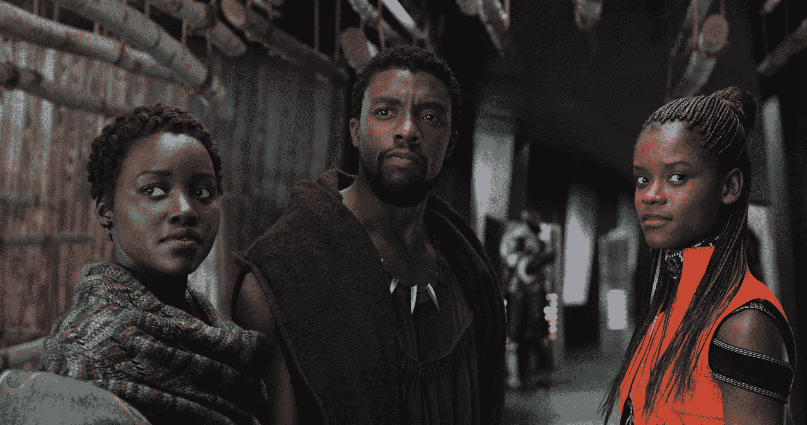

# 漫威的《黑豹》是超级英雄电影的新高潮

> 原文：<https://web.archive.org/web/https://techcrunch.com/2018/02/15/black-panther-review/>

《黑豹》不像我看过的任何一部电影。

我不想淡化[美国悠久的黑人电影历史](https://web.archive.org/web/20230316071647/https://www.nytimes.com/interactive/2018/02/01/movies/28-essential-films-black-history-month.html)(这一历史已经包括[少数黑人超级英雄](https://web.archive.org/web/20230316071647/https://www.bam.org/film/2018/fight-the-power-black-superheroes-on-film))。我也没有忽视这样一个事实，即《黑豹》是《漫威电影宇宙》的最新一部——所以，是的，它在某些方面符合好莱坞大制作故事的要求。

但不要搞错:这是一部利用漫威规模的资源讲述一个故事的电影，毫无歉意地将黑人演员、角色和关注点置于中心位置。这是一个了不起的成就，让我几乎一路笑个不停。

黑豹这个角色是由斯坦·李和杰克·科比创造的，他第一次出现在 50 多年前的《神奇四侠》中。多年来，各种各样的作家和艺术家(这部漫画由 Ta Nehisi-Coates 和 Brian Stelfreeze 于 2016 年重新推出)围绕着黑豹捍卫和统治的国家瓦坎达建立了一个丰富的神话。

虽然这部电影包括有趣的奥克兰和釜山之旅，但它一次又一次地回到了瓦坎达——这里被描绘成一个非洲旅游景观，科幻小玩意与严重仪式化(生动多彩)的文化无缝融合。

来源:漫威影业有限责任公司 2018

在漫威宇宙中，瓦坎达发现了超强金属 vibranium，以及该国随后决定隐藏其技术，这意味着它在很大程度上没有受到现实世界殖民主义的恐怖影响。这是黑豹幻想的关键之一:与美国的黑人英雄不同，黑豹的角色不会被迫不断面对奴隶制和压迫的遗留问题。

相反，这部电影的早期情节和冲突几乎完全以瓦坎丹人的担忧为中心。在《美国队长:内战 中，T'Challa(查德维克·博斯曼饰)在父亲去世后登上瓦坎丹王位，在他悲伤的同时，他还必须击退挑战者，决定自己想成为什么样的国王。

更大的世界最终入侵了，首先是尤利西斯·克劳伊(安迪·席克斯饰)，一个以前在*复仇者联盟:奥创时代*中出现的军火商，然后更引人注目的是埃里克·“杀戮者”·斯蒂文斯(迈克尔·B·乔丹饰)的出现，一个有着神秘怨恨的士兵。

尽管他的名字很傻，但杀戮者是这部电影中最精彩的部分，迫使 T'Challa 和瓦坎达统治阶级的其他人面对他们的过去，以及更大的历史负担。乔丹之前为瑞恩·库格勒导演做过令人印象深刻的工作，最近是在 *Creed* 中饰演主角，他在这里非常棒，从魅力到脆弱再到炽热的愤怒。

来源:漫威影业有限责任公司 2018

其他演员都很强。最突出的包括饰演 T'Challa 妹妹的勒提塔·赖特，精通技术的首里；温斯顿·杜克饰演姆巴库，一个敌对部落的首领；还有*让*的丹尼尔·卡卢亚饰演瓦卡比——这个角色的故事在剧本中可能被删减了，但在卡卢亚的表演中似乎已经完整成形。

至于超级英雄这个头衔，T'Challa 仍然是一个令人沉思的空白，就像他在《内战》中一样。但在这里，这个角色受益于获得更多的机会摆脱他人，无论是与首里开玩笑，与他的前任娜基亚(露皮塔·尼永奥)调情，还是被杀戮者打脸。他的服装得到了微妙的升级，看到豹子在釜山的街道上跳跃无疑是很酷的。

非漫威的影迷可能会对我不断提到其他漫威电影的事实感到有点担心——但即使你没有跟上(或者如果这是你第一次体验 MCU)，你应该没问题。

*黑豹*的功能就像最好的超级英雄漫画，借鉴之前的历史和背景，同时根据需要填充背景故事。这完全是一次独立的冒险。

[YouTube https://www.youtube.com/watch?v=xjDjIWPwcPU&w = 560&h = 315]

值得一提的是，如果你是一个漫威迷，你可能会注意到，当他们的电影借鉴不同的流派时，无论是政治惊悚片(*美国队长:冬日战士*)、太空歌剧(*银河护卫队*电影)还是抢劫片(*蚁人*)，它们通常都会在同一个地方结束，即充满 CGI 爆炸和冲击的结局，这将决定世界和/或宇宙的命运。

从情节的角度来看，《黑豹》也不是那么有创意——它基本上是一部*式的权力的游戏*式的王朝斗争——但它仍然是一个令人耳目一新的节奏变化；即使叙述很熟悉，也从不觉得公式化。结尾有一个很大的动作场景，但不是一场没有重量的打斗。相反，这是一场史诗般的幻想战斗(包括 CGI 动物)，其中的角色实际上受伤和死亡。你会很高兴听到没有一个[末日光束](https://web.archive.org/web/20230316071647/http://observer.com/2016/08/a-quick-word-from-the-giant-sky-beam-in-every-superhero-movie/)出现。

很可能仅仅几年后，围绕《神奇女侠》和《黑豹》的兴奋会变得古怪，因为来自漫威、DC 和其他工作室的电影越来越多地反映出漫画人物和创作者的日益多样化。但即使发生了这种情况，它们仍然值得作为超级英雄电影来看。

与此同时，这是值得庆祝的突破。

来源:漫威影业有限责任公司 2018