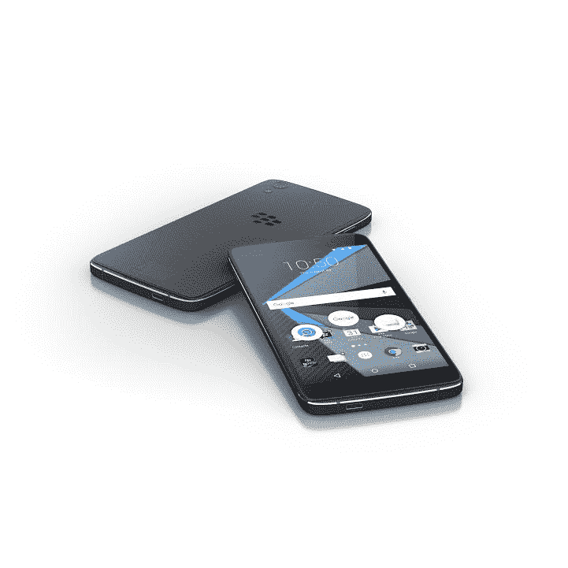

# 黑莓为其第二款 Android 手机 TechCrunch 抛弃物理键盘

> 原文：<https://web.archive.org/web/https://techcrunch.com/2016/07/26/blackberry-dtek50/>

# 黑莓为其第二款安卓手机抛弃了物理键盘

惊喜——黑莓又回来了。这家曾经强大且始终具有商业头脑的智能手机制造商带着其对 PRIV 的后续产品回归了。这家加拿大硬件公司的第二款 Android 手机采用 5.2 英寸全高清显示屏，取代了黑莓标志性的物理键盘。

正式命名为[的 DTEK50](https://web.archive.org/web/20221205073011/http://blogs.blackberry.com/2016/07/blackberrys-android-devices-such-as-the-new-dtek50-are-the-most-secure-on-the-market-heres-why-video-pics/) 运行 Android Marshmallow，并配有一系列安全功能，旨在维护该公司长期以来对隐私的关注。其中包括名义上的 DTEK 应用程序，旨在监控帐户和硬件访问，安全引导过程，全磁盘加密，以及谷歌移动操作系统之上的各种附加安全补丁。

[https://web.archive.org/web/20221205073011if_/https://www.youtube.com/embed/w9rkhCUAHT0?feature=oembed](https://web.archive.org/web/20221205073011if_/https://www.youtube.com/embed/w9rkhCUAHT0?feature=oembed)

视频

取代物理键盘的是一个新的智能软件版本，具有单词建议等功能。该公司还为该软件配备了统一的收件箱和方便键，其中包括常用的应用程序。这款手机延续了该公司对各种应用程序的企业支持，并利用 Android for Work 和 Google Play for Work。

DTEK50 通过一个微型 SD 插槽提供可扩展的内存，并具有一个带自动对焦功能的后置 1300 万像素摄像头和一个双音 LED 闪光灯。如果没有商标键盘，除了中央有商标黑莓标志的纹理背衬之外，硬件似乎与目前市场上过剩的中端 Android 设备没有太大区别。

[https://web.archive.org/web/20221205073011if_/https://www.youtube.com/embed/gUsa686CwZ8?feature=oembed](https://web.archive.org/web/20221205073011if_/https://www.youtube.com/embed/gUsa686CwZ8?feature=oembed)

视频

也就是说，7.4 毫米的厚度使 DTEK50 成为该公司迄今为止最薄的手机。它也相当轻，只有 4.8 盎司。电池的额定电量为 2610 毫安时。有 16GB 的内置存储和一个八核处理器

现在可以预购，标价 299 美元。它将于 8 月 8 日开始发货。