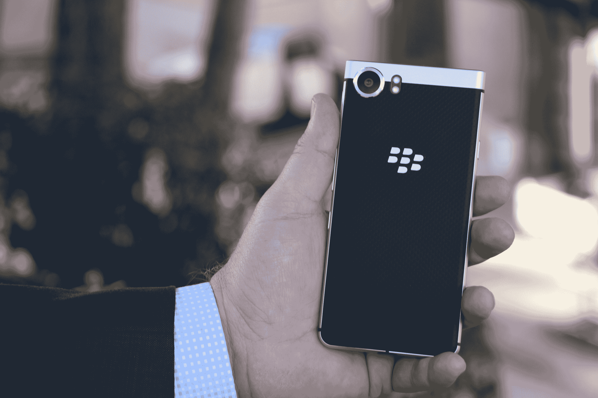
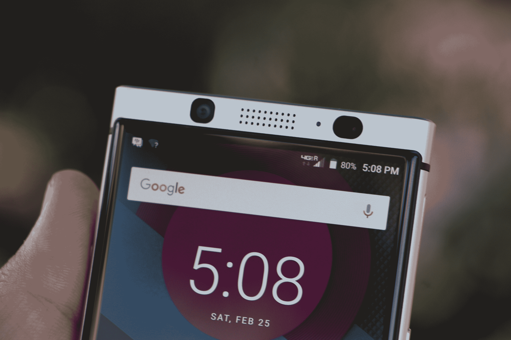
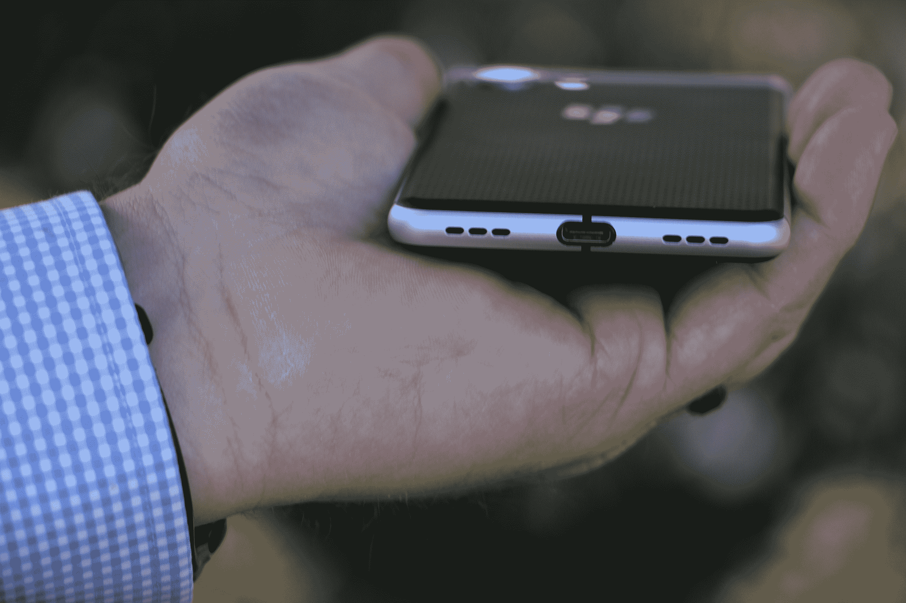

# 黑莓 Mercury 现在是 KeyOne 

> 原文：<https://web.archive.org/web/https://techcrunch.com/2017/02/25/blackberry-keyone/>

如果你认为[黑莓水星](https://web.archive.org/web/20221006022556/https://beta.techcrunch.com/2017/01/06/blackberry-mercury/)有点代号的感觉，你没有错。今天，在世界移动通信大会上，TCL 正式展示了其首款真正的黑莓手机，现在使用公认不那么时髦的 KeyOne(发音为“key one”)名称。虽然我认为当你的公司试图在企业领域牢牢树立自己的旗帜时，性感可能不是你在名字中寻找的主要内容。

这个设备看起来和我们在 CES 上看到的一样，当时它和一个罗马信使神、小行星和吃太多海鲜会中毒的元素有着相同的名字。TCL 显然想尽办法创造出一些标志性的东西，这些东西正好符合我们想到黑莓时大多数人的想法。

这是一款 4.5 英寸屏幕的高设备，这主要归功于底部的物理键盘，这是黑莓的大多数功能。自上次以来的新功能是在键盘的空格键中加入了指纹识别器，这是一个很酷的额外功能。

那么，2017 年还有多少人在找实体键盘呢？TCL/BlackBerry mobility 总经理布鲁斯·沃波尔(Bruce Walpole)承认，当这家加拿大公司的市场份额首次受到 iPhone 之流的侵蚀时，需求远没有达到现在的水平。“我们问人们是否会考虑物理键盘，”他告诉 TechCrunch。" 25%的人说他们会考虑。"

所以，本质上，那里有潜在的需求。“考虑”是相当不明确的。通过 KeyOne，公司必须将“考虑”转换为“客户”，这总是说起来容易做起来难。“毫无疑问，”沃波尔回答说，“但如果我们能抓住其中的一半，这是一个相当不错的数字。”

所以，四分之一的一半——一个相当适度的提议。

TCL 北美区总裁 Steve Cistulli 说:“这是为那些被迫使用平板玻璃但又想回来的人准备的，没有妥协。在过去，总会有一个妥协，屏幕尺寸，键盘或应用程序。这里没有妥协。”

它本质上是一款 Android 设备，装载了 TCL 设计的黑莓安全和软件，以吸引那些想要触摸屏和键盘的人。但该公司仍将为那些跳到触摸屏上并没有回头的人提供设备。

事实上，KeyOne 将是 TCL/BlackBerry 产品组合中的众多并行设备之一。根据 Cistulli 的说法，该公司的目标是在特定时间内在市场上推出大约三款设备，其中至少一款将是两家公司首次合作的 [DTEK 50/60](https://web.archive.org/web/20221006022556/https://beta.techcrunch.com/2016/10/25/dtek-60-review/) 设备的一种演变。

自然，KeyOne 将是这一系列中的第一款，将于 4 月下旬在北美(至少是美国和加拿大)上市，售价为 549 美元。美国用户将可以在发布时在线购买。不出所料，该公司首先关注企业，其次是“自带设备”这意味着在任何更广泛的零售渠道上市之前还需要一段时间。

或许，如果它能通过公司送到人们手中，它就能重新点燃人们与物理键盘的联系。他们目前对第一代设备的目标似乎很温和，就像里面的规格一样，包括骁龙 625。该设备将搭载 Android 7.1，但不会预装 Assistant。

从本质上讲，这是一款以工作为中心的设备，规格反映了这一点，它在电池部门推出了一款 3505 毫安时的电池，承诺可以使用一天。

TCL 面临着一场艰苦的战斗，向记性不好的观众重新介绍黑莓手机系列。但至少，它从一开始就有一个非常有趣的装置。“许多公司专门追逐苹果和三星，”西斯图利说。“大多数人都会志存高远，但很快就会失败。不过，企业空间还是有一席之地的。”