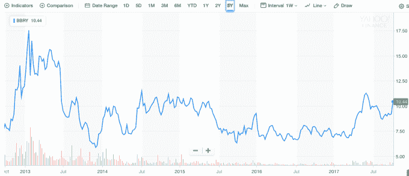
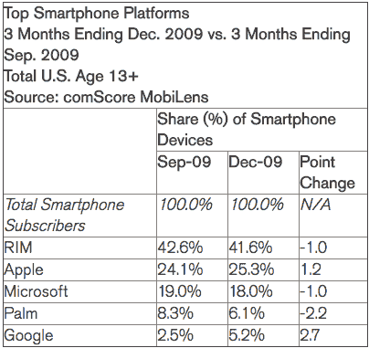
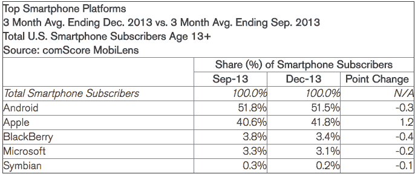

# 黑莓，是的，黑莓，正作为一家软件公司卷土重来

> 原文：<https://web.archive.org/web/https://techcrunch.com/2017/09/28/blackberry-yes-blackberry-is-making-a-comeback-as-a-software-company/>

# 黑莓，是的，黑莓，正作为一家软件公司卷土重来

当你想到死去的公司时，[黑莓](https://web.archive.org/web/20221025233842/https://us.blackberry.com/)显然是脑海中出现的一个，但在首席执行官陈志强的领导下，该公司实际上正在作为一家专注于安全的软件公司卷土重来，[最新的季度收益报告](https://web.archive.org/web/20221025233842/http://www.marketwired.com/press-release/blackberry-reports-record-software-services-revenue-fiscal-2018-second-quarter-nasdaq-bbry-2235329.htm)表明这一支点运转良好。

根据[发布的报告](https://web.archive.org/web/20221025233842/https://www.cnbc.com/2017/09/28/blackberry-shares-soar-after-strong-earnings-and-revenue-beats.html)，该公司报告收入 2.49 亿美元，打破了分析师 2.2 亿美元的预期。这一增长是由创纪录的软件收入带动的，达到 9.96 亿美元，同比增长 26%。该公司还报告了创纪录的 76%的毛利率，高于上个季度的 67%和一年前的 62%。

首席执行官陈志强很高兴，华尔街奖励了该公司的股票，股票当天以每股 9.90 美元开始，在发布时为 10.44 美元。当天早些时候，它曾高达 10.79 美元。

黑莓五年股价快照。图表:雅虎财经

总而言之，该公司正朝着正确的方向发展，这在五年前似乎是不可想象的，当时黑莓的手机业务陷入困境，成为 iPhone 和 Android 手机竞争的受害者，无人问津。

当陈于 2013 年 11 月接管公司时，他试图拯救一家在手机市场几乎没有机会的公司似乎是徒劳的，但该公司手头有一些现金，这些现金来自其作为一家受欢迎的手机制造商的辉煌时期。陈用这笔钱进行了战略性收购，帮助重新定义了这家公司。

图表:Crunchbase

在他加入董事会之前，黑莓是一家涉水的公司。它眼看着自己的手机市场份额遭到黑客攻击。根据 comScore 的[数据，将时光倒流到 2009 年，你会看到一家牢牢控制着智能手机市场的公司(当时黑莓被称为 RIM):](https://web.archive.org/web/20221025233842/https://www.comscore.com/Insights/Press-Releases/2010/2/comScore-Reports-December-2009-U.S.-Mobile-Subscriber-Market-Share)

图表:comScore

时间快进到 2013 年 12 月，也就是陈接手的那个月，市场发生了巨大的变化:

图表:comScore

如果你纯粹从手机的角度来看这家公司，它似乎没有多少剩余，但陈显然看到了公司的前进方向，他开始缓慢但坚定地重塑它。今天的报告只是一个季度的快照，但它表明公司可以从看似不可恢复的情况中恢复过来。

虽然陈[向](https://web.archive.org/web/20221025233842/https://www.cnbc.com/2017/09/28/blackberry-shares-soar-after-strong-earnings-and-revenue-beats.html)承认，前路可能会有坎坷，但黑莓已经将自己重新定义为一家软件公司，未来再次看起来一片光明。这在很久以前似乎是不可能的。