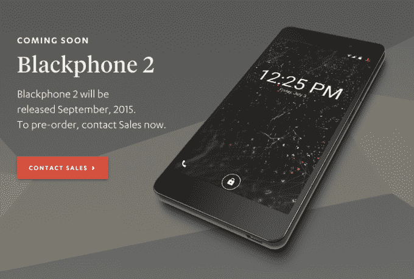

# Silent Circle 的 Blackphone 2 将于 9 月登陆

> 原文：<https://web.archive.org/web/https://techcrunch.com/2015/08/18/blackphone-2-pre-order/>

# Silent Circle 的 Blackphone 2 将于 9 月登陆

Silent Circle 在 3 月份的世界移动通信大会(Mobile World Congress)贸易展上展示了其第二代支持隐私的 Android 加固智能手机 Blackphone，宣传该设备将在夏季推出。

事实上，它仍然没有推出，该公司现在已经悄悄地在其网站上为 9 月份的发布发布了一个[预购页面](https://web.archive.org/web/20230316045255/https://www.silentcircle.com/products-and-solutions/devices/)——没有价格标签。

Blackphone 2 更新了外观和感觉部门的原始手机，前后都是全玻璃，加上更大的全高清显示屏。5.5 英寸的宽度，虽然落后于手掌伸展平板手机，但已经足够慷慨了。其他更新包括 64 位处理器和更多的内存。

Silent Circle 正在研发的另一款设备还没有进一步的消息:一款平板电脑，不幸的是它有一个笨拙的名字:Blackphone+，也是在 3 月份发布的。

这两款设备都将运行 Silent Circle 的 SilentOS(以前称为 PrivatOS):一种专注于安全的 Android 版本，并预装了支持隐私的应用程序，如 Silent Circle 的安全消息应用程序套件，以及捆绑访问第三方支持隐私的服务，如 SpiderOak 安全云存储。

该公司已经从最初的面向消费者的目标转向 Blackphone，将更多的精力集中在服务企业市场上——追逐曾经由 RIM 的黑莓手机占据的空间，现在以“企业隐私平台”的名义销售设备、软件和服务。