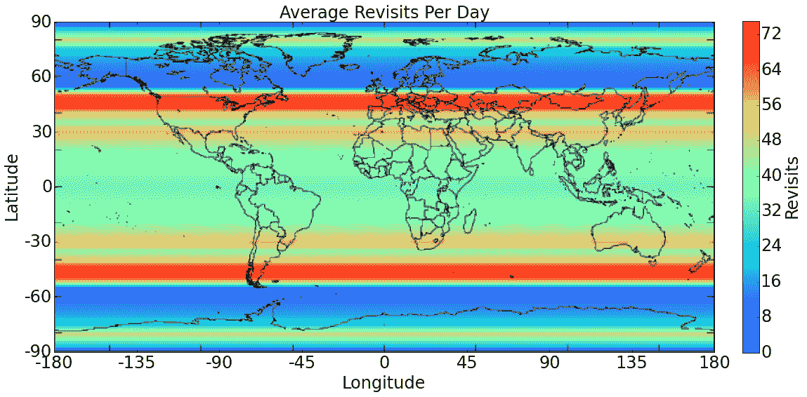

# BlackSky Global 希望发射 60 颗卫星，让您近乎实时地看到地球 

> 原文：<https://web.archive.org/web/https://techcrunch.com/2015/06/16/blacksky-global-wants-to-launch-60-satellites-to-give-you-a-near-real-time-view-of-earth/>

# BlackSky Global 想要发射 60 颗卫星来给你一个近乎实时的地球视图

我们都很熟悉谷歌地图和类似服务上的卫星图像。然而，这些图像每隔几个月才更新一次。总部位于西雅图的“卫星成像即服务”初创公司 BlackSky Global 希望发射一个由 60 颗卫星组成的舰队，为其客户提供近乎实时的地球大范围视图，并以其竞争对手十分之一的价格出售这些图像。

BlackSky Global 的母公司 Spaceflight Industries 已经从保罗艾伦的 Vulcan Capital、RRE 风险投资公司和剃刀边缘风险投资公司等公司筹集了总计 2850 万美元的资金。这笔资金的一部分将流向 BlackSky，该公司表示，目前有足够的资金在 2016 年底前将六艘航天器送入太空。

正如你从下面的地图中看到的，该公司计划确保其卫星每天将在主要城市和经济区上空飞行约 40 至 70 次，因此如果你需要图像，只需几个小时，BlackSky 就可以给你。这并不是你有时在电视上看到的科幻犯罪剧中看到的地球的实时视图，但这将允许该公司的客户近乎实时地监控他们的基础设施(甚至可能是农作物)。这项服务还承诺能够以每秒一帧的速度提供视频。

该公司正在开发一个基于网络的平台，允许其客户在线请求这些图像。

BlackSky 预计其服务将对各行各业的客户具有吸引力，包括农业、林业、国防、工程和工程企业以及政府客户。

BlackSky Global 首席技术官、美国空军作战响应空间办公室前主任彼得·韦格纳(Peter Wegner)表示:“BlackSky Global 的推出标志着在开放空间图像访问和实现全球持续关注方面迈出了一大步。“通过操作基础设施来近乎实时地观察我们的星球，我们可以预见一个开放的未来，在这个未来中，增强的地球观测将带来积极的变化，并让我们更好地了解我们的世界。”