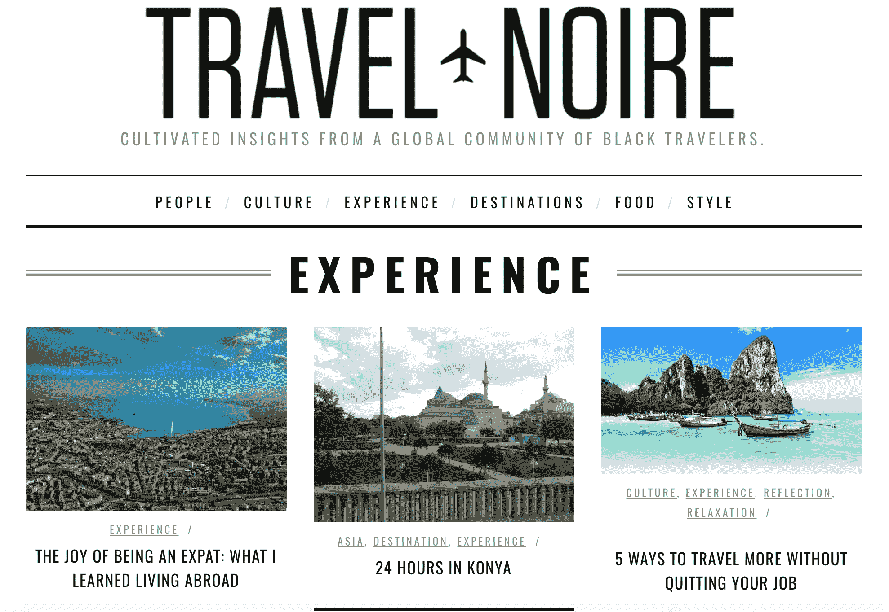

# Blavity 收购 Travel Noire，这是一个面向黑人千禧一代的旅游和探索平台 

> 原文：<https://web.archive.org/web/https://techcrunch.com/2017/09/18/blavity-acquires-travel-noire-a-travel-and-discovery-platform-for-black-millennials/>

# Blavity 收购了 Travel Noire，这是一个面向黑人千禧一代的旅游和探索平台

专注于黑人千禧一代和黑人文化的媒体和活动初创公司 Blavity 收购了旅游初创公司 Travel Noire，金额未披露。

[Travel Noire](https://web.archive.org/web/20221221193408/https://travelnoire.com/) ，为黑人千禧一代提供旅行提示和指导，每月接触超过 200 万千禧一代。下个月，我将和一些 TechCrunch 的同事去内罗毕。多亏了《黑色旅行》,我[现在知道去拜访](https://web.archive.org/web/20221221193408/https://travelnoire.com/david-sheldrick-wildlife-trust/?hvid=2Oooi)大卫·谢尔德里克野生动物信托基金会，这是一家位于内罗毕国家公园内的大象孤儿院。

Travel Noire 标志着 Blavity 今年的第二次收购。几个月前，Blavity 收购了媒体平台 Shadow 和 Act。作为收购的一部分，TravelNoire 创始人 Zim Ugochukwu 将加入 Blavity，并将继续担任 Travel Noire 的首席品牌官。

“旅行和文化是黑人千禧一代经历的重要组成部分，也是我们与世界互动的重要组成部分，”Blavity 联合创始人兼首席执行官摩根·德邦在一份声明中说。“Zim 改变了关于旅行的话题，并向世界展示了无论我们身在何处，我们都可以而且应该得到展示。我很高兴能将她的远见和专业知识加入到 Blavity 生态系统中。”

自 2014 年推出以来，Blavity 因制作病毒式内容而闻名，如[“黑人男性不常听到的 21 件事”](https://web.archive.org/web/20221221193408/http://blavity.com/21-things-black-men-need-hear/)和[“黑人小女孩不常听到的 19 件事”](https://web.archive.org/web/20221221193408/http://blavity.com/18-things-little-black-girls-dont-hear-often-enough/) Blavity 目前每月通过社交渠道接触超过 3000 万人。

由德邦、亚伦·塞缪尔斯、乔纳森·杰克逊和杰夫·尼尔森创立的 [Blavity](https://web.archive.org/web/20221221193408/http://blavity.com/) 最终目标是成为一个面向未被充分代表的千禧一代的线上和线下体验的生活方式品牌。今年 4 月，Blavity 筹集了超过 180 万美元的资金，根据 SEC 的文件。