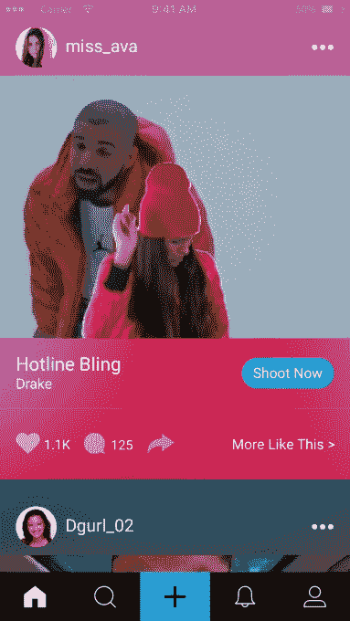

# Blin.gy 带你进入你最喜欢的音乐视频

> 原文：<https://web.archive.org/web/https://techcrunch.com/2017/02/17/blin-gy-puts-you-inside-your-favorite-music-video/>

绿屏效果或色度键控并不新鲜。早在 20 世纪 30 年代，这项技术就在好莱坞首次使用，现在仍被用于电影、体育广播，当然还有天气节目。但这并不是真正的消费技术——主要是因为需要一个真正的绿色屏幕、一个静态摄像头和演播室质量的照明。

但是能够有一个实时视频背景是很酷的——特别是如果你可以用它来创建独特的社交内容与你的朋友分享。

见见 [Blin.gy](https://web.archive.org/web/20230328094154/http://blin.gy/) ，这是一个新的应用程序，它想出了如何在不需要完整工作室环境的情况下实现“移动绿屏效果”。

Blin.gy 背后有一些背景——该团队之前已经[建立了 choosed](https://web.archive.org/web/20230328094154/https://techcrunch.com/2016/06/30/video-app-chosen-doubles-down-on-music-video-creation-with-access-to-20m-songs/),这是一个美国偶像风格的应用程序，你可以在那里创建和分享展示你才华的短视频剪辑。这家初创公司与 Ellen Show 合作，并获得了一些关注——但很快就发现，他们的关键人群——青少年——更喜欢像 [Musical.ly](https://web.archive.org/web/20230328094154/https://techcrunch.com/2016/05/06/musical-ly-raising-100-million-at-500-million-valuation-for-social-music-videos/) 这样的应用程序，音乐是他们创建的内容的焦点。

因此，该团队后退一步，埋头苦干，目标是开发一种工具来创建内容，让年轻人以一种前所未有的方式表达自己。

从本质上来说，他们希望创造一种新的内容类型，这种内容将是 Blin.gy 独有的。Musical.ly 有覆盖歌曲的快动作视频，Snapchat 有滤镜和 AR 风格的效果，Instagram 有 Boomerang——你明白这一点。

最终，该团队想出了一个主意，利用移动绿屏效果，将用户放入一个音乐视频中。虽然你会认为以今天的技术，将老式的色度键控移植到移动设备上很容易，但实际上比这要复杂得多。

该团队正在申请专利的算法(他们[写了一份白皮书](https://web.archive.org/web/20230328094154/https://dl.dropboxusercontent.com/u/24328239/Blin.gyWhitePaperv5.pdf)介绍更多细节)本质上是将传统的色度键控与新技术相结合，如对象类别检测、边缘检测、颜色处理和其他计算机视觉技术。简而言之，他们根据录制视频的环境动态地对这些不同的技术进行优先排序和组合。

因此，虽然像苹果公司的 Photo Booth effect 这样的技术会在你移动相机的那一刻完全混乱(并扭曲背景)，但 Blin.gy 的技术允许你使用不稳定的相机，在你录制视频时，它实际上可以移动。

当然，计算机视觉技术仍然很年轻(并且受到我们手机功能的限制)，所以 Blin.gy 仍然建议你在普通背景前录制视频，以获得最真实的结果。

这意味着并非所有的视频都是完美的——滚动主 feed 会显示光谱两端的视频——有些很棒，看起来就像是在“真正的”绿色屏幕前完成的，而其他视频的效果几乎不起作用。

但这家初创公司解释说，其中一些视频来自功率较低的 Android 手机，这些手机没有足够的处理能力来完全支持这种效果。第一次使用该应用时，还有一个指导组件，告诉你如何选择一个好的背景和灯光，由于年轻观众的本性(大多数当前用户是青少年)，他们并不总是遵循指示，这导致了低于标准的视频。

目前，该应用程序有数万个音乐视频片段可供选择，长度均为 15 秒。最终，Blin.gy 希望与唱片公司合作，为他们的应用程序设计定制的内容——比如一个音乐视频版本，在德雷克旁边有一个空位置，Blin.gy 用户可以在那里跳舞。他们已经对此进行了实验——该应用程序对 Migos 的 Bad 和 Boujee 视频进行了特殊编辑，其中包含开放空间和无跳转剪辑的镜头——当有人将其用作背景时，它看起来更真实。

现在可以在 [iOS 应用商店](https://web.archive.org/web/20230328094154/https://itunes.apple.com/de/app/blin.gy-videos+you-magic!/id1200290697?l=en&mt=8)和[谷歌 Play 商店](https://web.archive.org/web/20230328094154/https://play.google.com/store/apps/details?id=fm.bling.blingy)下载 Blin.gy。