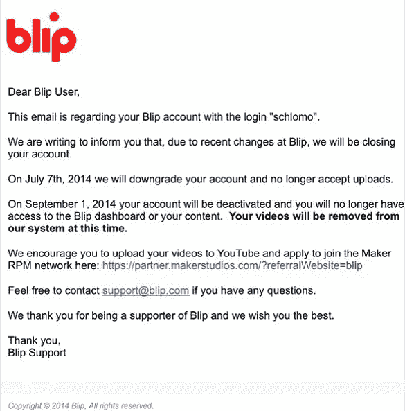

# Maker Studios 精选 Blip 视频平台 TechCrunch 上的内容

> 原文：<https://web.archive.org/web/https://techcrunch.com/2014/05/29/blip-downsizing/>

这些年来很多在线视频平台消失了。现在，它看起来像一个——虽然没有关闭——正在进行一场相当活跃的春季大扫除。 [Blip](https://web.archive.org/web/20221208011546/http://blip.com/) ，被 Maker Studios 收购的视频分发初创公司[(现在它自己被迪士尼](https://web.archive.org/web/20221208011546/https://beta.techcrunch.com/2013/08/21/blip-maker-studios/)收购[)，已经向许多用户发出通知，告诉他们他们的账户将被关闭。](https://web.archive.org/web/20221208011546/https://beta.techcrunch.com/2014/03/24/disney-maker-studios/)

除此之外，现在[不接受新的制作人](https://web.archive.org/web/20221208011546/http://blip.tv/join-blip)。

blip——允许制作人上传、分发和货币化他们的视频内容——在发给一些当前用户的通知中建议他们上传视频到 YouTube，并申请加入那里的 Maker RPM 网络。

制作人 Schlomo Rabinowitz 在 Instagram 上发布的完整记录如下。

这不是关闭 Blip 本身，而是 Blip 决定关闭它认为违反其服务条款的账户，或者仅仅是不够活跃。

“Blip 没有关闭。我们只是关闭了更多的账户，作为我们努力聚焦图书馆的一部分，”用杰夫·奥康奈尔的[话说](https://web.archive.org/web/20221208011546/https://twitter.com/jefforulez/status/471697630096261120)，他是 Maker Studios 和 Blip 的技术 SVP。

我们已经联系了 Blip 和 Maker，询问更多关于正在发生的事情的细节，并仍在等待回音。看起来不仅仅是我们。在[推特](https://web.archive.org/web/20221208011546/https://twitter.com/search?f=realtime&q=blip%20maker&src=typd)上快速搜索，发现许多其他制作人也提到他们也被解雇，几乎没有直接解释发生了什么。

关闭与否，已经有一段时间的谣言，似乎，制造商正计划关闭 Blip 最终。但与此同时，其他一些事态发展似乎表明，暂时现象(如果不是结束的话)受到的关注比过去少了。

本月早些时候，Maker.tv】推出了 Maker.tv ，这是一个独立于 YouTube 的流媒体平台，将成为其制作人才库中原创和“独家”内容的大本营。

人们普遍认为，Maker.tv 是建立在 Maker 通过 Blip 收购的一些资产基础上的——在转向一个帮助将视频放在 YouTube 和其他网站上的分发网络之前，它在早期的化身中试图将自己定位为一个可行的 YouTube 替代品。

与此同时，虽然 Blip 网站已经启动并运行，但它似乎有点自动驾驶。该公司的博客已经三个月没有更新了，其中一个[的最后条目](https://web.archive.org/web/20221208011546/http://blog.blip.com/post/75817891707/maker-studios)邀请用户“关注我们的姐妹博客(在创客工作室)了解更多恶作剧。”在运营博客的两个人中，一个现在自称是 Maker 的产品副总裁，另一个在其他地方工作。

blip 的 [Twitter 账户](https://web.archive.org/web/20221208011546/https://twitter.com/blip/)也在 2 月份停止更新——除了[今天早些时候的一个回复](https://web.archive.org/web/20221208011546/https://twitter.com/blip/status/472120799634407424)，建议对其视频收费有疑问的人联系 Blip 支持。

虽然 Blip 可能很难与 YouTube 的规模竞争，但 Maker 的制作人每月总共产生数十亿的在线浏览量，似乎 Maker 意识到可以利用自己的平台 Maker.tv 来利用这一点，这样可以更好地控制其创收命运，而不会削减 YouTube 的所有者谷歌或其他平台提供商的收入。或者，使用 Blip 的分销技术，更好地控制整个分销链。

看看 Maker 如何利用其精选的 Blip 制作人才库和视频目录做更长期的事情，将是一件有趣的事情。一种可能性是它们也被移植到 Maker 平台。