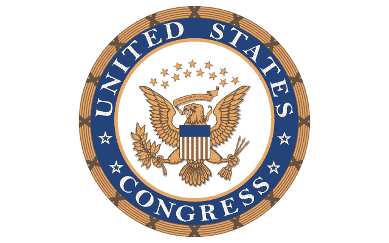
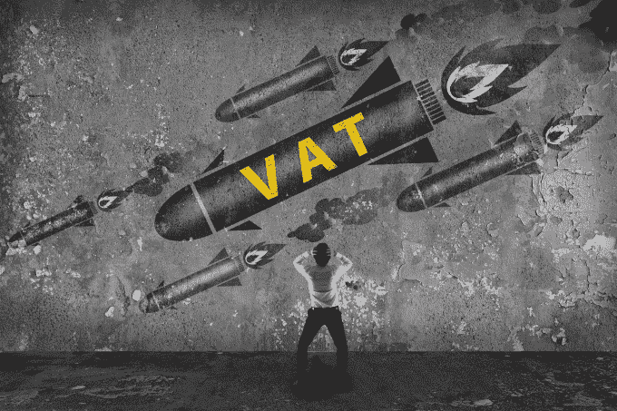

# 区块链技术可能改变政府服务

> 原文：<https://web.archive.org/web/https://techcrunch.com/2016/11/21/blockchain-technologies-could-transform-government-services/>

[RJ Krawiec](https://web.archive.org/web/20220701055506/https://www.crunchbase.com/person/rj-krawiec)

是德勤的负责人，主管德勤的联邦创新部门。

杰森·基尔迈尔撰稿人

[Jason Killmeyer](https://web.archive.org/web/20220701055506/https://www.crunchbase.com/person/jason-killmeyer)

是联邦战略和行动的高级顾问。

随着当前的选举季节引发了另一场关于政府如何更好地监督我们的选举和提供安全服务的讨论，新兴的区块链技术可能会提供一个解决方案。通过提供安全性和透明度——降低不公平竞争的风险并使*每个人*都能审计结果，区块链解决方案可以重塑美国选举的未来。

从金融服务开始，区块链已经在推动各行各业的大量投资和创新。政府可能是下一个。

在其核心，区块链是一个分布式分类帐，使有效和可靠的交易，通常是私人的(或假名)，安全和透明的。区块链记录对网络的所有成员都是可见的，因此可以很容易地对其进行监控和审计。它们受到加密和开创性的对等加密验证机制的保护，这使它们非常安全。此外，一旦记录被添加到区块链，它将是永久的，极难篡改。

这种独特的(看似矛盾的)属性组合使区块链技术成为潜在支持政府应用的有趣选择，从数字投票和数字识别到电子健康记录、数字契约，甚至免审计税务审计。

如果区块链在大规模上被证明是高效、可靠和安全的，这项技术有可能在下一届总统任期内达到一个拐点，并开始获得广泛接受。这将为我们国家的领导人提供振兴和重塑政府的机会。

当考虑如何利用区块链来改善和转变政府运作和服务时，从三个不同的角度来看待这些机会是有帮助的:政府对公民(G2C)、政府对政府(G2G)和政府对供应商(G2V)。****

**G2C**

区块链往往会取代现有的中介机构，这意味着政府——通常是这些中介机构中的一员——可能会发现其作为服务提供商的独特地位在一系列职能中逐渐消失。尽管如此，区块链提供的安全平台还可以为政府提供一个交易层，在这个交易层上执行和记录政府保留的服务功能。

政府利用这一技术为其公民服务的能力——为公民-国家互动提供一个可及且可自我验证的真相来源——值得探索，许多政府正在这么做。

潜在的应用包括安全的电子投票、病人控制的电子健康记录(T4，EHR)和数字产权。在加纳，一个试点项目已经在进行中，该项目使公民能够通过 GPS 坐标归档和数字化土地所有权，登记财产纠纷等等。

**G2G**

由于区块链实现了具有最小交易延迟的共享分类账，它可以让机构比以往任何时候都更快地调节交易和预算，而不必改变他们的传统服务模式。在政府机构维护信息孤岛的情况下，区块链可以通过充当机构间通信的公共事务层来简化信息共享。一个潜在的应用是 DHS 有兴趣将区块链作为

一个潜在的应用是，DHS 有兴趣将区块链作为一种高级分析工具，用于快速解决身份问题和保护国家安全。另一个潜在的应用是人员、货物和服务的机构内身份管理。在英国，区块链目前正在作为税收征收和汇款分散平台进行测试。

**G2V**

在某些情况下，政府能够利用其对供应商的影响力来鼓励合规。这意味着，政府不仅可以通过基于区块链的应用程序招揽工作和分配资金，还可以通过提供平台访问权来激励某些企业行为，从而推动供应商合规。

迄今为止，区块链在政府采购领域的活动可以忽略不计，尽管初创公司、行业联盟和至少一个外国政府在[贸易](https://web.archive.org/web/20220701055506/http://www.businesstimes.com.sg/banking-finance/consortium-develops-blockchain-prototype-solution-to-replace-lc-transactions)和运输申请方面取得了有趣的进展。

一个潜在的引人注目的 G2V 应用是基于区块链的监管链平台，以提供供应链保证；这种平台目前正在私营部门开发，政府可以通过将它们作为联邦合同资格的先决条件来帮助推动采用。

**政府在行动…还是不行动？**

一些人认为，区块链技术最终可能会产生与互联网相同的变革性影响，围绕该技术的私人投资美元和创业生态系统的规模是有希望的。

那么，政府能在哪里增加价值呢？从短期来看，它可以为开源生态系统和私人财团的发展提供继续繁荣的空间，同时在资产税务处理和工业区块链标准等领域提供监管清晰度。我们国家的领导人能够进一步巩固美国作为区块链创新的全球领导者的地位吗？还是会有其他人带路？

我们国家的领导人能够进一步巩固美国作为区块链创新的全球领导者的地位吗？还是会有其他人带路？

国会最近成立了一个区块链核心小组，目标是研究这项技术以及它如何帮助金融包容性。与此同时，各州也在密切关注区块链。例如，许多公司青睐的注册地特拉华州正在积极探索如何利用区块链

与此同时，各州也在密切关注区块链。例如，作为许多公司青睐的注册地，特拉华州正在积极探索如何将区块链作为公司注册地。

我们是否会看到这项技术以现有的形式被大规模采用还不清楚。但是，鉴于它的迅速崛起和潜在影响，区块链值得给予极大的关注和考虑。