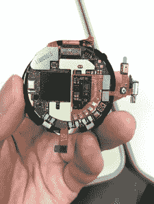
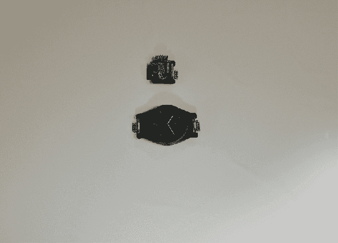

# 模块化智能手表将在 Android TechCrunch 上运行

> 原文：<https://web.archive.org/web/https://techcrunch.com/2015/06/02/blocks-modular-smartwatch-in-the-making-will-run-on-android/>

英国硬件初创公司 Blocks Wearables 正在制造一款模块化智能手表——在去年秋天的[预告视频](https://web.archive.org/web/20221006173414/https://beta.techcrunch.com/2014/10/14/blocks-teaser/)中以概念形式展示，最初的灵感来自[谷歌的 Project Ara 模块化智能手机](https://web.archive.org/web/20221006173414/https://beta.techcrunch.com/2015/05/29/googles-ara-modular-phone-takes-a-real-photo-from-a-snap-in-camera/)——该公司已确认该设备将运行在 Android Lollipop 的修改版本上，而不是谷歌 Wear 平台上。

今天，该团队还透露，该设备的核心模块将由高通骁龙 400 芯片组提供动力，外围模块使用超低功耗的 ARM 处理器。

基本想法是建立一个可定制的智能手表，允许所有者选择组成手镯的单个模块来定制其功能。(例如增加额外的电池容量，或者选择心率监测器进行健康跟踪。)第一个核心模块(又名表盘单元)将是一个圆形彩色触摸屏单元。

Blocks 还与英国奢侈男装珠宝品牌 Tateossian 合作，在设计方面提供进一步的用户定制——通过一系列彩色/纹理外壳来增加各个模块的外观和感觉。

帮助 Blocks 概念智能手表制造和发货的众筹活动本应在今年年初启动，但仍未实现——尽管该团队已经接受了一些预购的预注册。它现在说，它的目标是在夏季众筹。

“我们花了一些时间与(台湾 ODM)仁宝(Compal)签署制造协议，以便在发布时大规模生产块，”联合创始人 Alireza Tahmasebzadeh 解释为什么推迟推出众筹。他补充说，他们还决定等待高通加入，同时一直在努力完善连接器设计(用于连接智能手表的不同模块)。

“由于我们已经有了一个制造合作伙伴，生产将会进行得更快；而核心模块(最贵最难生产)的所有组件和电路都已经定型。下一步是最终确定我们模块的细节，并开始制造。该设备将在活动结束后 7-8 个月发货，”他补充道。

Blocks 选择了 Lollipop，而不是谷歌的可穿戴版 Android，因为前者支持更多功能。“例如，Android Wear 不支持蜂窝连接，至少目前不支持，”Tahmasebzadeh 说。“这就是为什么我们在 Android Lollipop 版本的基础上开发了模块，针对功耗进行了优化，将用户界面改为圆形显示，并对 Android 的 Linux 内核进行了必要的修改，以反映模块化。”

“使用 Android Lollipop 而不是 Android Wear 的另一个重要原因是，我们希望区块同时兼容 iOS 和 Android(可能还有 WP)。Android Wear 兼容 iOS 的未来仍不确定，”他补充道。

现阶段在开发工作方面还有什么要做的？据 Tahmasebzadeh 称，“最终确定硬件模块”,在操作系统方面，检查核心模块与外围模块的性能。

“最难的一块，核心块带工艺、显示屏和蓝牙，已经过全面设计和测试。我们还设计和测试了模块化电源管理系统(我们开发的这个系统可以让您在电池链的任何位置连接任意数量的电池，无论它们有多少电量)。当手表连接到适配器时，电池可以单独充电，也可以一起充电，”他说。

“模块化平台、通信和电源已经过测试，并按照我们的预期运行。连接器和设计非常实用，非常舒适。”

当前的块原型如下所示:

[gallery ids="1165887，1165886，1165885，1165884，1165883"]

最终，组装一款功能模块化智能手表的硬件和软件复杂性，对于为这种高度可定制、因此必然复杂的产品找到市场的挑战来说，可能最终无足轻重——至少在小众电子产品爱好者圈子之外。

另一个关键问题将是成本，特别是 Blocks 将与智能手表(和智能手机)竞争，智能手表上塞满了越来越多的传感器。因此，换入或换出某些模块的概念最终可能会被竞争对手设备不断增强的功能所掩盖。尤其是因为产品上市需要时间。(即使是谷歌也仍然没有把 Ara 放到消费者手中。)

模块化在理论上似乎是一个迷人的想法，但它仍有待在消费电子领域得到证明，因为设备需求必须强劲，升级周期极其短暂。

